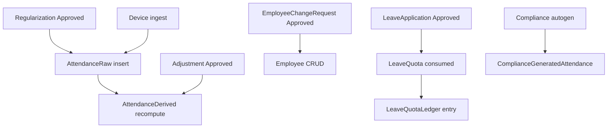

# MAMS Full Workflow Audit

> Combined single-file edition. Source: `docs/workflow-audit/` (21 files). Generated for Claude ingestion.

---

# Workflow Documentation Template

Use this structure for every user-facing workflow in files `03`–`13`.

```
WORKFLOW: [Name]
ROLES: [who can start / complete]
PRECONDITIONS: [auth, viewMode, permissions, feature flags]

STEP 1 — [Screen/action]
  - UI: fields, buttons, validation (from Zod schemas in shared/types + frontend forms)
  - Branch A if … / Branch B if …
  - API: METHOD /path → request body → response
  - DB: collections read/written, key fields changed
  - Business rules: service functions, formulas, thresholds
  - Errors: HTTP status, user-visible message
  - Success: next screen or state

STEP 2 — …
FINAL OUTCOME: …
```

## Conventions

- **API paths** are relative to server base (`/api/...` unless noted, e.g. `/iclock`).
- **Auth** means Bearer JWT access token unless route is public or device push.
- **viewMode** (`real` | `compliant`) is on the JWT and affects attendance/report projections; it is separate from permissions.
- **IST** = `Asia/Kolkata` — all calendar dates in HR workflows use IST unless stated.
- **N/A in MAMS:** public signup, payment/transaction flows, SMS/push notifications, external object storage (files in MongoDB).

---

# MAMS Workflow Audit — Master Index

**System:** MAMS (Makson Group HRMS)  
**Monorepo:** `mams/` — React/Vite (`mams-web`), Express/MongoDB (`mams-server`), shared types (`shared/types`)  
**Generated for:** Claude-ready business workflow raw material extracted from routes, services, models, and UI.

---

## Reading Order

1. [01-module-inventory.md](./01-module-inventory.md) — every screen and route
2. [02-roles-permissions.md](./02-roles-permissions.md) — RBAC matrices
3. Domain workflows `03`–`13` — step-by-step user journeys
4. System layer `14`–`19` — lifecycles, jobs, notifications, integrations, flags, edge cases

---

## Document Map

| File | Section(s) |
|------|------------|
| [WORKFLOW_TEMPLATE.md](./WORKFLOW_TEMPLATE.md) | Standard workflow doc format |
| [01-module-inventory.md](./01-module-inventory.md) | (1) Modules, screens, purposes, roles |
| [02-roles-permissions.md](./02-roles-permissions.md) | (4) RBAC: roles, permissions, viewMode |
| [03-auth-session-onboarding.md](./03-auth-session-onboarding.md) | (2) Login, password, JWT, tours, provisioning |
| [04-employees-workflows.md](./04-employees-workflows.md) | (2)(3) Employee CRUD, CSV, change requests, unmask |
| [05-attendance-workflows.md](./05-attendance-workflows.md) | (2)(3) Raw punches, derived attendance, dashboard, reports |
| [06-compliance-workflows.md](./06-compliance-workflows.md) | (2)(3) Compliance attendance, autogen, async reports |
| [07-leave-workflows.md](./07-leave-workflows.md) | (2)(3) Leave types, holidays, quota, applications |
| [08-regularization-workflows.md](./08-regularization-workflows.md) | (2)(3) Missed-punch regularization |
| [09-visitors-workflows.md](./09-visitors-workflows.md) | (2)(3) Public forms, admin forms, approvals |
| [10-devices-biometrics-workflows.md](./10-devices-biometrics-workflows.md) | (2)(3) Devices, eSSL/Hanvon ingest |
| [11-admin-console-workflows.md](./11-admin-console-workflows.md) | (2)(3) Admin overview, users, org, security, flags |
| [12-dashboard-settings-workflows.md](./12-dashboard-settings-workflows.md) | (2)(3) Dashboard layout/KPI, HR settings, branding |
| [13-activity-audit-workflows.md](./13-activity-audit-workflows.md) | (2)(3) Activity log, org audit, compliance activity |
| [14-data-lifecycles.md](./14-data-lifecycles.md) | (6) Entity state machines (23 models) |
| [15-background-jobs.md](./15-background-jobs.md) | (5) Cron, pollers, startup jobs |
| [16-notifications-alerts.md](./16-notifications-alerts.md) | (8) In-app and email triggers |
| [17-integrations.md](./17-integrations.md) | (7) MongoDB, SMTP, biometrics, translation, deploy |
| [18-feature-flags-env.md](./18-feature-flags-env.md) | (10) Flags, env vars, behavioral differences |
| [19-edge-cases-retries.md](./19-edge-cases-retries.md) | (9) Rate limits, idempotency, error codes |

---

## Glossary

| Term | Meaning |
|------|---------|
| **real viewMode** | 12-hour attendance projection (real entry/exit, gross/net hours) |
| **compliant viewMode** | 8-hour compliance projection (compliant entry/exit/hours) |
| **Smart Anchor** | Punch-matching engine (`SMART_ANCHOR_VERSION`, `settings.smartAnchorEnabled`) |
| **Compliance autogen** | Synthetic 8h attendance in `ComplianceGeneratedAttendance` |
| **Adjustment** | HR request to change derived attendance; approval re-derives |
| **Regularization** | Synthetic raw punches on approval for missed biometric punches |
| **Employee change request** | Compliance-proposed employee CRUD pending HR approval |
| **Report job** | Async in-process Mongo queue for large XLSX exports |
| **Org admin notification** | In-app bell alert for `org.admin` role only |

---

## Roles Summary

| Role | Default home | Primary focus |
|------|--------------|---------------|
| `org.admin` | `/admin` | Governance + full HR operational access |
| `hr.admin` | `/dashboard` | Real-view HR operations, employee management |
| `hr.compliance` | `/dashboard` | Compliant view, approvals, change requests |
| `it.admin` | `/dashboard` | Devices + leave (limited) |

Four roles, **28 permissions** — see [02-roles-permissions.md](./02-roles-permissions.md).

---

## Explicitly Out of Scope (Not in Code)

- **Public signup** — users provisioned by admins via Settings/Admin Users
- **Payment/transaction flows** — no payment gateway
- **SMS / push notifications** — in-app (`org.admin`) and optional SMTP email only
- **External object storage** — `VisitorFile`, `ReportJob` store binaries in MongoDB

---

## API Endpoint Appendix

All routes mount under server `index.ts`. Auth: `requireAuth` unless noted.

### Auth — `/api/auth`
| Method | Path | Auth | Doc |
|--------|------|------|-----|
| POST | `/login` | — | 03 |
| POST | `/refresh` | — | 03 |
| POST | `/logout` | JWT | 03 |
| GET | `/me` | JWT | 03 |
| POST | `/change-password` | JWT | 03 |
| POST | `/onboarding/complete` | JWT | 03 |
| PATCH | `/preferences` | JWT | 03 |

### Users — `/api/users`
| Method | Path | Permission | Doc |
|--------|------|------------|-----|
| GET | `/` | manage.org_users / manage.users | 03, 11 |
| POST | `/` | manage.org_users / manage.users | 03, 11 |
| PATCH | `/:id` | manage.org_users (admin) or self | 03, 11 |
| POST | `/:id/revoke-sessions` | manage.security / manage.org_users | 03, 11 |

### Employees — `/api/employees`, `/api/employees/import-csv`
| Method | Path | Permission | Doc |
|--------|------|------------|-----|
| GET | `/next-code` | manage.employees / manage.users | 04 |
| GET | `/` | auth | 04 |
| GET | `/:id` | auth | 04 |
| POST | `/` | manage.employees / manage.users | 04 |
| PATCH | `/:id` | manage.employees / manage.users | 04 |
| DELETE | `/:id` | manage.employees / manage.users | 04 |
| POST | `/:id/unmask` | unmask.sensitive | 04 |
| GET | `/import-csv/template` | manage.employees | 04 |
| POST | `/import-csv` | manage.employees | 04 |

### Employee change requests — `/api/employee-change-requests`
| Method | Path | Permission | Doc |
|--------|------|------------|-----|
| GET | `/` | auth | 04 |
| POST | `/` | write.employee_change | 04 |
| POST | `/:id/decide` | approve.employee_change | 04 |

### Attendance — `/api/attendance`
| Method | Path | Permission | Doc |
|--------|------|------------|-----|
| GET | `/` | auth | 05 |
| GET | `/raw` | auth | 05 |
| GET | `/raw/recent` | auth | 05 |
| GET | `/raw/stats` | auth | 05 |

### Adjustments — `/api/adjustments`
| Method | Path | Permission | Doc |
|--------|------|------------|-----|
| GET | `/` | auth | 05, 06 |
| POST | `/` | write.adjust | 05 |
| POST | `/:id/decide` | approve.adjust | 05 |
| POST | `/bulk-decide` | approve.adjust | 05 |

### Dashboard — `/api/dashboard`
| Method | Path | Doc |
|--------|------|-----|
| GET | `/stats`, `/charts`, `/week-trend` | 05, 12 |
| GET/PUT | `/layout`, `/kpi` | 12 |
| GET | `/attendance`, `/attendance/departments`, `/attendance.xlsx` | 05, 12 |

### Reports — `/api/reports`
| Method | Path | Doc |
|--------|------|-----|
| GET | `/daily`, `/monthly`, `/department`, `/location` | 05 |
| GET | `/*.csv`, `/*.xlsx` variants | 05 |

### Compliance attendance — `/api/compliance-attendance`
| Method | Path | Permission | Doc |
|--------|------|------------|-----|
| GET | `/` | read.compliant | 06 |
| POST | `/generate`, `/generate-month` | org.admin / read.compliant / cron secret | 06 |
| PATCH | `/:id` | read.compliant + org.admin | 06 |
| GET | `/month-hours` | read.compliant + org.admin | 06 |
| POST | `/report-jobs` | read.compliant | 06 |
| GET | `/report-jobs/:id`, `.../download` | read.compliant | 06 |
| POST | `/report.xlsx`, `/financial-report.xlsx` | — (410 deprecated) | 06 |

### Leave — `/api/leave`
| Method | Path | Doc |
|--------|------|-----|
| GET | `/summary`, `/types`, `/holidays`, `/quota/*`, `/applications/*`, `/settings/policy` | 07 |
| POST/PATCH/DELETE | types, holidays, quota, applications | 07 |

### Regularization — `/api/regularization`
| Method | Path | Doc |
|--------|------|-----|
| GET | `/`, `/preview` | 08 |
| POST | `/` | 08 |
| PATCH | `/:id/approve`, `/:id/reject` | 08 |

### Visitors — `/api/visitors`, `/api/public/visitor-forms`
| Method | Path | Doc |
|--------|------|-----|
| CRUD | `/forms/*`, `/requests/*`, `/files/:key` | 09 |
| Public | `GET/POST /:slug/*` | 09 |

### Devices — `/api/devices`
| Method | Path | Doc |
|--------|------|-----|
| GET/POST/PATCH/DELETE | `/`, `/:id` | 10 |
| POST | `/:id/test`, `/:id/sync`, `/sync-all` | 10 |

### Biometrics (no JWT)
| Method | Path | Doc |
|--------|------|-----|
| GET/POST | `/iclock/*` | 10 |
| POST | `/integrations/hanvon/push` | 10 |

### Admin — `/api/admin`, `/api/admin/overview`
| Method | Path | Permission | Doc |
|--------|------|------------|-----|
| GET | `/health` | read.system_health | 11 |
| GET/PATCH | `/feature-flags` | manage.feature_flags | 11, 18 |
| GET/PUT | `/overview/*` (stats, kpi, widgets, table, exports) | read.system_health | 11 |

### Settings — `/api/settings`
| Method | Path | Doc |
|--------|------|-----|
| GET/PATCH | `/` | 12 |

### Activity — `/api/activity`
| Method | Path | Doc |
|--------|------|-----|
| GET | `/me` | 13 |
| GET | `/org` | 13 |
| POST | `/log` | 13 |

### Notifications — `/api/notifications`
| Method | Path | Doc |
|--------|------|-----|
| GET | `/`, `/unread-count` | 16 |
| PATCH | `/read-all`, `/:id/read` | 16 |

### Go-live — `/api/go-live`
| Method | Path | Doc |
|--------|------|-----|
| GET | `/orphan-punches`, `/readiness` | 19 |

---

## Page → Doc Cross-Reference

| Page file | Route | Primary doc |
|-----------|-------|-------------|
| Login.tsx | `/login` | 03 |
| ChangePassword.tsx | `/change-password` | 03 |
| PublicVisitorForm.tsx | `/visit/:slug` | 09 |
| Dashboard.tsx | `/dashboard` | 05, 12 |
| Employees.tsx, EmployeeDetail.tsx | `/employees` | 04 |
| AttendanceLog.tsx | `/attendance` | 05 |
| ComplianceAttendanceLog.tsx | `/compliance-attendance` | 06 |
| Reports.tsx | `/reports` | 05 |
| Adjustments.tsx | `/adjustments` | 06 (compliance UI) |
| Regularization.tsx | `/regularization` | 08 |
| Leave.tsx | `/leave` | 07 |
| Visitors.tsx | `/visitors` | 09 |
| Devices.tsx | `/devices` | 10 |
| ComplianceActivity.tsx | `/compliance-activity` | 13 |
| EmployeeChangeRequests.tsx | `/employee-change-requests` | 04 |
| Settings.tsx / ComplianceSettings.tsx | `/settings` | 12 |
| AutogenerationDemo.tsx | `/autogeneration-demo` | 18 (flag-gated) |
| AdminOverview.tsx | `/admin` | 11 |
| AdminUsers.tsx | `/admin/users` | 11 |
| AdminOrganization.tsx | `/admin/organization` | 11, 12 |
| AdminSecurity.tsx | `/admin/security` | 11 |
| AdminAudit.tsx | `/admin/audit` | 13 |
| AdminSystemHealth.tsx | `/admin/health` | 11 |
| AdminFeatureFlags.tsx | `/admin/feature-flags` | 11, 18 |

---

## Model → Doc Cross-Reference

All 23 Mongoose models documented in [14-data-lifecycles.md](./14-data-lifecycles.md).

---

## Coverage Audit (Verified)

| Check | Count | Status | Reference |
|-------|-------|--------|-----------|
| Route handlers (`router.get/post/patch/delete`) | 152 across 23 route files | ✓ | Appendix above + domain docs `03`–`13`, `19` |
| Page files (`mams-web/src/pages`) | 29 (26 routed + 3 child modals + `_Stub`) | ✓ | [01-module-inventory.md](./01-module-inventory.md) |
| Mongoose models | 23 | ✓ | [14-data-lifecycles.md](./14-data-lifecycles.md) |
| Roles | 4 | ✓ | [02-roles-permissions.md](./02-roles-permissions.md) |
| Permissions | 28 | ✓ | [02-roles-permissions.md](./02-roles-permissions.md) |
| Feature flags | 4 | ✓ | [18-feature-flags-env.md](./18-feature-flags-env.md) |
| Background jobs | 5 | ✓ | [15-background-jobs.md](./15-background-jobs.md) |
| Notification kinds | 3 in-app + 2 email | ✓ | [16-notifications-alerts.md](./16-notifications-alerts.md) |

**Route file index:**

`activity`, `adjustments`, `admin`, `adminOverview`, `attendance`, `auth`, `complianceAttendance`, `csvImport`, `dashboard`, `devices`, `employeeChangeRequests`, `employees`, `essl`, `goLive`, `hanvon`, `leave`, `notifications`, `publicVisitor`, `regularization`, `reports`, `settings`, `users`, `visitors`

**Explicit N/A (not invented):** signup, payments, SMS/push, external object storage.

---

# Module & Screen Inventory

Complete inventory of MAMS routes, pages, navigation, and API namespaces. Source: `mams-web/src/App.tsx`, `Sidebar.tsx`, `AdminSidebar.tsx`, `mobileBottomNav.ts`.

---

## Route Summary

| # | Path | Page component | Layout |
|---|------|----------------|--------|
| 1 | `/login` | Login | Public |
| 2 | `/visit/:slug` | PublicVisitorForm | Public |
| 3 | `/change-password` | ChangePassword | Auth (no mustChangePassword gate) |
| 4 | `/admin` | AdminOverview | AdminLayout |
| 5 | `/admin/users` | AdminUsers | AdminLayout |
| 6 | `/admin/organization` | AdminOrganization | AdminLayout |
| 7 | `/admin/security` | AdminSecurity | AdminLayout |
| 8 | `/admin/audit` | AdminAudit | AdminLayout |
| 9 | `/admin/health` | AdminSystemHealth | AdminLayout |
| 10 | `/admin/feature-flags` | AdminFeatureFlags | AdminLayout |
| 11 | `/` | HomeRedirect | Layout → role-based |
| 12 | `/dashboard` | Dashboard | Layout |
| 13 | `/employees` | Employees | Layout |
| 14 | `/employees/:id` | EmployeeDetail | Layout |
| 15 | `/attendance` | AttendanceLog | Layout |
| 16 | `/compliance-attendance` | ComplianceAttendanceLog | Layout |
| 17 | `/reports` | Reports | Layout |
| 18 | `/autogeneration-demo` | AutogenerationDemo | Layout (flag-gated) |
| 19 | `/adjustments` | Adjustments | Layout |
| 20 | `/regularization` | Regularization | Layout |
| 21 | `/leave` | Leave | Layout |
| 22 | `/visitors` | Visitors | Layout |
| 23 | `/devices` | Devices | Layout |
| 24 | `/compliance-activity` | ComplianceActivity | Layout |
| 25 | `/employee-change-requests` | EmployeeChangeRequests | Layout |
| 26 | `/settings` | SettingsGate | Layout |

**SettingsGate:** `viewMode === 'compliant'` → `ComplianceSettings`; else → `Settings`.

**Catch-all:** `*` → `HomeRedirect` (`org.admin` → `/admin`, else `/dashboard`).

---

## Public Screens

### `/login` — Login
- **Goal:** Authenticate with email and password.
- **Roles:** Unauthenticated users.
- **UI:** Email, password, submit; error toast on failure.
- **API:** `POST /api/auth/login`
- **Success:** Redirect per role; `mustChangePassword` → `/change-password`.

### `/visit/:slug` — Public Visitor Form
- **Goal:** Visitor submits org-configured form without login.
- **Roles:** Anonymous public.
- **UI:** Dynamic fields, file upload, intro video attestation, multilingual (en/gu/hi).
- **API:** `/api/public/visitor-forms/:slug/*`
- **Success:** Confirmation message; creates pending visitor request.

---

## HR Main Layout Screens

### `/dashboard` — Dashboard
- **Goal:** Daily attendance command center with KPIs, charts, employee table.
- **Roles:** All authenticated (compliance users see compliant projections).
- **Permissions:** No page gate; data respects `viewMode`.
- **Key actions:** KPI filter, customize KPIs, edit layout, export table, guided tour.
- **API:** `/api/dashboard/*`, `/api/attendance` (indirect via table).

### `/employees` — Employee Directory
- **Goal:** Search, list, add employees; CSV import entry.
- **Roles:** HR Admin, Org Admin (full); others read-only list.
- **Permissions:** `manage.employees` for create/import; unmask requires `unmask.sensitive` + grants.
- **Key actions:** Search/filter, sort, add employee modal, CSV import, navigate to detail.
- **API:** `/api/employees`, `/api/employees/import-csv`

### `/employees/:id` — Employee Detail
- **Goal:** View/edit single employee; unmask sensitive fields.
- **Permissions:** `manage.employees` for edit/delete; unmask gated.
- **Key actions:** Edit modal, delete modal, per-field unmask with password.
- **API:** `GET/PATCH/DELETE /api/employees/:id`, `POST .../unmask`

### `/attendance` — Attendance Log (Real)
- **Goal:** View raw biometric punches and derived attendance for real (12h) view.
- **Roles:** Users with `read.real` (or org.admin defaults).
- **Key actions:** Date filters, live recent feed (~5s poll), outside-shift filter, stats cards.
- **API:** `/api/attendance`, `/api/attendance/raw/*`

### `/compliance-attendance` — Compliance Attendance Log
- **Goal:** View autogenerated 8h compliance records; generate; async reports.
- **Roles:** `read.compliant` permission holders.
- **Key actions:** Shift tabs, generate for date, report modal, org.admin override edit.
- **API:** `/api/compliance-attendance/*`

### `/reports` — Reports
- **Goal:** Daily, monthly, department, location attendance reports with export.
- **Roles:** All authenticated; columns respect `viewMode`.
- **Key actions:** Filter, print, CSV/XLSX export.
- **API:** `/api/reports/*`

### `/adjustments` — Adjustments (Legacy Route)
- **Goal:** **Currently renders compliance attendance UI** (`ComplianceAttendancePanel`), not a separate adjustments list.
- **Note:** `adjustments` onboarding tour ID exists in schema but is not wired to this page.
- **API:** Primarily `/api/compliance-attendance`; adjustment CRUD at `/api/adjustments` (used elsewhere).

### `/regularization` — Regularization
- **Goal:** Submit and approve missed-punch corrections.
- **Permissions:** `write.regularization` (create), `approve.regularization` (decide).
- **Key actions:** Create modal with preview, approve/reject.
- **API:** `/api/regularization/*`

### `/leave` — Leave Management
- **Goal:** Apply, approve, configure leave.
- **Tabs:** Requests (all), Holidays (`manage.leave`), Settings (`manage.leave`).
- **Permissions:** `write.leave`, `approve.leave`, `manage.leave` per action.
- **API:** `/api/leave/*`

### `/visitors` — Visitors (Admin)
- **Goal:** Build visitor forms; review/approve submissions.
- **Tabs:** Forms (`manage.visitors`), Requests (`read/approve.visitors`).
- **API:** `/api/visitors/*`

### `/devices` — Devices & Biometrics
- **Goal:** Register devices, test connectivity, sync Hanvon pull devices.
- **Permissions:** `manage.devices` for mutations; all auth users can list.
- **API:** `/api/devices/*`; ingestion via `/iclock`, `/integrations/hanvon`

### `/compliance-activity` — Compliance Activity
- **Goal:** Audit log filtered to `hr.compliance` role actions.
- **Permission:** `read.compliance_activity`
- **API:** `GET /api/activity/org` (role forced)

### `/employee-change-requests` — Employee Change Requests
- **Goal:** Compliance submits create/update/delete proposals; HR approves.
- **Permissions:** `write.employee_change`, `approve.employee_change`
- **API:** `/api/employee-change-requests/*`

### `/settings` — HR Settings (Real View)
- **Goal:** Personal theme, shifts reference, activity log, leave shortcut.
- **Note:** Org-wide config is under Admin → Organization.
- **API:** `/api/auth/preferences`, `/api/activity/me`, `/api/settings` (read)

### `/settings` — My Profile (Compliant View)
- **Component:** `ComplianceSettings` — profile card, change password link only.

### `/autogeneration-demo` — Autogen Shift Demo
- **Goal:** Internal demo of shift autogeneration UI.
- **Gate:** `VITE_FEATURE_AUTOGEN_DEMO_ENABLED` / `FEATURE_AUTOGEN_DEMO_ENABLED`
- **Route:** Only registered when flag enabled.

### `/change-password` — Change Password
- **Goal:** Forced or voluntary password change.
- **Gate:** All authenticated; `mustChangePassword` redirects here from other routes.
- **API:** `POST /api/auth/change-password`

---

## Admin Layout Screens

### `/admin` — Admin Overview
- **Goal:** Governance KPIs, configurable charts, data table.
- **Permission:** `read.system_health` for API; console access via `canAccessAdminConsole`.
- **Key actions:** Configure KPIs/charts/table, filter, export, guided tour.
- **API:** `/api/admin/overview/*`

### `/admin/users` — Users & Roles
- **Goal:** Create/edit MAMS login accounts.
- **Permission:** `manage.org_users`
- **API:** `/api/users/*`

### `/admin/organization` — Organization
- **Goal:** Branding, company info, shifts, export naming, notifications.
- **Permission:** `manage.org_settings`, `manage.export_naming`
- **API:** `/api/settings`

### `/admin/security` — Security & Sessions
- **Goal:** Revoke user refresh sessions.
- **Permission:** `manage.security` or `manage.org_users`
- **API:** `POST /api/users/:id/revoke-sessions`

### `/admin/audit` — Audit Log
- **Goal:** Organization-wide activity.
- **Permission:** `read.org_audit`
- **API:** `GET /api/activity/org`

### `/admin/health` — System Health
- **Goal:** API, MongoDB, device fleet status.
- **Permission:** `read.system_health`
- **API:** `GET /api/admin/health`

### `/admin/feature-flags` — Feature Flags
- **Goal:** Runtime org toggles.
- **Permission:** `manage.feature_flags`
- **API:** `GET/PATCH /api/admin/feature-flags`

---

## Navigation Overlays

### Sidebar (`Sidebar.tsx`)
HR module links with permission-based visibility. Compliance users may see compliant-only items. Links include Dashboard, Employees, Attendance, Compliance Attendance, Reports, Adjustments, Regularization, Leave, Visitors, Devices, Compliance Activity, Employee Change Requests, Settings, Administration.

### AdminSidebar (`AdminSidebar.tsx`)
Admin nav + HR module shortcuts for org.admin.

### Mobile Bottom Nav (`mobileBottomNav.ts`)
**org.admin only:** Compliance Attendance, Dashboard, Attendance (3-tab bottom bar).

---

## Page Files (29 total)

| File | Routed |
|------|--------|
| Login.tsx | Yes |
| ChangePassword.tsx | Yes |
| PublicVisitorForm.tsx | Yes |
| Dashboard.tsx | Yes |
| Employees.tsx | Yes |
| EmployeeDetail.tsx | Yes |
| EmployeesAddModal.tsx | Child component |
| EmployeeDeleteModal.tsx | Child component |
| AttendanceLog.tsx | Yes |
| ComplianceAttendanceLog.tsx | Yes |
| Reports.tsx | Yes |
| Adjustments.tsx | Yes |
| Regularization.tsx | Yes |
| Leave.tsx | Yes |
| Visitors.tsx | Yes |
| Devices.tsx | Yes |
| ComplianceActivity.tsx | Yes |
| EmployeeChangeRequests.tsx | Yes |
| Settings.tsx | Yes |
| ComplianceSettings.tsx | Via SettingsGate |
| AutogenerationDemo.tsx | Flag-gated |
| AdminOverview.tsx | Yes |
| AdminUsers.tsx | Yes |
| AdminOrganization.tsx | Yes |
| AdminSecurity.tsx | Yes |
| AdminAudit.tsx | Yes |
| AdminSystemHealth.tsx | Yes |
| AdminFeatureFlags.tsx | Yes |
| _Stub.tsx | Not routed (dev stub) |

---

## Onboarding Tours (11 wired)

Tour IDs: `dashboard`, `employees`, `attendance`, `reports`, `adjustments`, `regularization`, `leave`, `visitors`, `devices`, `settings`, `admin-overview`.

Auto-start on first-login session (`mams-first-login-session` in sessionStorage). Completion: `POST /api/auth/onboarding/complete`.

**Note:** `adjustments` tour exists in schema but page does not wire `useInteractivePageTour`.

---

# Roles & Permissions

Source: `shared/types/src/rbac.ts`, `permissionHelpers.ts`, `user.ts`, route middleware, frontend gates.

---

## Roles

| Role | Label | Default viewMode | Default home |
|------|-------|------------------|--------------|
| `org.admin` | Organization Admin | `real` | `/admin` |
| `hr.admin` | HR Admin | `real` | `/dashboard` |
| `hr.compliance` | Compliance Auditor | `compliant` | `/dashboard` |
| `it.admin` | IT Admin | `real` | `/dashboard` |

**viewMode** is assigned at user creation: `hr.compliance` → `compliant`; all others → `real`. It affects JWT claims and attendance/report field projection. It is **not** a permission.

---

## Permissions (28)

### Governance (`ORG_GOVERNANCE`)
| Permission | Description |
|------------|-------------|
| `manage.org_users` | Create/edit users (replaces legacy `manage.users` for admin CRUD) |
| `manage.org_settings` | Organization settings PATCH |
| `manage.security` | Revoke sessions |
| `read.org_audit` | Full org audit log |
| `manage.feature_flags` | Runtime feature toggles |
| `read.system_health` | Health + admin overview APIs |
| `manage.export_naming` | Export filename patterns |

### HR Operational (`HR_OPERATIONAL`)
| Permission | Description |
|------------|-------------|
| `read.real` | Real (12h) attendance view |
| `read.compliant` | Compliant (8h) attendance + compliance modules |
| `write.adjust` | Create attendance adjustments |
| `approve.adjust` | Approve/reject adjustments |
| `write.regularization` | Create regularization requests |
| `approve.regularization` | Approve/reject regularization |
| `unmask.sensitive` | Reveal masked employee fields (with grants) |
| `manage.employees` | Employee CRUD + CSV import |
| `manage.devices` | Device CRUD, test, sync |
| `read.leave` | View leave data |
| `write.leave` | Apply for leave |
| `approve.leave` | Approve/reject/cancel leave |
| `manage.leave` | Leave types, holidays, quota config |
| `read.visitors` | View visitor requests |
| `approve.visitors` | Approve/reject visitor requests |
| `manage.visitors` | Visitor form CRUD |

### Additional (in caps, not all in defaults)
| Permission | Description |
|------------|-------------|
| `manage.settings` | Legacy alias in org.admin cap |
| `manage.users` | Legacy alias for user management |
| `read.compliance_activity` | Compliance activity log page |
| `approve.employee_change` | Decide employee change requests |
| `write.employee_change` | Submit employee change requests |

---

## Default Permissions by Role (`PERMISSIONS_BY_ROLE`)

### org.admin
All `ORG_GOVERNANCE` + all `HR_OPERATIONAL` (full system access by default).

### hr.admin
`read.real`, `write.adjust`, `write.regularization`, `approve.regularization`, `unmask.sensitive`, `manage.employees`, `manage.devices`, `manage.leave`, `read.visitors`, `approve.visitors`, `manage.visitors`, `read.compliance_activity`, `approve.employee_change`

**Not in default:** `read.compliant`, `approve.adjust`, `approve.leave`, `write.leave`, governance permissions.

### hr.compliance
`read.compliant`, `approve.adjust`, `approve.regularization`, `approve.leave`, `read.leave`, `read.visitors`, `approve.visitors`, `write.employee_change`

**Not in default:** employee direct CRUD, device management, leave write, governance.

### it.admin
`read.real`, `manage.devices`, `manage.leave`

---

## Maximum Assignable Cap (`ROLE_PERMISSION_CAP`)

Custom permissions on user create/update must be ⊆ cap for role.

| Permission | org.admin | hr.admin | hr.compliance | it.admin |
|------------|:---------:|:--------:|:-------------:|:--------:|
| manage.org_users | ✓ | — | — | — |
| manage.org_settings | ✓ | — | — | — |
| manage.security | ✓ | — | — | — |
| read.org_audit | ✓ | — | — | — |
| manage.feature_flags | ✓ | — | — | — |
| read.system_health | ✓ | — | — | — |
| manage.export_naming | ✓ | — | — | — |
| manage.settings | ✓ | — | — | — |
| manage.users | ✓ | — | — | — |
| read.real | ✓ | ✓ | — | ✓ |
| read.compliant | ✓ | ✓ | ✓ | — |
| write.adjust | ✓ | ✓ | — | — |
| approve.adjust | ✓ | ✓ | ✓ | — |
| write.regularization | ✓ | ✓ | — | — |
| approve.regularization | ✓ | ✓ | ✓ | — |
| unmask.sensitive | ✓ | ✓ | — | — |
| manage.employees | ✓ | ✓ | — | — |
| manage.devices | ✓ | ✓ | — | ✓ |
| read.leave | ✓ | ✓ | ✓ | ✓ |
| write.leave | ✓ | ✓ | — | ✓ |
| approve.leave | ✓ | ✓ | ✓ | ✓ |
| manage.leave | ✓ | ✓ | — | ✓ |
| read.visitors | ✓ | ✓ | ✓ | — |
| approve.visitors | ✓ | ✓ | ✓ | — |
| manage.visitors | ✓ | ✓ | — | — |
| read.compliance_activity | — | ✓ | — | — |
| approve.employee_change | — | ✓ | — | — |
| write.employee_change | — | — | ✓ | — |

Validation: `validatePermissionsForRole()` — non-empty, all in cap.

---

## Role × Screen Access (Effective)

| Screen | org.admin | hr.admin | hr.compliance | it.admin |
|--------|:---------:|:--------:|:-------------:|:--------:|
| Admin console | ✓ | If delegated perm | — | — |
| Dashboard | ✓ | ✓ | ✓ (compliant) | ✓ |
| Employees | ✓ | ✓ CRUD | Read + change requests | Read |
| Attendance (real) | ✓ | ✓ | — | ✓ |
| Compliance attendance | ✓ | If `read.compliant` | ✓ | — |
| Reports | ✓ | ✓ | ✓ (compliant cols) | ✓ |
| Adjustments route | ✓ | ✓ | ✓ | — |
| Regularization | ✓ | ✓ write+approve | approve only | — |
| Leave | ✓ | ✓ | approve+read | devices+leave |
| Visitors | ✓ | ✓ | read+approve | — |
| Devices | ✓ | ✓ | — | ✓ |
| Compliance activity | ✓ | If perm | — | — |
| Employee change requests | ✓ | approve | write | — |
| Settings | ✓ HR | ✓ HR | ✓ profile only | ✓ HR |

Nav may show links before page-level permission blocks — API enforces final access.

---

## Role × API Namespace

| Namespace | Typical gate |
|-----------|--------------|
| `/api/auth/*` | Public login/refresh; JWT for rest |
| `/api/users/*` | `manage.org_users` / `manage.users` |
| `/api/employees/*` | Auth read; `manage.employees` write |
| `/api/employee-change-requests/*` | `write.employee_change` / `approve.employee_change` |
| `/api/attendance/*` | Auth (viewMode projection) |
| `/api/adjustments/*` | `write.adjust` / `approve.adjust` |
| `/api/compliance-attendance/*` | `read.compliant`; org.admin for patch |
| `/api/leave/*` | Mixed per route |
| `/api/regularization/*` | write/approve permissions |
| `/api/visitors/*` | manage/read/approve.visitors |
| `/api/devices/*` | Auth read; `manage.devices` write |
| `/api/dashboard/*` | Auth |
| `/api/reports/*` | Auth |
| `/api/settings` | Auth read; `manage.org_settings` patch |
| `/api/admin/*` | Governance permissions |
| `/api/admin/overview/*` | Entire router: `read.system_health` |
| `/api/activity/*` | Auth; org needs `read.org_audit` or `read.compliance_activity` |
| `/api/notifications/*` | **Role `org.admin` only** (not permission-based) |
| `/iclock/*`, `/integrations/hanvon/*` | Device serial/token (no JWT) |

---

## Special Cases

### Unmask (`unmask.sensitive`)
- Only `hr.admin` can receive field-level grants (`unmaskFieldGrants`).
- `permissionsWithUnmaskGrants()`: HR Admin gets `unmask.sensitive` only when grants non-empty.
- `FEATURE_UNMASK_ENABLED=false` strips permission from JWT session via `filterPermissionsForSession()`.
- Unmask API returns **404** `feature_disabled` when flag off.
- Each unmask attempt requires actor password; logged in `UnmaskAudit`.

### Admin Console Access
`canAccessAdminConsole(role, permissions)` true if:
- `role === 'org.admin'`, OR
- Any of: `manage.org_users`, `manage.org_settings`, `read.org_audit`, `manage.security`, `manage.feature_flags`, `read.system_health`

### Notifications API
Gated by **role === org.admin**, not a permission string.

### Compliance View Filtering
Employee change request list: `viewMode === 'compliant'` → filter `initiatedBy = current user`.

### Last Org Admin Protection
Cannot deactivate or demote last active `org.admin` → **400** `last_org_admin`.

### Session Revocation Triggers
- Admin changes user role, permissions, `isActive`, or `mustChangePassword`
- Admin revokes sessions explicitly
- User changes own password (all refresh tokens revoked)

### Legacy Permission Aliases
`hasManageOrgUsersPermission()` accepts `manage.org_users` OR `manage.users`.

---

## Frontend Enforcement Points

| Location | Check |
|----------|-------|
| `App.tsx` RequireAuth | `mustChangePassword` gate |
| `AdminLayout` | `canAccessAdminConsole` |
| `Sidebar.tsx` | Permission-based nav items |
| Page components | `useAuth` permissions for buttons/modals |
| `SettingsGate` | viewMode for settings vs profile |
| `isAutogenDemoEnabled()` | Route registration |

Backend middleware (`requireAuth`, `requirePermission`, `requireAnyPermission`) is authoritative.

---

# Auth, Session & Onboarding Workflows

Source: `mams-server/src/routes/auth.routes.ts`, `mams-server/src/services/auth.service.ts`, `mams-server/src/middleware/auth.ts`, `mams-server/src/utils/passwordPolicy.ts`, `shared/types/src/user.ts`, `mams-web/src/pages/Login.tsx`, `mams-web/src/App.tsx`.

**N/A in MAMS:** public self-signup; accounts are provisioned by org admins via `/api/users`.

---

## Collections

| Collection | Purpose |
|------------|---------|
| `users` | Credentials, role, viewMode, permissions, onboarding state, theme |
| `refresh_tokens` | Hashed refresh tokens (7-day TTL, single-use rotation) |
| `audit_logs` | `login`, `login_failed`, `logout`, `password_changed` events |

---

## Zod Schemas (`@mams/types`)

| Schema | Fields / rules |
|--------|----------------|
| `LoginRequestSchema` | `email` (email), `password` (min 1) |
| `RefreshRequestSchema` | `refreshToken` (string) |
| `ChangePasswordRequestSchema` | `currentPassword`, `newPassword` (min 1 each); server extends `newPassword` with `PasswordSchema` |
| `PasswordSchema` (server) | 10–128 chars; score ≥ 3 of: lowercase, uppercase, digit, symbol (`!@#$%^&*…`) |
| `CompleteOnboardingTourSchema` | `tour`: one of `dashboard`, `employees`, `attendance`, `reports`, `adjustments`, `regularization`, `leave`, `visitors`, `devices`, `settings`, `admin-overview` |
| `UpdatePreferencesRequestSchema` | `themePreference?`: `light` \| `dark` \| `system` (at least one required) |

---

## Business Rules (auth.service)

- **Account lockout:** After 5 failed password attempts → `lockedUntil` = now + 15 minutes (`LOCKOUT_THRESHOLD=5`, `LOCKOUT_DURATION_MS=15min`).
- **Login success:** Resets `failedLoginCount`, clears `lockedUntil`, sets `lastLoginAt`, `isFirstLogin = !lastLoginAt` (before save).
- **JWT access claims:** `sub`, `role`, `viewMode`, `permissions` (filtered by runtime feature flags via `filterPermissionsForSession`).
- **Refresh rotation:** Used token revoked (`revokedAt`); new refresh token issued; old token cannot be reused.
- **Change password:** Revokes **all** active refresh tokens for user (forces re-login on other devices).
- **Permissions backfill:** `ensureUserRoleDefaultPermissions` runs on login, refresh, and `/me`.

---

## WORKFLOW: Login

**ROLES:** Any provisioned user (all roles).

**PRECONDITIONS:** User exists, `isActive=true`, account not locked.

### STEP 1 — Login screen (`/login`)

- **UI:** Email, password; client calls login API.
- **API:** `POST /api/auth/login`
  - Body: `LoginRequestSchema`
  - Response 200: `{ user: UserPublic, accessToken, refreshToken, isFirstLogin? }`
- **DB:** Read `users`; write `failedLoginCount`/`lockedUntil` on failure; on success write `lastLoginAt`, create `refresh_tokens` row (`tokenHash`, `expiresAt` +7d, `issuedFromIp`).
- **Business rules:** Email matched case-insensitively; bcrypt password compare.
- **Errors:**
  - 401 `invalid_credentials` — "Invalid email or password" (unknown/inactive user or bad password)
  - 423 `account_locked` — "Account is temporarily locked. Try again in 15 minutes."
  - 429 — rate limit on `/api/auth/login` (app-level login limiter)
- **Success branches:**
  - `user.mustChangePassword` → `/change-password`
  - `isFirstLogin` → first-login onboarding session flag (client)
  - Else → `defaultHomePath(role)` (`org.admin` → `/admin`, others → `/dashboard`)

### STEP 2 — Store session (client)

- **UI:** Persist `accessToken`, `refreshToken`; attach `Authorization: Bearer <accessToken>` on API calls.
- **Success:** Authenticated app shell.

**FINAL OUTCOME:** Valid JWT session; user lands on home or forced password change.

---

## WORKFLOW: Token Refresh

**ROLES:** Any authenticated client with a valid refresh token.

**PRECONDITIONS:** Refresh token not revoked/expired; user still active.

### STEP 1 — Silent refresh (client interceptor)

- **API:** `POST /api/auth/refresh`
  - Body: `{ refreshToken }`
  - Response 200: `{ user, accessToken, refreshToken }` (new pair)
- **DB:** Revoke old refresh row; insert new refresh row with `rotatedFromTokenHash`.
- **Errors:** 401 `invalid_refresh_token` — "Refresh token invalid or expired" or "User no longer active"

**FINAL OUTCOME:** Rotated tokens without re-entering password.

---

## WORKFLOW: Logout

**ROLES:** Authenticated user.

**PRECONDITIONS:** Bearer access token + refresh token in body.

### STEP 1 — Logout action

- **API:** `POST /api/auth/logout` (Auth required)
  - Body: `{ refreshToken }`
  - Response: 204 No Content
- **DB:** Set `revokedAt` on matching `refresh_tokens` row; audit `logout`.
- **Errors:** 401 unauthenticated / invalid access token

**FINAL OUTCOME:** Refresh token revoked; client clears local tokens.

---

## WORKFLOW: Session Validation (`/me`)

**ROLES:** Authenticated user.

### STEP 1 — App bootstrap / profile refresh

- **API:** `GET /api/auth/me`
  - Response 200: `{ auth: AuthClaims, user: UserPublic }`
- **DB:** Read `users`; backfill default permissions if needed.
- **Errors:** 401 `session_invalid` — "Account is inactive or unavailable"

**FINAL OUTCOME:** Fresh user profile and JWT claims for UI gating.

---

## WORKFLOW: Forced / Voluntary Password Change

**ROLES:** Authenticated user (`mustChangePassword` forces route guard).

**PRECONDITIONS:** `App.tsx` and layouts redirect to `/change-password` when `user.mustChangePassword`.

### STEP 1 — Change password form

- **UI:** Current password, new password, confirm (client-side policy mirror).
- **API:** `POST /api/auth/change-password`
  - Body: `ChangePasswordBodySchema` = `ChangePasswordRequestSchema` + `PasswordSchema` on `newPassword`
  - Response 200: `{ user: UserPublic }` with `mustChangePassword: false`
- **DB:** Update `passwordHash`; set `mustChangePassword=false`; revoke all refresh tokens.
- **Business rules:** New password must differ from current; `PasswordSchema` enforced server-side.
- **Errors:**
  - 400 `invalid_password` — policy message from Zod
  - 400 `same_password` — "New password must be different from your current password"
  - 401 `invalid_credentials` — "Current password is incorrect"
  - 401 `unauthorized` — inactive user

**FINAL OUTCOME:** Password updated; user can access main app; other sessions invalidated.

---

## WORKFLOW: Onboarding Product Tours

**ROLES:** Authenticated users per page.

**PRECONDITIONS:** Client "Give me a tour" buttons per module; first-login session may auto-prompt.

### STEP 1 — Complete a tour

- **UI:** Driver.js tour on dashboard, employees, attendance, etc.
- **API:** `POST /api/auth/onboarding/complete`
  - Body: `{ tour: OnboardingTourId }`
  - Response 200: `{ user }` with `completedOnboardingTours` updated
- **DB:** `$addToSet` on `users.completedOnboardingTours`.
- **Errors:** 401 unauthorized; 400 Zod validation on unknown tour id

**FINAL OUTCOME:** Tour id persisted; UI won't re-offer completed tour.

---

## WORKFLOW: Theme Preferences

**ROLES:** Authenticated user.

### STEP 1 — Update theme

- **API:** `PATCH /api/auth/preferences`
  - Body: `UpdatePreferencesRequestSchema`
  - Response 200: `{ user }` with `themePreference`
- **DB:** Update `users.themePreference`.
- **Errors:** 400 `validation_error` — "Provide at least one preference to update"

**FINAL OUTCOME:** Theme preference saved (`light` | `dark` | `system`).

---

## API Summary

| Method | Path | Auth | Description |
|--------|------|------|-------------|
| POST | `/api/auth/login` | Public | Login |
| POST | `/api/auth/refresh` | Public | Rotate tokens |
| POST | `/api/auth/logout` | Bearer | Revoke refresh token |
| GET | `/api/auth/me` | Bearer | Profile + claims |
| POST | `/api/auth/change-password` | Bearer | Change password |
| POST | `/api/auth/onboarding/complete` | Bearer | Mark tour complete |
| PATCH | `/api/auth/preferences` | Bearer | Theme preference |

---

## Security Notes

- Access token: JWT signed with `JWT_ACCESS_SECRET`; expiry from `JWT_ACCESS_EXPIRES`.
- Refresh token: Separate secret; stored as SHA-256 hash only.
- No public registration endpoint; user provisioning is admin workflow (`/api/users`, documented separately).
- `viewMode` on JWT affects data projection (e.g. employees hide `timeShift` in compliant mode) but is not a permission.

---

# Employees Workflows

Source: `mams-server/src/routes/employees.routes.ts`, `employeeChangeRequests.routes.ts`, `csvImport.routes.ts`, `shared/types/src/employee.ts`, `employeeChangeRequest.ts`, `sensitiveUnmask.ts`, `mams-server/src/services/employee.service.ts`, `employeeCode.service.ts`.

---

## Collections

| Collection | Purpose |
|------------|---------|
| `employees` | Master employee records (soft-delete via `isDeleted`) |
| `employee_change_requests` | Compliance-gated create/update/delete proposals |
| `employee_code_sequences` | Monotonic `MKS####` allocation (via `employeeCode.service`) |
| `audit_logs` | `employee_created`, `employee_updated`, `employee_deleted`, `csv_import`, change-request events, unmask events |

---

## Permissions

| Action | Permission |
|--------|------------|
| List / view masked employee | Auth only (any logged-in user) |
| Create / update / delete / CSV import | `manage.employees` OR `manage.users` |
| Submit change request | `write.employee_change` |
| Approve/reject change request | `approve.employee_change` |
| Unmask sensitive field | `unmask.sensitive` + per-user `unmaskFieldGrants` + feature flag |

**viewMode note:** In `compliant` viewMode, `timeShift` is omitted from API responses; `alternateShift` (A/B/C) is always shown.

---

## Zod Schemas

### Employee CRUD (`employee.ts`)

| Schema | Rules |
|--------|-------|
| `EmployeeCreateBodySchema` | All fields except `empCode` (server-allocated). Includes `SensitiveFieldsSchema`: PAN (`^[A-Z]{5}[0-9]{4}[A-Z]$`), Aadhaar (12 digits), bank account (9–18 digits), IFSC, PF, ESI, etc. |
| `EmployeePatchBodySchema` | Partial of create body; `empCode` never patchable |
| `EmployeeListQuerySchema` | `search`, `department`, `location`, `status`, `page` (default 1), `pageSize` (1–200, default 50), `sortBy`, `sortDir` |
| `EMP_CODE_REGEX` | `^MKS\d{4}$` |
| `TimeShiftSchema` | `Day` \| `Night` |
| `ComplianceShiftSchema` | `A` \| `B` \| `C` |
| `WeekdaySchema` | Monday–Sunday; `weeklyOff` array min 1 max 2 |

### CSV import (`csvImport.routes.ts` — local `RowSchema`)

Same fields as template header; `weeklyOff` semicolon-separated (`Sunday` or `Sunday;Saturday`); `joinDate` `YYYY-MM-DD`.

### Change requests (`employeeChangeRequest.ts`)

| Schema | Rules |
|--------|-------|
| `EmployeeChangeRequestBodySchema` | Discriminated union on `changeType`: `create` \| `update` \| `delete`; `reason` 10–2000 chars; `update`/`delete` require `employeeId` |
| `EmployeeChangeRequestProposedSchema` | Profile + optional sensitive fields (strings, not full validation until approval path) |
| `EmployeeChangeRequestDecisionSchema` | `decision`: `approve` \| `reject`; `approverNote?`; `timeShift?` (`Day`/`Night`) required on approve-create |
| `EmployeeChangeRequestListQuerySchema` | `status`, `changeType`, `employeeId`, pagination |

### Unmask (`employees.routes.ts` — inline)

```typescript
{ field: SensitiveUnmaskFieldSchema, password: string.min(1), reason?: string }
```

`SensitiveUnmaskFieldSchema`: `pan`, `aadhaar`, `bankAccountNumber`, `pfNumber`, `esiNumber`, `ifsc`, `bankName`, `accountHolderName`, `accountType`.

---

## WORKFLOW: List & Search Employees

**ROLES:** Any authenticated user.

**PRECONDITIONS:** Bearer token.

### STEP 1 — Employees page

- **UI:** Search, department/location/status filters, pagination, sort.
- **API:** `GET /api/employees?search=&department=&location=&status=&page=&pageSize=&sortBy=&sortDir=`
  - Response: `{ items: EmployeeMasked[], total, page, pageSize }`
- **DB:** Query `employees` where `isDeleted != true`; regex search on `name`, `empCode`, `biometricId`.
- **Business rules:** `toMaskedEmployee()` masks sensitive fields (last-4 / Aadhaar format); compliant viewMode hides `timeShift`.
- **Errors:** 401 unauthenticated; 400 Zod on query

**FINAL OUTCOME:** Paginated masked employee list.

---

## WORKFLOW: View Single Employee

**ROLES:** Any authenticated user.

### STEP 1 — Employee detail drawer/page

- **API:** `GET /api/employees/:id`
  - Response: `EmployeeMasked`
- **DB:** Read `employees` by ObjectId; 404 if missing or `isDeleted`.
- **Errors:** 404 `not_found` — "Employee not found"

**FINAL OUTCOME:** Masked employee detail.

---

## WORKFLOW: Create Employee (Direct HR Path)

**ROLES:** `hr.admin`, `org.admin` (with `manage.employees`).

**PRECONDITIONS:** `manage.employees` or `manage.users`.

### STEP 1 — Preview next code (optional)

- **API:** `GET /api/employees/next-code`
  - Response: `{ nextEmpCode: "MKS0001" }`

### STEP 2 — Create form (wizard step 1 + statutory/bank)

- **UI:** `EmployeeCreateStep1Schema` fields + sensitive fields; server assigns `empCode`.
- **API:** `POST /api/employees`
  - Body: `EmployeeCreateBodySchema`
  - Response 201: `EmployeeMasked`
- **DB:** `allocateNextEmpCode()` → `employees.create`; audit `employee_created`.
- **Business rules:** Unique indexes on `empCode`, `biometricId` (duplicate → mapped ApiError).
- **Errors:**
  - 403 forbidden
  - 409 duplicate emp code / biometric ID
  - 400 Zod validation (PAN, Aadhaar, etc.)

**FINAL OUTCOME:** New active employee with server-assigned `MKS####` code.

---

## WORKFLOW: Update Employee

**ROLES:** `manage.employees`.

### STEP 1 — Edit employee

- **API:** `PATCH /api/employees/:id`
  - Body: `EmployeePatchBodySchema`
  - Response: updated `EmployeeMasked`
- **DB:** `$set` partial fields; `joinDate` converted to Date; audit `employee_updated` with `changedFields`.
- **Errors:** 404 not found; 409 duplicate biometric; 403 forbidden

**FINAL OUTCOME:** Employee record updated.

---

## WORKFLOW: Soft Delete Employee

**ROLES:** `manage.employees`.

### STEP 1 — Delete confirmation

- **API:** `DELETE /api/employees/:id`
  - Response: 204
- **DB:** `isDeleted=true`, `status='Inactive'`; audit `employee_deleted`.
- **Errors:** 404 not found

**FINAL OUTCOME:** Employee hidden from lists; not physically removed.

---

## WORKFLOW: Unmask Sensitive Field

**ROLES:** User with `unmask.sensitive`, grant for field, unmask feature flag enabled.

**PRECONDITIONS:** `isUnmaskEnabled()` runtime flag.

### STEP 1 — Unmask dialog

- **UI:** Select field, re-enter password, optional reason.
- **API:** `POST /api/employees/:id/unmask`
  - Body: `{ field, password, reason? }`
  - Response: `{ field, value, unmaskedAt }`
- **DB:** Read employee; audit unmask success/failure (password/grant failures logged).
- **Business rules:** `bcrypt.compare` on actor password; `userHasUnmaskGrant(actor, field)`.
- **Errors:**
  - 404 `feature_disabled` / `not_found`
  - 401 `invalid_credentials` — incorrect password
  - 403 `forbidden` — no grant for field

**FINAL OUTCOME:** Plain-text value returned once; fully audit-logged.

---

## WORKFLOW: CSV Bulk Import

**ROLES:** `manage.employees`.

### STEP 1 — Download template

- **API:** `GET /api/employees/import-csv/template`
  - Response: CSV attachment `mams-employee-import-template.csv` (UTF-8 BOM)
- **Columns:** empCode, name, gender, department, designation, location, timeShift, alternateShift, weeklyOff, joinDate, biometricId, pan, aadhaar, bank fields, pfNumber, esiNumber, status

### STEP 2 — Upload CSV

- **API:** `POST /api/employees/import-csv`
  - Content-Type: raw text body (max 10MB)
  - Response: `{ totalRows, successCount, duplicateCount, invalidCount, errors[] }`
- **DB:** Per valid row `employees.create`; on any success `syncEmployeeCodeSequenceFromDb()`; audit `csv_import`.
- **Business rules:** Header must include all template columns; row-level Zod + duplicate checks for `empCode` and `biometricId`.
- **Errors:**
  - 400 `empty_or_no_data`
  - 400 `missing_columns`
  - Per-row errors in response (no abort)

**FINAL OUTCOME:** Batch insert report; valid rows persisted.

---

## WORKFLOW: Employee Change Request (Compliance Path)

**ROLES:** Submit — `write.employee_change` (default `hr.compliance`). Decide — `approve.employee_change`.

**PRECONDITIONS:** Compliant users listing requests only see their own (`initiatedBy` filter when `viewMode=compliant`).

### STEP 1 — Submit request

- **UI:** Change type create/update/delete, proposed data, reason (min 10 chars).
- **API:** `POST /api/employee-change-requests`
  - Body: `EmployeeChangeRequestBodySchema`
  - Response 201: created document
- **DB:** `employee_change_requests` status `Pending`; snapshot `previousData` for update/delete.
- **Business rules:** Only one pending request per employee; update/delete require valid active employee.
- **Errors:**
  - 400 `invalid_employee`
  - 404 `not_found`
  - 409 `duplicate_pending`

### STEP 2 — List / review queue

- **API:** `GET /api/employee-change-requests?status=&changeType=&employeeId=&page=`
  - Response: `{ items, total, page, pageSize, counts: { Pending, Approved, Rejected } }`

### STEP 3 — Approve or reject

- **API:** `POST /api/employee-change-requests/:id/decide`
  - Body: `EmployeeChangeRequestDecisionSchema`
- **Branch A — Approve create:** Requires `timeShift` in body; `allocateNextEmpCode()`; creates employee from `proposedData`.
- **Branch B — Approve update:** Patches employee; optional `timeShift` override; sensitive fields only if present in proposed.
- **Branch C — Approve delete:** `isDeleted=true`, `deletedAt`, `status=Inactive`.
- **Branch D — Reject:** Status `Rejected`; no employee mutation.
- **DB:** Update request with `decidedBy`, `decidedAt`, `approverNote`; audit approved/rejected.
- **Errors:**
  - 404 pending request not found
  - 400 `missing_time_shift` on approve-create without `timeShift`
  - 400 `missing_employee`

**FINAL OUTCOME:** Compliance-approved changes materialized in `employees`; audit trail preserved.

---

## API Summary

| Method | Path | Permission |
|--------|------|------------|
| GET | `/api/employees` | Auth |
| GET | `/api/employees/next-code` | manage.employees |
| GET | `/api/employees/:id` | Auth |
| POST | `/api/employees` | manage.employees |
| PATCH | `/api/employees/:id` | manage.employees |
| DELETE | `/api/employees/:id` | manage.employees |
| POST | `/api/employees/:id/unmask` | unmask.sensitive |
| GET | `/api/employees/import-csv/template` | manage.employees |
| POST | `/api/employees/import-csv` | manage.employees |
| GET | `/api/employee-change-requests` | Auth (+ compliant filter) |
| POST | `/api/employee-change-requests` | write.employee_change |
| POST | `/api/employee-change-requests/:id/decide` | approve.employee_change |

---

## Masking Rules (`employee.service`)

Sensitive fields returned masked by default: PAN/bank/PF/ESI/IFSC/account name use tail-4 masking; Aadhaar `XXXX XXXX 1234`. `isMasked: true` on all list/detail responses until explicit unmask.

---

# Attendance Workflows

Source: `mams-server/src/routes/attendance.routes.ts`, `attendanceIngestion.service.ts`, `attendance.service.ts`, `attendanceRawList.service.ts`, `attendanceRawStats.service.ts`, `essl.routes.ts`, `hanvon.routes.ts`, `shared/types/src/attendance.ts`, `punchEvent.ts`.

Device push ingestion is covered in `10-devices-biometrics-workflows.md`; this document focuses on **reading** attendance and the derived computation pipeline.

---

## Collections

| Collection | Purpose |
|------------|---------|
| `attendance_raw` | Append-only punch events (device, regularization, adjustments) |
| `attendance_derived` | One row per employee per IST date — real + compliant projections |
| `employees` | Shift, weekly off, biometric mapping |
| `devices` | Source device reference on raw punches |
| `audit_logs` | `orphan_punch` when biometricId unknown |

---

## Zod Schemas

### Derived attendance list (`attendance.routes.ts` — local `QuerySchema`)

| Field | Rules |
|-------|-------|
| `date` | optional `YYYY-MM-DD` |
| `startDate`, `endDate` | optional range on `date` |
| `employeeId`, `department`, `location` | optional filters |
| `page` | int ≥ 1, default 1 |
| `pageSize` | 1–500, default 100 |

### Raw punch list (`AttendanceRawListQuerySchema`)

| Field | Rules |
|-------|-------|
| `search`, `date`, `startDate`, `endDate` | optional |
| `punchType` | `IN` \| `OUT` \| `OTHER` |
| `outsideShiftOnly` | boolean |
| `page`, `pageSize` | pageSize max 200 |
| `sortBy` | `rawTimestamp`, `name`, `empCode`, `punchType` |
| `limit` | 1–200 (live feed shortcut) |

### Raw stats (`AttendanceRawStatsQuerySchema`)

`search`, `date`, `startDate`, `endDate` — no `punchType` (full breakdown in tiles).

### Canonical punch (`CanonicalPunchEventSchema`)

Produced by vendor adapters before ingestion:

- `biometricId`, `timestampIst` (`YYYY-MM-DD HH:mm:ss` IST wall clock)
- `punchType`: `IN` \| `OUT` \| `OTHER`
- `vendor`, `rawProtocol`, `parserVersion`, `vendorPayload`
- `idempotencyKey` — dedupe key

---

## Data Projection by viewMode

JWT `viewMode` controls derived attendance API fields (not a permission check on route — any auth user):

| viewMode | Fields returned |
|----------|-----------------|
| `real` | `realEntryAt`, `realExitAt`, `realGrossHours`, `realNetHours`, `breakMinutes`, `otHours`, `dayType`, `status` |
| `compliant` | `compliantEntryAt`, `compliantExitAt`, `compliantHours`, `dayType`, `status` |

`hr.admin` typically has `viewMode=real`; `hr.compliance` has `viewMode=compliant`.

---

## Derived Computation (`attendance.service` — `recomputeDerived`)

Triggered when:

- New raw punches ingested (`late_punch_arrived`)
- Regularization approved (`regularization_applied`)
- Adjustment approved (separate module)

**Rules:**

1. Load all `attendance_raw` for `(employeeId, rawDate)` sorted by `rawTimestamp`.
2. **No punches:** If employee `weeklyOff` includes that weekday → `dayType=Weekly Off`, `status=Weekly Off`; else `Absent`.
3. **With punches:** `realEntryAt` = first punch; `realExitAt` = last punch; `decomposeHours` for gross/net/break/OT.
4. **Compliant projection:** `smartAnchorV2()` using employee `alternateShift` (A/B/C) produces compliant entry/exit and 8h-style `compliantHours`.
5. Upsert single `attendance_derived` row per day.

**Enums:**

- `DayType`: `Working`, `Weekly Off`, `Absent`
- `AttendanceStatus`: `Present`, `Absent`, `Weekly Off`, `Half Day`
- `PunchType`: `IN`, `OUT`, `OTHER`

---

## Ingestion Pipeline (`attendanceIngestion.service`)

All vendors call `ingestCanonicalPunches(device, events, sourceIp)`:

1. Map `biometricId` → `employeeId`; unknown bios → `orphans[]`, audit `orphan_punch`.
2. Convert IST timestamp → UTC `rawTimestamp`; set `rawDate` (IST calendar).
3. Dedupe by `idempotencyKey` before insert.
4. `insertMany` new rows; `recomputeDerived` for each affected `(employeeId, rawDate)` pair.
5. Update `devices.lastPingAt`.

Returns: `{ inserted, duplicates, orphans, affectedPairs }`.

---

## WORKFLOW: View Derived Attendance Grid

**ROLES:** Any authenticated user (projection varies by viewMode).

**PRECONDITIONS:** Bearer token.

### STEP 1 — Attendance / reports date view

- **UI:** Date or range filter, optional employee filter.
- **API:** `GET /api/attendance?date=&startDate=&endDate=&employeeId=&page=&pageSize=`
  - Response: `{ viewMode, items[], total, page, pageSize }` with populated `employeeId` (name, empCode, department, location)
- **DB:** Read `attendance_derived`; populate employee.
- **Errors:** 401; 400 Zod

**FINAL OUTCOME:** Paginated derived attendance for user's view mode.

---

## WORKFLOW: Attendance Log (Raw Punches)

**ROLES:** Any authenticated user.

### STEP 1 — Historical raw list

- **API:** `GET /api/attendance/raw?` + `AttendanceRawListQuerySchema` query params
  - Response: `AttendanceRawListResponse` (`items`, `total`, `page`, `pageSize`, optional `truncated`)

### STEP 2 — Live feed (polled ~5s)

- **API:** `GET /api/attendance/raw/recent?limit=50` (max 200)
  - Response: `{ items }` — latest punches only

- **DB:** Read `attendance_raw` with search/join on employees; IST date filtering.
- **Business rules:** `outsideShiftOnly` flags punches outside configured shift windows (service-level).

**FINAL OUTCOME:** Operational visibility into device-level punches.

---

## WORKFLOW: Raw Punch KPI Stats

**ROLES:** Any authenticated user.

### STEP 1 — Stats tiles on Attendance Log

- **API:** `GET /api/attendance/raw/stats?date=&startDate=&endDate=&search=`
  - Response: `AttendanceRawStats` — `{ total, in, out, other, uniqueEmployees, scope, scopeDate? }`
  - `scope`: `today` \| `date` \| `range` \| `all`

**FINAL OUTCOME:** Aggregate punch counts for dashboard tiles.

---

## WORKFLOW: Device → Raw → Derived (End-to-End)

**ROLES:** System (devices); HR views result.

**PRECONDITIONS:** Employee `biometricId` matches device user id; device registered and active.

### STEP 1 — Device pushes punches

- eSSL: `POST /iclock/cdata?SN=&table=ATTLOG` (see doc 10)
- Hanvon: `POST /integrations/hanvon/push` (see doc 10)

### STEP 2 — Ingestion

- Adapter → `CanonicalPunchEvent[]` → `ingestCanonicalPunches`
- **DB:** Insert `attendance_raw`; recompute `attendance_derived`

### STEP 3 — HR views derived row

- Same as derived grid workflow; real vs compliant fields per JWT viewMode.

**Errors (ingestion):** Orphan punches logged, not inserted; duplicates silently skipped.

**FINAL OUTCOME:** Same-day attendance row updated within seconds of punch arrival.

---

## API Summary

| Method | Path | Auth | Description |
|--------|------|------|-------------|
| GET | `/api/attendance` | Bearer | Derived attendance list |
| GET | `/api/attendance/raw` | Bearer | Raw punch list |
| GET | `/api/attendance/raw/recent` | Bearer | Live punch feed |
| GET | `/api/attendance/raw/stats` | Bearer | Raw punch KPIs |

**Device endpoints (not under `/api`):**

| Method | Path | Description |
|--------|------|-------------|
| GET/POST | `/iclock/cdata` | eSSL handshake + ATTLOG push |
| GET | `/iclock/getrequest` | eSSL poll command |
| POST | `/integrations/hanvon/push` | Hanvon JSON batch |

---

## IST Convention

All calendar dates in attendance (`rawDate`, derived `date`, query params) use **Asia/Kolkata** IST unless noted. Raw `rawTimestamp` stored UTC; displayed converted to IST in UI/services.

---

## Related Workflows

- **Adjustments** — manual compliant/real corrections (separate module)
- **Regularization** — synthetic raw punches on approval (doc 08)
- **Compliance autogen** — separate synthetic compliant ledger (doc 06), not mixed into `attendance_derived` real punches

---

# Compliance Attendance Workflows

Source: `mams-server/src/routes/complianceAttendance.routes.ts`, `complianceAutogen.service.ts`, `complianceAttendanceList.service.ts`, `complianceAttendanceUpdate.service.ts`, `complianceHoursAggregate.service.ts`, `reportJob.service.ts`, `shared/types/src/complianceAttendance.ts`, `reportJob.ts`, `complianceDailyGenerator.ts`.

Compliance attendance is a **separate ledger** (`compliance_generated_attendance`) from real derived attendance. It powers the 8-hour compliant view, monthly reports, and financial exports.

---

## Collections

| Collection | Purpose |
|------------|---------|
| `compliance_generated_attendance` | Per employee per IST date: check-in/out, hours, shift, generator version |
| `employees` | Active roster for autogen (`alternateShift`, name sort) |
| `report_jobs` | Async XLSX generation (compliance monthly, financial) |
| `audit_logs` | Manual compliance edits |

---

## Permissions & Role Gates

| Action | Requirement |
|--------|-------------|
| List compliance attendance | `read.compliant` |
| Report jobs (compliance) | `read.compliant` |
| Report jobs (financial) | `read.compliant` + `role === org.admin` |
| Download financial report | `org.admin` only |
| PATCH compliance row | `read.compliant` + `org.admin` |
| Month hours aggregate | `read.compliant` + `org.admin` |
| Trigger autogen (`/generate`, `/generate-month`) | `read.compliant` OR `org.admin` OR `x-cron-secret` header |

---

## Zod Schemas

### List query (route-local `ListQuerySchema`)

| Field | Rules |
|-------|-------|
| `date`, `startDate`, `endDate` | optional IST dates |
| `search` | optional employee text |
| `alternateShift` | `ComplianceShiftSchema` (`A` \| `B` \| `C`) |
| `page` | default 1; `pageSize` 1–500 default 50 |
| `sortBy` | `date`, `name`, `empCode`, `department`, `alternateShift`, `hoursWorked`, `status` |
| `sortDir` | `SortDirSchema` |

### Manual edit (`ComplianceAttendanceUpdateSchema`)

| Field | Rules |
|-------|-------|
| `checkInAt`, `checkOutAt` | ISO datetime optional |
| `hoursWorked` | number ≥ 0 optional |
| `alternateShift` | `A` \| `B` \| `C` optional |
| `adjustmentNote` | **required** string 5–2000 chars |

### Report jobs (`CreateReportJobBodySchema`)

Discriminated union on `type`:

- `compliance_monthly`: `{ type, yearMonth: YYYY-MM, overrides?: [{ employeeId, totalHours }] max 500 }`
- `financial`: `{ type, yearMonth: YYYY-MM }` — org.admin only

---

## Autogen Business Rules (`complianceAutogen.service`)

`runComplianceAutogenForDate(targetDate)`:

1. **Skip Sundays** (`isSundayIstDate`) — returns `{ skippedSunday: true, generated: 0 }`.
2. Load all **Active**, non-deleted employees.
3. Sort by `alternateShift` (A→B→C) then name.
4. For each employee: `generateDailyCompliancePunches({ seedBase: employeeId:date, alternateShift })` — deterministic pseudo-random compliant times (~8h).
5. Upsert `compliance_generated_attendance` with `checkInAt`, `checkOutAt`, `checkOutNextDay`, `hoursWorked`, `status: Present`, `generatorVersion`.
6. Bulk write in batches of 500.

`runComplianceAutogenForMonth(yearMonth)` — iterates weekdays in month, sums results.

**Default date for `/generate`:** `yesterdayIstDateString()` if `date` query omitted.

**Cron auth:** Header `x-cron-secret` must match `COMPLIANCE_AUTOGEN_CRON_SECRET` env.

---

## WORKFLOW: View Compliance Attendance List

**ROLES:** `hr.compliance`, `org.admin` (with `read.compliant`).

**PRECONDITIONS:** Permission `read.compliant`.

### STEP 1 — Compliance attendance page

- **UI:** Date range, shift filter, search, sort, pagination.
- **API:** `GET /api/compliance-attendance?` + list query
  - Response: paginated rows from `listComplianceGeneratedAttendance` (employee populate, hours, status)
- **DB:** Read `compliance_generated_attendance`.
- **Errors:** 403 forbidden; 400 Zod

**FINAL OUTCOME:** Compliant 8h ledger for audit review.

---

## WORKFLOW: Daily / Monthly Autogen

**ROLES:** Compliance auditor, org admin, or cron job.

### STEP 1 — Generate single day

- **API:** `POST /api/compliance-attendance/generate?date=YYYY-MM-DD`
  - Default date: yesterday IST
  - Response: `ComplianceAutogenResult` — `{ date, skippedSunday, generated, errors }`

### STEP 2 — Generate full month

- **API:** `POST /api/compliance-attendance/generate-month?yearMonth=YYYY-MM`
  - Response: `{ yearMonth, weekdaysProcessed, generated, errors }`

- **DB:** Upsert `compliance_generated_attendance` for each active employee per weekday.
- **Errors:**
  - 403 `forbidden` — not allowed to trigger
  - 400 `invalid_date` / `invalid_month`

**FINAL OUTCOME:** Synthetic compliant attendance populated for reporting.

---

## WORKFLOW: Manual Compliance Correction

**ROLES:** `org.admin` only.

**PRECONDITIONS:** `read.compliant` + org admin role check.

### STEP 1 — Edit row in compliance grid

- **UI:** Adjust check-in/out, hours, shift; mandatory adjustment note.
- **API:** `PATCH /api/compliance-attendance/:id`
  - Body: `ComplianceAttendanceUpdateSchema`
  - Response: updated record
- **DB:** Update `compliance_generated_attendance`; audit with note and actor.
- **Errors:** 400 `invalid_id`; 403 forbidden; 404 not found (service-level)

**FINAL OUTCOME:** Manually corrected compliant record with audit trail.

---

## WORKFLOW: Compliance Monthly Report (Async Job)

**ROLES:** `read.compliant`.

**PRECONDITIONS:** Deprecated sync endpoints return 410.

### STEP 1 — Enqueue job

- **API:** `POST /api/compliance-attendance/report-jobs`
  - Body: `{ type: "compliance_monthly", yearMonth: "YYYY-MM", overrides?: [...] }`
  - Response 202: `{ jobId, status: "queued" }`

### STEP 2 — Poll status

- **API:** `GET /api/compliance-attendance/report-jobs/:id`
  - Response: `ReportJobStatusResponse` — status, progress, filename, errorMessage

### STEP 3 — Download

- **API:** `GET /api/compliance-attendance/report-jobs/:id/download`
  - Response: XLSX attachment

- **DB:** `report_jobs` collection; file buffer stored until download.
- **Errors:** 403 for financial type without org.admin; job failed state in poll response

**FINAL OUTCOME:** Downloadable monthly compliance XLSX.

---

## WORKFLOW: Financial Report (Org Admin)

**ROLES:** `org.admin` with `read.compliant`.

### STEP 1 — Enqueue financial job

- **API:** `POST /api/compliance-attendance/report-jobs`
  - Body: `{ type: "financial", yearMonth: "YYYY-MM" }`
  - Response 202: job created

### STEP 2 — Poll and download

- Same as compliance job; download endpoint enforces org.admin.

**Deprecated:** `POST /compliance-attendance/report.xlsx` and `POST /financial-report.xlsx` return **410** with message to use report-jobs.

**FINAL OUTCOME:** Financial XLSX for org admin only.

---

## WORKFLOW: Month Hours Lookup

**ROLES:** `org.admin`.

### STEP 1 — Employee month total

- **API:** `GET /api/compliance-attendance/month-hours?employeeId=&yearMonth=YYYY-MM`
  - Response: `{ complianceHours: number }`
- **Errors:** 400 `invalid_query` if params missing/invalid

**FINAL OUTCOME:** Aggregate compliant hours for one employee-month.

---

## API Summary

| Method | Path | Gate |
|--------|------|------|
| GET | `/api/compliance-attendance` | read.compliant |
| POST | `/api/compliance-attendance/generate` | read.compliant / cron / org.admin |
| POST | `/api/compliance-attendance/generate-month` | same |
| PATCH | `/api/compliance-attendance/:id` | read.compliant + org.admin |
| GET | `/api/compliance-attendance/month-hours` | read.compliant + org.admin |
| POST | `/api/compliance-attendance/report-jobs` | read.compliant (+ type gate) |
| GET | `/api/compliance-attendance/report-jobs/:id` | read.compliant |
| GET | `/api/compliance-attendance/report-jobs/:id/download` | read.compliant (+ financial gate) |
| POST | `/api/compliance-attendance/report.xlsx` | 410 deprecated |
| POST | `/api/compliance-attendance/financial-report.xlsx` | 410 deprecated |

---

## Relationship to Real Attendance

| Aspect | `attendance_derived` | `compliance_generated_attendance` |
|--------|----------------------|-----------------------------------|
| Source | Real device punches + regularization | Autogen algorithm + manual edits |
| Primary users | HR operations (`read.real`) | Compliance audit (`read.compliant`) |
| Hours model | 12h real + smartAnchor compliant column | Fixed ~8h compliant ledger |
| Sunday | From actual punches / weekly off | Autogen skips generation |

Both respect IST calendar dates and employee `alternateShift` (A/B/C) for compliant logic.

---

# Leave Workflows

Source: `mams-server/src/routes/leave.routes.ts`, `shared/types/src/leave.ts`, `permissionHelpers.ts`, services under `mams-server/src/services/leave/`.

---

## Collections

| Collection | Purpose |
|------------|---------|
| `leave_types` | Configurable leave categories (paid, quota, half-day rules) |
| `holidays` | Calendar holidays (optional dept/location scope) |
| `leave_applications` | Applications with status workflow |
| `leave_quotas` | Per employee / leave type / period balances |
| `leave_quota_ledger` | Audit trail of quota consumption/restoration |
| `employees` | Department, location for holiday matching |
| `settings` | `leaveQuotaResetPolicy`, `financialYearStartMonth` |
| `audit_logs` | leave_applied, approved, rejected, cancelled, type/holiday/quota events |

---

## Permissions

| Action | Permission |
|--------|------------|
| View summary, types, holidays, applications, quota | Auth (list endpoints); helpers: `canViewLeave` |
| Apply for leave | `write.leave` OR `manage.leave` |
| Approve / reject / cancel | `approve.leave` OR `manage.leave` |
| Manage types, holidays, quota, policy | `manage.leave` |
| Auto-approve on create (`adminApply: true`) | Requires `approve.leave` or `manage.leave` (`resolveLeaveAdminApply`) |

---

## Zod Schemas

### Leave types

| Schema | Key rules |
|--------|-----------|
| `LeaveTypeCreateSchema` | `code` lowercase+underscore; `name`; `paid`, `halfDayEligible`, `maxConsecutiveDays?`, `requiresDocument`, `annualQuotaDefault`, `active`, `sortOrder` |
| `LeaveTypePatchSchema` | Partial omit `code` |

### Holidays

| Schema | Key rules |
|--------|-----------|
| `HolidayCreateSchema` | `name`, `date` YYYY-MM-DD, `type` National/Regional/Company, `departments[]`, `locations[]` |
| `HolidayPatchSchema` | Partial |

### Applications

| Schema | Key rules |
|--------|-----------|
| `LeaveApplicationCreateSchema` | `employeeId`, `leaveTypeId`, `fromDate`, `toDate`, `halfDayPortion?` first/second, `reason` 1–2000, `notifyEmployee` default false, `adminApply` default true; `fromDate <= toDate`; half-day requires single date |
| `LeaveDecisionSchema` | `note?` max 2000 |
| `LeaveRejectSchema` | `note` required min 1 |
| `LeaveListQuerySchema` | filters + pagination; `sortBy` employee/fromDate/totalDays/status |

### Quota

| Schema | Key rules |
|--------|-----------|
| `LeaveQuotaAdjustSchema` | `employeeId`, `leaveTypeId`, `delta` number, `reason` 1–500 |
| `LeaveQuotaApplyDefaultSchema` | `employeeIds?` or `department?` |
| `LeaveQuotaPreviewQuerySchema` | `employeeId`, `leaveTypeId`, `asOfDate?` |

### Status enum

`Pending` | `Approved` | `Rejected` | `Cancelled`

---

## Business Rules

### Day calculation (`leaveDayCalculator.service`)

- **Full days:** Count dates in range excluding holidays that apply to employee's department AND location (empty holiday scope = applies to all).
- **Half day:** `totalDays = 0.5` if single date not a holiday; else 0.
- **Paid leave with 0 chargeable days:** Rejected with `no_leave_days`.

### Overlap (`leaveOverlap.service`)

- Cannot apply if overlapping non-cancelled/rejected leave exists for same employee.

### Quota (`leaveQuota.service`)

- **On approve** (immediate or later): `consumeQuotaForLeave` — decrements remaining for paid types.
- **On cancel** (was approved): `restoreQuotaForLeave`.
- **Manual adjust:** `applyQuotaDelta` with ledger entry.

### Admin apply (`resolveLeaveAdminApply`)

- If `adminApply: true` but user lacks approve permission → 403.
- If allowed: status `Approved` on create, quota consumed immediately, `decidedBy`/`decidedAt` set.

### Notifications

- `notifyEmployee` flag triggers employee notification service.
- All applications notify org admins via `notifyOrgAdmins`.

### Default leave types (`DEFAULT_LEAVE_TYPES`)

Paid Leave (12/yr), LWP, Casual (6/yr), Sick (6/yr, requires document) — seed via `POST /types/seed-defaults` if collection empty.

---

## WORKFLOW: Configure Leave Types

**ROLES:** `manage.leave` (typically `hr.admin`, `it.admin`).

### STEP 1 — List types

- **API:** `GET /api/leave/types` → `{ items: LeaveTypePublic[] }`

### STEP 2 — Create / update

- **API:** `POST /api/leave/types` — body `LeaveTypeCreateSchema` → 201
- **API:** `PATCH /api/leave/types/:id` — body `LeaveTypePatchSchema`

### STEP 3 — Seed defaults (dev)

- **API:** `POST /api/leave/types/seed-defaults` — no-op if types exist

**FINAL OUTCOME:** Active leave catalog for applications.

---

## WORKFLOW: Manage Holidays

**ROLES:** `manage.leave`.

### STEP 1 — List

- **API:** `GET /api/leave/holidays?year=YYYY`

### STEP 2 — CRUD

- **POST** `/api/leave/holidays` — `HolidayCreateSchema`
- **PATCH** `/api/leave/holidays/:id`
- **DELETE** `/api/leave/holidays/:id` → 204

### STEP 3 — Bulk import

- **POST** `/api/leave/holidays/import-csv` — body `{ rows: HolidayCreateSchema[] }` min 1

**FINAL OUTCOME:** Holiday calendar drives leave day exclusion.

---

## WORKFLOW: Apply for Leave

**ROLES:** `write.leave` or `manage.leave`.

**PRECONDITIONS:** Active leave type; valid employee; no overlap.

### STEP 1 — Quota preview (optional)

- **API:** `GET /api/leave/quota/preview?employeeId=&leaveTypeId=&asOfDate=`
  - Response: balance + `paid`, `leaveTypeName`

### STEP 2 — Submit application

- **UI:** Employee, type, dates, half-day, reason, notify toggle, admin auto-approve toggle.
- **API:** `POST /api/leave/applications`
  - Body: `LeaveApplicationCreateSchema`
  - Response 201: populated application
- **DB:** Create `leave_applications`; if Approved → consume quota; audit `leave_applied`.
- **Business rules:** Max consecutive check; half-day eligibility; overlap check; holiday exclusion for `totalDays`.
- **Errors:**
  - 403 `forbidden` — adminApply without approve perm
  - 400 `half_day_not_allowed`, `max_consecutive`, `no_leave_days`
  - 404 employee/type not found
  - 409 `overlap`

**FINAL OUTCOME:** `Pending` or `Approved` application; admins notified.

---

## WORKFLOW: Approve Leave

**ROLES:** `approve.leave` or `manage.leave`.

### STEP 1 — Approve pending application

- **API:** `PATCH /api/leave/applications/:id/approve`
  - Body: `LeaveDecisionSchema` (`note?`)
- **DB:** status `Approved`; `consumeQuotaForLeave`; audit `leave_approved`.
- **Errors:** 400 `invalid_status` if not Pending; 404 not found

**FINAL OUTCOME:** Approved leave; quota consumed.

---

## WORKFLOW: Reject Leave

**ROLES:** `approve.leave`.

### STEP 1 — Reject with reason

- **API:** `PATCH /api/leave/applications/:id/reject`
  - Body: `LeaveRejectSchema` — note required
- **DB:** status `Rejected`; audit `leave_rejected`.

**FINAL OUTCOME:** Application rejected; no quota impact.

---

## WORKFLOW: Cancel Leave

**ROLES:** `approve.leave`.

### STEP 1 — Cancel pending or approved

- **API:** `PATCH /api/leave/applications/:id/cancel`
  - Body: `LeaveDecisionSchema`
- **DB:** status `Cancelled`; if was Approved → `restoreQuotaForLeave`.
- **Errors:** 400 `invalid_status` for Rejected/Cancelled already

**FINAL OUTCOME:** Leave voided; quota restored if previously approved.

---

## WORKFLOW: List & Export Applications

**ROLES:** Authenticated (typically HR).

### STEP 1 — List with filters

- **API:** `GET /api/leave/applications?status=&employeeId=&search=&...`
  - Special sort `sortBy=employee` uses aggregation on employee name.

### STEP 2 — Detail with ledger

- **API:** `GET /api/leave/applications/:id` — includes last 10 quota ledger entries

### STEP 3 — Export

- **GET** `/api/leave/applications/export.xlsx` — up to 5000 rows, branded filename
- **GET** `/api/leave/applications/export.csv` — CSV with preamble/footer branding

**FINAL OUTCOME:** Operational leave register.

---

## WORKFLOW: Quota Management

**ROLES:** `manage.leave`.

### STEP 1 — List quotas

- **API:** `GET /api/leave/quota?employeeId=` — remaining = entitled + manualAdjustment - consumed

### STEP 2 — Manual adjustment

- **API:** `POST /api/leave/quota/adjust` — `LeaveQuotaAdjustSchema`

### STEP 3 — Apply default policy to cohort

- **API:** `POST /api/leave/quota/apply-default-policy` — by employeeIds or department

### STEP 4 — Policy settings

- **GET** `/api/leave/settings/policy` — reset policy + FY start month
- **PATCH** `/api/leave/settings/policy` — `leaveQuotaResetPolicy`: calendar_year | financial_year | joining_anniversary; `financialYearStartMonth` 1–12

**FINAL OUTCOME:** Quota balances aligned with org policy.

---

## WORKFLOW: Leave Dashboard Summary

**ROLES:** Authenticated.

- **API:** `GET /api/leave/summary` — aggregated KPIs from `getLeaveSummary()`

---

## API Summary

| Method | Path | Permission |
|--------|------|------------|
| GET | `/api/leave/summary` | Auth |
| GET/POST | `/api/leave/types` | Auth / manage.leave |
| PATCH | `/api/leave/types/:id` | manage.leave |
| POST | `/api/leave/types/seed-defaults` | manage.leave |
| GET/POST/PATCH/DELETE | `/api/leave/holidays` | Auth / manage.leave |
| POST | `/api/leave/holidays/import-csv` | manage.leave |
| GET | `/api/leave/quota/preview` | Auth |
| GET | `/api/leave/quota` | Auth |
| POST | `/api/leave/quota/adjust` | manage.leave |
| POST | `/api/leave/quota/apply-default-policy` | manage.leave |
| GET/POST | `/api/leave/applications` | Auth / write.leave |
| GET | `/api/leave/applications/:id` | Auth |
| PATCH | `/api/leave/applications/:id/approve` | approve.leave |
| PATCH | `/api/leave/applications/:id/reject` | approve.leave |
| PATCH | `/api/leave/applications/:id/cancel` | approve.leave |
| GET | `/api/leave/applications/export.xlsx` | Auth |
| GET | `/api/leave/applications/export.csv` | Auth |
| GET/PATCH | `/api/leave/settings/policy` | Auth / manage.leave |

---

## IST Convention

`fromDate`, `toDate`, holiday `date`, and quota `asOfDate` use **YYYY-MM-DD** IST calendar dates.

---

# Regularization Workflows

Source: `mams-server/src/routes/regularization.routes.ts`, `regularizationApply.service.ts`, `shared/types/src/regularization.ts`.

Regularization corrects missing or wrong attendance punches by creating **synthetic raw punches** on approval, then recomputing derived attendance.

---

## Collections

| Collection | Purpose |
|------------|---------|
| `regularization_requests` | Pending/Approved/Rejected requests |
| `attendance_raw` | Synthetic punches inserted on approval (`source: regularization`) |
| `attendance_derived` | Recomputed after approval |
| `employees` | Validation + biometricId on synthetic punches |
| `audit_logs` | `regularization_created`, `regularization_approved`, `regularization_rejected` |

---

## Permissions

| Action | Permission |
|--------|------------|
| List, preview | Auth (any logged-in user) |
| Create request | `write.regularization` |
| Approve / reject | `approve.regularization` |

Default: `hr.admin` has write + approve; `hr.compliance` has approve only (not write by default).

---

## Zod Schemas

### `RegularizationCreateSchema`

| Field | Rules |
|-------|-------|
| `employeeId` | string min 1 |
| `date` | `YYYY-MM-DD` |
| `type` | `missed_in` \| `missed_out` \| `missed_both` \| `wrong_punch` \| `other` |
| `requestedInTime` | `HH:mm` 24h — required for missed_in, missed_both, wrong_punch |
| `requestedOutTime` | `HH:mm` — required for missed_out, missed_both, wrong_punch |
| `reason` | 10–2000 chars |
| `remarks` | optional max 500 |

Helpers: `regularizationTypeNeedsIn(type)`, `regularizationTypeNeedsOut(type)`.

### `RegularizationApproveSchema`

`approverNote?` max 2000

### `RegularizationRejectSchema`

`approverNote` required min 1 max 2000

### `RegularizationListQuerySchema`

`status`, `employeeId`, `startDate`, `endDate`, `page`, `pageSize` (max 200)

### `RegularizationPreviewQuerySchema`

`employeeId`, `date` (YYYY-MM-DD)

### Status

`Pending` | `Approved` | `Rejected`

---

## Business Rules

### Duplicate prevention (`assertNoDuplicatePending`)

Only **one Pending** request per `(employeeId, date)` — 409 `duplicate_pending`.

### Approval application (`applyRegularizationApproval`)

1. Build punch specs from type + requested times:
   - IN punch: `istStringToUtc(date + requestedInTime:00)`
   - OUT punch: same for out time
   - Idempotency keys: `reg:{requestId}:in`, `reg:{requestId}:out`
2. Insert `attendance_raw` rows with `deviceId: null`, `vendor: 'eSSL'`, payload `{ source: 'regularization', regularizationRequestId }`.
3. Duplicate key → reuse existing raw id (idempotent re-approve safe).
4. `recomputeDerived(employeeId, date, 'regularization_applied')`.
5. Store `appliedRawIds` on request document.

### Preview

Shows employee, derived summary (real entry/exit IST HH:mm, status, dayType), raw punch count and list with formatted times.

---

## WORKFLOW: Preview Before Request

**ROLES:** Any authenticated user.

### STEP 1 — Select employee + date

- **API:** `GET /api/regularization/preview?employeeId=&date=`
  - Response:
    ```json
    {
      "employee": { "id", "name", "empCode" },
      "date": "YYYY-MM-DD",
      "derived": { "status", "realEntryAt", "realExitAt", "dayType" } | null,
      "rawPunchCount": number,
      "rawPunches": [{ "punchType", "time", "source" }]
    }
    ```
- **Errors:** 400 `invalid_employee`; 404 employee not found

**FINAL OUTCOME:** HR sees existing punches before filing regularization.

---

## WORKFLOW: Submit Regularization Request

**ROLES:** `write.regularization`.

### STEP 1 — Regularization form

- **UI:** Employee, date, type (drives required IN/OUT times), reason, optional remarks.
- **API:** `POST /api/regularization`
  - Body: `RegularizationCreateSchema`
  - Response 201: created request (`status: Pending`)
- **DB:** `regularization_requests.create`; audit `regularization_created`.
- **Errors:**
  - 400 Zod (missing IN/OUT for type)
  - 404 employee not found
  - 409 `duplicate_pending`

**FINAL OUTCOME:** Request queued for approver.

---

## WORKFLOW: List Regularization Queue

**ROLES:** Authenticated.

### STEP 1 — Filterable list

- **API:** `GET /api/regularization?status=&employeeId=&startDate=&endDate=&page=`
  - Response: `{ items, total, page, pageSize, counts: { Pending, Approved, Rejected } }`
- **DB:** Populate employee, initiatedBy, decidedBy; sorted by `initiatedAt` desc.

**FINAL OUTCOME:** Approval queue with status counts.

---

## WORKFLOW: Approve Regularization

**ROLES:** `approve.regularization`.

**PRECONDITIONS:** Request status `Pending`.

### STEP 1 — Approve

- **UI:** Optional approver note.
- **API:** `PATCH /api/regularization/:id/approve`
  - Body: `RegularizationApproveSchema`
  - Response: updated request with `appliedRawIds`
- **DB:** Insert raw punch(es); recompute derived; set status Approved, decidedBy/At/Ip.
- **Business rules:** At least one punch spec required for type; employee must exist.
- **Errors:**
  - 404 pending request not found
  - 400 `invalid_request` — no punch times to apply

**FINAL OUTCOME:** Synthetic punches in raw log; derived attendance updated for that IST date.

---

## WORKFLOW: Reject Regularization

**ROLES:** `approve.regularization`.

### STEP 1 — Reject with note

- **API:** `PATCH /api/regularization/:id/reject`
  - Body: `RegularizationRejectSchema` — note required
- **DB:** status Rejected; no punch insertion; audit `regularization_rejected`.

**FINAL OUTCOME:** Request closed; attendance unchanged.

---

## Type → Required Times Matrix

| type | requestedInTime | requestedOutTime |
|------|-----------------|------------------|
| missed_in | required | — |
| missed_out | — | required |
| missed_both | required | required |
| wrong_punch | required | required |
| other | — | — (approval may fail if no times) |

For `other`, create schema allows omitting times, but approval throws `invalid_request` if no specs generated.

---

## API Summary

| Method | Path | Permission |
|--------|------|------------|
| GET | `/api/regularization` | Auth |
| GET | `/api/regularization/preview` | Auth |
| POST | `/api/regularization` | write.regularization |
| PATCH | `/api/regularization/:id/approve` | approve.regularization |
| PATCH | `/api/regularization/:id/reject` | approve.regularization |

---

## IST Convention

`date` and preview times are **IST calendar**; stored `rawTimestamp` is UTC converted via `istStringToUtc`. Display uses `utcToIstTimeString` (HH:mm).

---

## Related Workflows

- **Attendance derived recompute** — doc 05 (`recomputeDerived`)
- **Adjustments** — separate compliant/real adjustment module (not regularization)
- **Compliance autogen** — independent ledger; does not consume regularization punches directly

---

# Visitors Workflows

Source: `mams-server/src/routes/visitors.routes.ts`, `publicVisitor.routes.ts`, `shared/types/src/visitor.ts`, `visitAccess.ts`, `visitorLocales.ts`, `visitorIntroMedia.ts`.

Visitor management has two surfaces: **authenticated HR** (`/api/visitors`) and **public form** (`/api/public/visitor-forms/:slug`).

---

## Collections

| Collection | Purpose |
|------------|---------|
| `visitor_forms` | Form definitions, fields, intro media, public slug, translations |
| `visitor_requests` | Submissions and approval state |
| `visitor_files` | Binary file storage in MongoDB (intro + field uploads) |
| `audit_logs` | Form CRUD, slug regeneration, request submitted/approved/rejected |

**N/A in MAMS:** External object storage; files stored in `visitor_files.data` buffer.

---

## Permissions

| Action | Permission |
|--------|------------|
| Forms summary (dropdown) | `read.visitors` OR `approve.visitors` OR `manage.visitors` |
| Form CRUD, intro upload | `manage.visitors` |
| List/view requests | `read.visitors` OR `approve.visitors` OR `manage.visitors` |
| Approve/reject requests | `approve.visitors` OR `manage.visitors` |
| Download files | same as read requests |
| Public submit | None (rate-limited) |

---

## Zod Schemas

### Form fields (`VisitorFieldSchema`)

| Field | Rules |
|-------|-------|
| `id` | unique within form |
| `type` | short_text, long_text, email, phone, date, time, dropdown, radio, checkbox, file |
| `label` | 1–200 chars |
| `required` | boolean default false |
| `options` | required for dropdown/radio/checkbox (min 1) |
| `order` | int ≥ 0 |
| `maxFileBytes` | 1–5_242_880 for file fields |

### Form create/update

| Schema | Rules |
|--------|-------|
| `VisitorFormCreateSchema` | `title` 1–200; `description?`; `intro?`; `multilingual?`; `fields` 1–100; `isActive` default true; intro URL/upload validation |
| `VisitorFormUpdateSchema` | Partial + `slugStrategy`: `keep` \| `regenerate` (at least one field required) |

### Intro media

- Image: url or upload (`storageKey`); max 5MB on admin upload
- Video: youtube, loom, or upload; per-locale (`en`, `gu`, `hi`); max 25MB upload
- `viewingMandatory` on video → public submit requires `introAttestation`

### Request approval

| Schema | Rules |
|--------|-------|
| `VisitorRequestApproveSchema` | `approverNote?`; `visitAccess?` discriminated union |
| `VisitorVisitAccessSchema` | `default` \| `duration` (hours 0–72) \| `until` (date + HH:mm IST) |
| `VisitorRequestRejectSchema` | `approverNote` required 1–2000 |

### Public submit (`VisitorPublicSubmitSchema`)

- `responses`: record of string | string[] | null
- `fileRefs`: `[{ fieldId, storageKey }]`
- `introAttestation?`: `{ videoCompleted: true, completedAt: ISO datetime }`
- `locale?`: `en` | `gu` | `hi`

### List query (`VisitorRequestListQuerySchema`)

`status`, `formId`, `search`, `startDate`, `endDate`, pagination.

---

## Visit Access Resolution (`resolveVisitValidUntil`)

On approve:

| mode | visitValidUntil |
|------|-----------------|
| `default` (or omitted) | 18:00 IST today, or tomorrow 18:00 if already past 18:00 IST |
| `duration` | `decidedAt + durationHours` |
| `until` | Parsed IST date + time → UTC instant |

Stored: `visitValidUntil`, `visitAccessMode`, `visitDurationHours`.

---

## WORKFLOW: Create Visitor Form

**ROLES:** `manage.visitors`.

### STEP 1 — Form builder

- **UI:** Title, description, multilingual toggle, field builder, intro image/video, active flag.
- **API:** `POST /api/visitors/forms`
  - Body: `VisitorFormCreateSchema`
  - Response 201: enriched form with `publicUrl`, `formVersion: 1`
- **DB:** Generate unique `publicSlug`; `refreshFormTranslations` for gu/hi; validate intro storage keys if upload refs.
- **Business rules:** Duplicate field ids rejected; intro upload keys must exist in `visitor_files` (unconsumed).
- **Errors:** 400 `invalid_intro`; Zod field/intro errors

**FINAL OUTCOME:** Active form with public QR/link URL.

---

## WORKFLOW: Edit Form / Regenerate Slug

**ROLES:** `manage.visitors`.

### STEP 1 — Update form

- **API:** `PATCH /api/visitors/forms/:id`
  - Body: `VisitorFormUpdateSchema`
  - On `slugStrategy: regenerate`: old slug moved to `retiredSlugs[]`, new slug issued, `formVersion++`
- **DB:** Rebuild translations after save.

### STEP 2 — Toggle active

- **API:** `PATCH /api/visitors/forms/:id/toggle-active` — flips `isActive`

### STEP 3 — Archive

- **API:** `DELETE /api/visitors/forms/:id` → 204 (`isArchived=true`, `isActive=false`)

### STEP 4 — Intro media upload (admin)

- **API:** `POST /api/visitors/forms/:id/intro-upload` multipart
  - Fields: `kind` image|video, `locale` for video, `file`
  - Limits: image 5MB; video 25MB; mime allowlists
  - Response 201: `{ storageKey, filename, mimeType, size, intro }`

**FINAL OUTCOME:** Updated form; retired slugs return 410 on public access.

---

## WORKFLOW: Public Visitor Submission

**ROLES:** Anonymous visitor.

**PRECONDITIONS:** Form `isActive`; valid slug; rate limits (30 GET/min, 10 submit/min, 5 upload/min per IP).

### STEP 1 — Load form

- **API:** `GET /api/public/visitor-forms/:slug`
  - Response: serialized public form (locale content, intro for locale)
- **Branch A — retired slug:** 410 `link_retired`
- **Branch B — inactive:** 403 `form_inactive`
- **Branch C — not found:** 404

### STEP 2 — Load intro media (if upload-based)

- **API:** `GET /api/public/visitor-forms/:slug/intro-media/:storageKey`

### STEP 3 — Upload field files

- **API:** `POST /api/public/visitor-forms/:slug/upload` multipart
  - `fieldId` + `file`; max 5MB route limit; field `maxFileBytes` default 2MB
  - Response 201: `{ storageKey, filename, size, mimeType }`

### STEP 4 — Submit

- **API:** `POST /api/public/visitor-forms/:slug/submit`
  - Body: `VisitorPublicSubmitSchema`
  - Validates responses via `validateVisitorResponses`; intro via `validateIntroAttestation`
  - Marks file refs `consumed: true`
  - Response 201: `{ ok: true, message: "…awaiting review." }`
- **DB:** Create `visitor_requests` status Pending; snapshot `fieldsSnapshot`, `formVersion`; audit `visitor_request_submitted`; notify org admins.
- **Errors:**
  - 400 `validation_error` + field errors
  - 400 `intro_video_required`
  - 400 `invalid_file_ref`
  - 410/403 as above

**FINAL OUTCOME:** Pending visitor request in HR queue.

---

## WORKFLOW: Review Visitor Requests

**ROLES:** `read.visitors` / `approve.visitors`.

### STEP 1 — List requests

- **API:** `GET /api/visitors/requests?status=&formId=&search=&startDate=&endDate=`
  - Response: items + status counts

### STEP 2 — Detail with audit trail

- **API:** `GET /api/visitors/requests/:id`
  - Response: `{ item, auditTrail }`

### STEP 3 — Download attachment

- **API:** `GET /api/visitors/files/:storageKey` — streams file from `visitor_files`

**FINAL OUTCOME:** HR reviews submission and attachments.

---

## WORKFLOW: Approve Visitor Request

**ROLES:** `approve.visitors` or `manage.visitors`.

### STEP 1 — Approve with access window

- **UI:** Optional note; visit access mode (default / duration / until datetime).
- **API:** `PATCH /api/visitors/requests/:id/approve`
  - Body: `VisitorRequestApproveSchema`
- **DB:** status Approved; `visitValidUntil`, `visitAccessMode`, `visitDurationHours`; audit `visitor_request_approved`.
- **Errors:** 404 pending request not found

**FINAL OUTCOME:** Approved visit with computed validity window.

---

## WORKFLOW: Reject Visitor Request

**ROLES:** `approve.visitors`.

### STEP 1 — Reject with reason

- **API:** `PATCH /api/visitors/requests/:id/reject`
  - Body: `VisitorRequestRejectSchema`
- **DB:** status Rejected; audit `visitor_request_rejected`.

**FINAL OUTCOME:** Request closed.

---

## Response Validation Rules (`validateVisitorResponses`)

Per field type:

- Required empty → "This field is required"
- email → regex validation
- phone → `^[+]?[\d\s()-]{7,20}$`
- date → `YYYY-MM-DD`
- time → `HH:mm`
- dropdown/radio/checkbox → value must be in `options`
- file → satisfied by `fileRefs` not empty response text

---

## API Summary (Authenticated)

| Method | Path | Permission |
|--------|------|------------|
| GET | `/api/visitors/forms/summary` | read/approve/manage.visitors |
| GET/POST | `/api/visitors/forms` | manage.visitors |
| GET/PATCH/DELETE | `/api/visitors/forms/:id` | manage.visitors |
| POST | `/api/visitors/forms/:id/intro-upload` | manage.visitors |
| PATCH | `/api/visitors/forms/:id/toggle-active` | manage.visitors |
| GET | `/api/visitors/requests` | read/approve/manage.visitors |
| GET | `/api/visitors/requests/:id` | read/approve/manage.visitors |
| PATCH | `/api/visitors/requests/:id/approve` | approve.visitors |
| PATCH | `/api/visitors/requests/:id/reject` | approve.visitors |
| GET | `/api/visitors/files/:storageKey` | read/approve/manage.visitors |

## API Summary (Public)

| Method | Path | Auth |
|--------|------|------|
| GET | `/api/public/visitor-forms/:slug` | Rate limit |
| GET | `/api/public/visitor-forms/:slug/intro-media/:storageKey` | Rate limit |
| POST | `/api/public/visitor-forms/:slug/upload` | Rate limit |
| POST | `/api/public/visitor-forms/:slug/submit` | Rate limit |

---

## Notifications

- Public submit → `notifyOrgAdmins` with form title and slug.
- No SMS/push to visitor in MAMS (in-app admin notifications only).

---

# Devices & Biometrics Workflows

Source: `mams-server/src/routes/devices.routes.ts`, `essl.routes.ts`, `hanvon.routes.ts`, `deviceSync.service.ts`, `attendanceIngestion.service.ts`, `shared/types/src/device.ts`, `punchEvent.ts`, `attendance.ts` (ESSLPunch).

Biometric attendance flows: **register device** → **device pushes/pulls punches** → **canonical ingestion** → **derived attendance recompute**.

---

## Collections

| Collection | Purpose |
|------------|---------|
| `devices` | Registry: serial, vendor, protocol, integration config, ping/sync metadata |
| `attendance_raw` | Ingested punches (append-only, idempotent) |
| `attendance_derived` | Recomputed per employee-day |
| `employees` | `biometricId` maps to device user id |
| `audit_logs` | device_registered/updated/deleted/synced; orphan_punch |

---

## Permissions (Admin API)

| Action | Permission |
|--------|------------|
| List devices | Auth (any user) |
| Create, update, delete, test, sync | `manage.devices` |

Device push endpoints (`/iclock`, `/integrations/hanvon`) use **device serial + config token**, not JWT.

---

## Zod Schemas

### Device CRUD (`devices.routes.ts`)

**`DeviceBaseSchema`:**

| Field | Rules |
|-------|-------|
| `deviceCode` | 1–50 chars |
| `serialNumber` | 1–100 chars (unique) |
| `vendor` | `eSSL` \| `Hanvon` (default eSSL) |
| `protocolMode` | `push` \| `pull` (default push) |
| `integrationConfig` | `DeviceIntegrationConfigSchema` optional |
| `model`, `name`, `department`, `location` | required strings |
| `ipAddress`, `notes` | optional |

**Hanvon refinements (`refineHanvonConfig`):**

- Pull mode → `integrationConfig.pullBaseUrl` required (valid URL)
- Push mode → `integrationConfig.pushToken` required (min 8 chars)

**`DeviceIntegrationConfigSchema`:**

- `pushToken` — Hanvon webhook secret
- `pullBaseUrl` — e.g. `http://192.168.0.50:8080`
- `apiKey` — Hanvon pull auth
- `pullIntervalMinutes` — 1–1440

### Canonical punch (`CanonicalPunchEventSchema`)

| Field | Description |
|-------|-------------|
| `biometricId` | Matches `employees.biometricId` |
| `timestampIst` | `YYYY-MM-DD HH:mm:ss` IST |
| `punchType` | IN \| OUT \| OTHER |
| `vendor` | eSSL \| Hanvon |
| `idempotencyKey` | Dedupe: vendor + deviceSn + bio + timestamp + type |
| `vendorPayload`, `rawProtocol`, `parserVersion` | Traceability |

### eSSL line format (`ESSLPunchSchema`)

Tab-separated ATTLOG line: `userId`, `timestamp`, `status` (0=in, 1=out, …), `verifyType`, `workCode`.

---

## Online / Health Semantics

- **isOnline:** `lastPingAt` within last **5 minutes** (list enrichment).
- **recentPunchCount:** Raw punches in last 24h per device.
- **totalEmployeesAssigned:** Count of active non-deleted employees (global, not per-device enrollment table).

---

## WORKFLOW: Register Device

**ROLES:** `it.admin`, `hr.admin` with `manage.devices`.

### STEP 1 — Add device form

- **UI:** Code, serial, vendor, protocol, model, name, dept, location, Hanvon integration fields.
- **API:** `POST /api/devices`
  - Body: `DeviceCreateSchema` (after `normalizeDeviceBody` strips null integration fields)
  - Response 201: device document
- **DB:** `devices.create` with `isActive: true`; audit `device_registered`; notify org admins.
- **Errors:**
  - 409 `duplicate_serial` — serial already exists
  - 400 Zod (Hanvon config missing)
  - 403 forbidden

**FINAL OUTCOME:** Device known to MAMS; eSSL/Hanvon can authenticate by serial.

---

## WORKFLOW: List & Monitor Devices

**ROLES:** Authenticated.

### STEP 1 — Device list

- **API:** `GET /api/devices`
  - Response: `{ items: enriched[], total }` with `isOnline`, `recentPunchCount`, `totalEmployeesAssigned`, defaults `vendor: eSSL`, `protocolMode: push`

**FINAL OUTCOME:** Operations dashboard for device health.

---

## WORKFLOW: Update / Remove Device

**ROLES:** `manage.devices`.

### STEP 1 — Patch

- **API:** `PATCH /api/devices/:id` — `DevicePatchSchema` partial

### STEP 2 — Delete

- **API:** `DELETE /api/devices/:id` → 204 hard delete

- **Errors:** 404 not found

**FINAL OUTCOME:** Registry updated; deleted serial returns 404 on push.

---

## WORKFLOW: Test Connectivity

**ROLES:** `manage.devices`.

### STEP 1 — Test button

- **API:** `POST /api/devices/:id/test`
  - Response: `DeviceSyncResult` — `{ ok, vendor, method, error? }`

**Branches:**

- **Hanvon pull:** GET `{pullBaseUrl}/api/health` with optional `X-Api-Key`, 10s timeout
- **Push devices (eSSL / Hanvon push):** `ok` if `lastPingAt` within 5 minutes

**FINAL OUTCOME:** Connectivity diagnostic without ingesting data.

---

## WORKFLOW: Manual Sync

**ROLES:** `manage.devices`.

### STEP 1 — Sync one device

- **API:** `POST /api/devices/:id/sync`
  - **Hanvon pull:** Calls `pullHanvonDeviceLogs` → ingests via `ingestCanonicalPunches`
  - **Push devices:** Updates `lastSyncAt`, `lastSyncStatus: ok` (ack only; punches arrive via push)
  - Response: `{ ok, inserted?, duplicates?, device }` or 502 on failure
- **Audit:** `device_synced`

### STEP 2 — Sync all active

- **API:** `POST /api/devices/sync-all`
  - Response: `{ ok, count, results[] }`

- **Errors:** 502 `sync_failed` with error message from adapter

**FINAL OUTCOME:** Pull devices fetch backlog; push devices refresh sync metadata.

---

## WORKFLOW: eSSL ADMS Push (Automatic)

**ROLES:** Physical device (no JWT).

**Mount:** `/iclock` (not under `/api`).

**PRECONDITIONS:** `DeviceModel` row with matching `serialNumber`, `vendor=eSSL`, `isActive=true`.

### STEP 1 — Handshake

- **API:** `GET /iclock/cdata?SN={serialNumber}`
  - Updates `lastPingAt`
  - Response: plain text handshake from `buildEsslHandshakeResponse`

### STEP 2 — Push attendance

- **API:** `POST /iclock/cdata?SN=&table=ATTLOG`
  - Body: plain text lines (tab-separated punches)
  - `esslAdapter.parsePunches` → `CanonicalPunchEvent[]`
  - `ingestCanonicalPunches(device, events, sourceIp)`
  - Response: `OK`
- **Other tables:** `OPERLOG` logged debug only

### STEP 3 — Device poll (optional)

- **API:** `GET /iclock/getrequest?SN=` — returns ATTLOG query command; updates ping

- **Rate limit:** 600 req/min per IP
- **Errors:** 404 plain text "Device not registered"

**FINAL OUTCOME:** Raw punches stored; derived attendance updated.

---

## WORKFLOW: Hanvon Push (Automatic)

**ROLES:** Hanvon device/SDK.

**Mount:** `/integrations/hanvon/push`

**PRECONDITIONS:** Device `vendor=Hanvon`, `isActive`, optional `pushToken` match.

### STEP 1 — Authenticated push

- **Headers:** `X-Device-Serial`, `X-Device-Token` (or `deviceSn` in body)
- **API:** `POST /integrations/hanvon/push`
  - Body: JSON batch (adapter-specific)
  - `hanvonAdapter.parsePunches` → canonical events
  - `ingestCanonicalPunches`
  - Response: `{ ok, inserted, duplicates, orphans }`
- **Errors:**
  - 400 `missing_serial`, `no_valid_records`
  - 401 `invalid_token`
  - 404 `device_not_registered`
- **Rate limit:** 300 req/min

**FINAL OUTCOME:** Same ingestion pipeline as eSSL.

---

## WORKFLOW: Hanvon Pull (Scheduled / Manual)

**ROLES:** System via sync endpoint.

**PRECONDITIONS:** `protocolMode=pull`, `integrationConfig.pullBaseUrl` (+ optional `apiKey`).

### STEP 1 — Pull logs

- Invoked by `POST /api/devices/:id/sync` or sync-all
- Fetches remote API, parses punches, calls `ingestCanonicalPunches`
- Updates device sync status fields

**FINAL OUTCOME:** Backfill when push unavailable.

---

## Ingestion Business Rules (`ingestCanonicalPunches`)

1. Resolve employees by `biometricId`; unmatched → `orphans` list + audit `orphan_punch` (not inserted).
2. Convert IST → UTC; set `rawDate` IST.
3. Skip rows with duplicate `idempotencyKey`.
4. `insertMany` new raw docs (`ordered: false`).
5. For each affected `(employeeId, rawDate)`: `recomputeDerived(..., 'late_punch_arrived')`.
6. Update `device.lastPingAt`.

**Returns:** `{ inserted, duplicates, orphans, affectedPairs }`

---

## WORKFLOW: Orphan Punch Handling

**ROLES:** System (automatic).

When device sends unknown `biometricId`:

- Punch **not** stored in `attendance_raw`
- `audit_logs` event `orphan_punch` with orphan id list
- Server logs warning `orphan_punches_received`

**HR remediation:** Create/update employee with matching `biometricId`, or fix device enrollment; historical orphans are not retried automatically.

**FINAL OUTCOME:** Data integrity preserved; ops alerted via audit.

---

## API Summary

### Admin (`/api/devices`)

| Method | Path | Permission |
|--------|------|------------|
| GET | `/api/devices` | Auth |
| POST | `/api/devices` | manage.devices |
| PATCH | `/api/devices/:id` | manage.devices |
| DELETE | `/api/devices/:id` | manage.devices |
| POST | `/api/devices/:id/test` | manage.devices |
| POST | `/api/devices/:id/sync` | manage.devices |
| POST | `/api/devices/sync-all` | manage.devices |

### Device protocols (no JWT)

| Method | Path | Vendor |
|--------|------|--------|
| GET/POST | `/iclock/cdata` | eSSL |
| GET | `/iclock/getrequest` | eSSL |
| POST | `/iclock/devicecmd` | eSSL |
| POST | `/integrations/hanvon/push` | Hanvon |

---

## IST & Idempotency

- Device timestamps interpreted as **IST wall clock** (`timestampIst`).
- `rawDate` derived in IST for alignment with HR calendars.
- Re-sending same punch with same idempotency key counts as **duplicate** (not double-counted).

---

## Related Workflows

- **Attendance read paths** — doc 05
- **Regularization** — synthetic raw punches with `deviceId: null` (doc 08)
- **Employee biometricId** — must match device user id (doc 04)

---

# Admin Console Workflows

Source: `mams-web/src/pages/admin/*`, `mams-web/src/components/admin/*`, `mams-server/src/routes/admin.routes.ts`, `mams-server/src/routes/adminOverview.routes.ts`, `mams-server/src/routes/users.routes.ts`.

**Access:** Routes under `/admin` require JWT auth. `org.admin` is the primary role; sidebar also exposes HR modules for `org.admin` only.

**N/A in MAMS:** public signup; all accounts provisioned via Admin Users or HR Settings user panels.

---

## Admin Navigation

| Route | Page | Permission gate |
|-------|------|-----------------|
| `/admin` | Admin Overview | `read.system_health` (all admin routes) |
| `/admin/users` | Users & roles | `manage.org_users` for mutations |
| `/admin/organization` | Organization | `manage.org_settings` for org fields |
| `/admin/security` | Security & sessions | `manage.security` or `manage.org_users` for revoke |
| `/admin/audit` | Audit log | `read.org_audit` |
| `/admin/health` | System health | `read.system_health` |
| `/admin/feature-flags` | Feature flags | `manage.feature_flags` |

---

## WORKFLOW: Admin Overview Dashboard

**ROLES:** `org.admin` (default home `/admin`).

**PRECONDITIONS:** `read.system_health`; JWT `viewMode` affects attendance projections in tables/charts.

### STEP 1 — Load overview (`/admin`)

- **UI:** KPI grid, custom chart widgets, configurable data table, date picker (7-day window), status/shift filters.
- **API (parallel):**
  - `GET /api/admin/overview/stats` → fleet counts (employees, devices, pending adjustments)
  - `GET /api/admin/overview/analytics?date=` → day-level analytics
  - `GET /api/admin/overview/charts?date=&metric=` → bar/donut chart data
  - `GET /api/admin/overview/kpi` → user's KPI slot config
  - `GET /api/admin/overview/widgets` → user's chart widget config
  - `GET /api/admin/overview/table-config` → table kind + visible columns
  - `GET /api/admin/overview/attendance?date=&page=&…` → attendance rows (requires `read.real` or `read.compliant`)
- **DB:** Reads `employees`, `attendancederiveds`, `devices`, `adjustments`, `users` (layout prefs on `users` document).
- **Success:** Interactive dashboard with optional KPI drill-down filters.

### STEP 2 — Configure KPI slots (optional)

- **UI:** Enter configure mode → pick metrics per slot (`pending_adjustments`, `devices_offline`, etc.).
- **API:** `PUT /api/admin/overview/kpi` → `AdminOverviewKpiConfigSchema`
- **DB:** Writes `users.adminOverviewKpi`
- **Audit:** `admin_overview_kpi_saved` when slots change
- **Success:** KPI grid reflects new metrics.

### STEP 3 — Configure chart widgets (optional)

- **UI:** Add/edit up to `ADMIN_OVERVIEW_WIDGET_MAX` widgets; picker for metric + chart type.
- **API:** `PUT /api/admin/overview/widgets` → `AdminOverviewWidgetsConfigSchema`
- **DB:** Writes `users.adminOverviewWidgets`
- **Audit:** `admin_overview_widgets_saved`

### STEP 4 — Configure data table (optional)

- **UI:** Choose table kind (`attendance` | `users` | `audit` | `devices` | `employees`); column picker.
- **API:** `PUT /api/admin/overview/table-config` → `AdminOverviewTableConfigSchema`
- **DB:** Writes `users.adminOverviewTable`
- **Audit:** `admin_overview_table_saved`
- **Table data APIs** (by kind):
  - `GET /api/admin/overview/attendance` — `read.real` or `read.compliant`
  - `GET /api/admin/overview/users` — `manage.org_users`
  - `GET /api/admin/overview/audit` — `read.org_audit`
  - `GET /api/admin/overview/devices` — `read.system_health`
  - `GET /api/admin/overview/employees` — `read.real` | `read.compliant` | `manage.employees`

### STEP 5 — Export table (optional)

- **UI:** Export button on table toolbar.
- **API:** `GET /api/admin/overview/{kind}.xlsx` with query filters
- **Success:** XLSX download via `adminOverviewExport.service`.

**FINAL OUTCOME:** Org admin has a personalized operational command center with audit trail on layout changes.

---

## WORKFLOW: Users & Roles

**ROLES:** `org.admin` with `manage.org_users`.

**PRECONDITIONS:** Admin Users page reuses `UsersManagementPanel` from `Settings.tsx`.

### STEP 1 — List users

- **API:** `GET /api/users` (requires `manage.org_users` or legacy `manage.users`)
- **DB:** Read `users` collection

### STEP 2 — Create user

- **UI:** Modal with name, email, password, role, optional permission overrides.
- **Validation:** Name ≤120 chars; email (Zod); password 10–128 chars, policy score ≥3.
- **API:** `POST /api/users`
- **DB:** Create `users` row with `passwordHash`, `mustChangePassword: true`, role defaults from `PERMISSIONS_BY_ROLE`
- **Email:** `sendWelcomeUserEmail` if `MAIL_ENABLED=true`; audit `welcome_email_failed` on failure
- **Audit:** `user_created`
- **Business rules:** Only `org.admin` can assign `hr.admin` role
- **Success:** User must change password on first login

### STEP 3 — Edit user

- **API:** `PATCH /api/users/:id`
- **Fields:** role, permissions, `isActive`, `mustChangePassword`, `unmaskFieldGrants`, `viewMode`
- **RBAC:** Non-admins may only patch self (limited fields); org settings changes require `manage.org_users`
- **Audit:** `user_updated`; revokes refresh tokens if RBAC/status/`mustChangePassword` changed

### STEP 4 — Revoke sessions (also on Security page)

- **API:** `POST /api/users/:id/revoke-sessions`
- **Permission:** `manage.security` or `manage.org_users`
- **DB:** Sets `revokedAt` on all active `refreshtokens` for user
- **Audit:** `sessions_revoked`

**FINAL OUTCOME:** Provisioned accounts with enforced first-login password change and optional welcome email.

---

## WORKFLOW: Organization Settings

**ROLES:** `org.admin` with `manage.org_settings`.

**PRECONDITIONS:** Organization page wraps `OrganizationSettingsPanel` from Settings.

### STEP 1 — Load settings

- **API:** `GET /api/settings`
- **DB:** Singleton `settings` document (auto-created if missing)

### STEP 2 — Edit org profile & compliance IDs

- **UI sections:** Company name, registered address, signatory; CIN, GSTIN, PF/ESI/factory licence numbers
- **API:** `PATCH /api/settings` with relevant fields
- **Audit:** `settings_changed` with `payload.section` = `company` or `compliance`

### STEP 3 — Configure shifts & weekly off

- **Fields:** `weeklyOffDefault`, `realShifts`, `complianceShifts` (A/B/C)
- **Validation:** Shift windows `HH:MM` format via Zod
- **Audit section:** `shifts` or `company`

### STEP 4 — Branding & export naming

- **Fields:** `orgBranding`, `companyLogo`, `favicon`, `exportNaming`, `timeFormat`
- **Permissions:** `manage.export_naming` required for `exportNaming` alone
- **Audit sections:** `brand_assets`, `export_naming`, `time_display`

### STEP 5 — Notification alert toggles

- **Fields:** `orgNotificationAlerts` (`visitorSubmitted`, `leaveApplied`, `deviceRegistered`)
- **Effect:** Gates `notifyOrgAdmins` in notification.service (see doc 16)
- **Audit section:** `org_notifications`

**FINAL OUTCOME:** Org-wide configuration persisted in singleton Settings; all changes audit-logged.

---

## WORKFLOW: Security & Sessions

**ROLES:** `org.admin` with `manage.security` or `manage.org_users`.

### STEP 1 — View active accounts

- **UI:** Sortable table: user, role, last login
- **API:** `GET /api/users`

### STEP 2 — Revoke all sessions

- **UI:** Confirm modal per user
- **API:** `POST /api/users/:id/revoke-sessions`
- **Effect:** User signed out everywhere; must re-login
- **Note:** Force password reset via user edit (`mustChangePassword: true`) — documented in UI copy

**FINAL OUTCOME:** Session hygiene without deleting the user account.

---

## WORKFLOW: Organization Audit Log

**ROLES:** `org.admin` with `read.org_audit`.

### STEP 1 — Browse audit events

- **UI:** Category tabs (all, auth, company, users, employees, settings, security); filters for user, role, search
- **API:** `GET /api/activity/org` → `OrgActivityListQuerySchema`
- **DB:** Read `auditlogs` with category filters from `buildCategoryFilter`
- **Pagination:** 50 per page

### STEP 2 — Export Excel

- **API:** `GET /api/admin/overview/audit.xlsx` with same filters
- **Success:** Download audit spreadsheet

**FINAL OUTCOME:** Full org-wide activity visibility for governance.

---

## WORKFLOW: System Health

**ROLES:** `org.admin` with `read.system_health`.

### STEP 1 — View health cards

- **UI:** API status, DB connection, device fleet (online = ping within 15 min)
- **API:** `GET /api/admin/health`
- **Auto-refresh:** Every 60 seconds (client polling)
- **Response fields:** `api`, `dbConnected`, `dbState`, `version`, `timezone`, `devices.{total,online,offline}`, `ts`

**FINAL OUTCOME:** Quick operational health check without SSH access.

---

## WORKFLOW: Feature Flags Console

**ROLES:** `org.admin` with `manage.feature_flags`.

See [18-feature-flags-env.md](./18-feature-flags-env.md) for flag catalog and resolution order.

### STEP 1 — View flags

- **API:** `GET /api/admin/feature-flags`
- **UI:** Summary cards, category filter, risk badges, deploy snippet panel

### STEP 2 — Toggle flag

- **UI:** Toggle switch; high-risk flags (`unmaskEnabled`) require confirmation modal
- **API:** `PATCH /api/admin/feature-flags` → `{ flagId, enabled }` or `{ changes: { … } }`
- **DB:**
  - Runtime flags (`unmaskEnabled`, `autogenDemoEnabled`) → `settings.featureFlags` + in-memory cache
  - Settings-backed flags → direct `settings` fields (`smartAnchorEnabled`, `confidentialityNoticeEnabled`)
- **Audit:** `feature_flags_changed` or `settings_changed` (via feature flags console)
- **Note:** Web flags with `requiresWebRebuild: true` need Netlify env rebuild to sync UI

**FINAL OUTCOME:** Runtime behavior changed without redeploy (except web build flags).

---

## API Summary — Admin Routes

| Method | Path | Permission |
|--------|------|------------|
| GET | `/api/admin/health` | `read.system_health` |
| GET/PATCH | `/api/admin/feature-flags` | `manage.feature_flags` |
| GET | `/api/admin/overview/*` | `read.system_health` (+ per-endpoint extras) |
| PUT | `/api/admin/overview/kpi`, `/widgets`, `/table-config` | `read.system_health` |
| GET | `/api/admin/overview/*.xlsx` | Same as list endpoints |

---

## Cross-References

- User provisioning detail: [03-auth-session-onboarding.md](./03-auth-session-onboarding.md)
- Settings field matrix: [12-dashboard-settings-workflows.md](./12-dashboard-settings-workflows.md)
- Audit event types: [13-activity-audit-workflows.md](./13-activity-audit-workflows.md)
- Feature flag resolution: [18-feature-flags-env.md](./18-feature-flags-env.md)

---

# Dashboard & Settings Workflows

Source: `mams-web/src/pages/Dashboard.tsx`, `mams-web/src/pages/Settings.tsx`, `mams-web/src/pages/ComplianceSettings.tsx`, `mams-server/src/routes/dashboard.routes.ts`, `mams-server/src/routes/settings.routes.ts`.

**viewMode gate:** `SettingsGate` in `App.tsx` renders `ComplianceSettings` when `viewMode === 'compliant'`, else `Settings` (HR Settings).

---

## WORKFLOW: HR Dashboard

**ROLES:** `hr.admin`, `hr.compliance`, `it.admin`, `org.admin` (via HR nav).

**PRECONDITIONS:** Authenticated; attendance visibility depends on `read.real` vs `read.compliant` on JWT.

### STEP 1 — Load dashboard (`/dashboard`)

- **UI:** KPI cards, bar/donut charts, attendance table, week trend sparkline
- **API:**
  - `GET /api/dashboard/stats` → today's present/absent, device counts, pending adjustments
  - `GET /api/dashboard/charts?date=` → chart series
  - `GET /api/dashboard/week-trend` → 7-day present/absent/weekly-off counts
  - `GET /api/dashboard/layout` → user's chart layout
  - `GET /api/dashboard/kpi` → KPI slot configuration
  - `GET /api/dashboard/attendance?date=&department=&…` → paginated rows
- **DB:** `attendancederiveds`, `employees`, `devices`, `adjustments`
- **Projection:** `listDashboardAttendance` uses JWT `viewMode` for real vs compliant entry/exit/hours

### STEP 2 — Filter attendance table

- **UI:** Date, department, status filter (`All` | `Present` | `Absent` | …), shift (`Day` | `Night`)
- **API:** Same `GET /api/dashboard/attendance` with query params (`DashboardAttendanceQuerySchema`)

### STEP 3 — Configure layout (optional)

- **UI:** Drag/reorder chart slots (`bar`, `donut`, `table`)
- **API:** `PUT /api/dashboard/layout` → `DashboardLayoutSchema`
- **DB:** `users.dashboardLayout`
- **Audit:** `dashboard_layout_saved` when slots change

### STEP 4 — Configure KPI slots (optional)

- **API:** `PUT /api/dashboard/kpi` → `DashboardKpiConfigSchema`
- **DB:** `users.dashboardKpi`
- **Audit:** `dashboard_kpi_saved`

### STEP 5 — Export attendance Excel

- **API:** `GET /api/dashboard/attendance.xlsx` (all matching rows, not paginated)
- **Filename:** From `exportNaming` patterns via `buildExportFileName`

**FINAL OUTCOME:** Role-appropriate attendance dashboard with personal layout persistence.

---

## WORKFLOW: HR Settings (`/settings`, real viewMode)

**ROLES:** Any authenticated user for read; write sections gated by permission.

**PRECONDITIONS:** `viewMode !== 'compliant'`.

### Section: Appearance

- **UI:** Theme toggle (`light` | `dark` | `system`)
- **API:** `PATCH /api/auth/preferences` → `themePreference`
- **DB:** `users.themePreference`

### Section: Leave shortcut

- **UI:** Link card to `/leave` (leave config lives on Leave page, not Settings)

### Section: Shifts reference

- **Permission:** `manage.org_settings` to edit
- **API:** `PATCH /api/settings` → `realShifts`, `complianceShifts`, `weeklyOffDefault`
- **Note:** Full org editing also available at Admin → Organization

### Section: My activity

- **UI:** `ActivityLogPanel` — personal audit feed
- **API:** `GET /api/activity/me` (see doc 13)

### Section: Users & roles (embedded panel)

- **Permission:** `manage.org_users` or `manage.users`
- **Same flows as Admin Users** (create, edit, revoke, unmask grants)
- **Also used by:** `AdminUsers.tsx` wrapper

### Section: Organization settings (embedded panel)

- **Permission:** `manage.org_settings`
- **Also used by:** `AdminOrganization.tsx` wrapper
- **Fields:** Company profile, compliance IDs, branding, export naming, notification toggles, smart anchor, confidentiality notice

### Section: Unmask field grants

- **Permission:** `unmask.sensitive` + `isUnmaskEnabled()` feature flag
- **UI:** Per-user grants for sensitive employee fields
- **API:** `PATCH /api/users/:id` → `unmaskFieldGrants`

### Section: Export naming preview

- **Permission:** `manage.export_naming`
- **UI:** Token-based filename patterns per export type; live preview

**FINAL OUTCOME:** HR operators manage day-to-day config; org admins use embedded panels identical to admin console.

---

## WORKFLOW: Compliance Settings (`/settings`, compliant viewMode)

**ROLES:** `hr.compliance` (primary).

**PRECONDITIONS:** `viewMode === 'compliant'`.

### STEP 1 — View profile card

- **UI:** Name, email, role badge (read-only)

### STEP 2 — Change password

- **UI:** Button navigates to `/change-password`
- **API:** `POST /api/auth/change-password` (see doc 03)

**FINAL OUTCOME:** Minimal self-service profile for compliance users; no org-wide settings exposure.

---

## Settings PATCH Permission Matrix

| Field group | Required permission |
|-------------|---------------------|
| Org profile, shifts, branding, logos, notification toggles, smart anchor, confidentiality | `manage.org_settings` or legacy `manage.settings` |
| `exportNaming` only | `manage.export_naming` or `manage.org_settings` |
| `leaveQuotaResetPolicy`, `financialYearStartMonth` | `manage.org_settings` (leave admin context) |

All successful patches emit `settings_changed` audit with `payload.section` derived from `settingsSectionFromChangedFields`.

---

## Settings Singleton Lifecycle

```
[Deploy / first GET] → SettingsModel.findOne() || SettingsModel.create({})
[PATCH] → merge fields → save → audit
[Feature flag PATCH] → may update settings.featureFlags or smartAnchor/confidentiality fields
```

No explicit version field; `orgBranding.updatedAt` / `featureFlags.updatedAt` track branding and runtime flag changes.

---

## User Preference Documents (on `users` collection)

| Field | Scope | Saved via |
|-------|-------|-----------|
| `dashboardLayout` | HR dashboard charts | `PUT /api/dashboard/layout` |
| `dashboardKpi` | HR dashboard KPIs | `PUT /api/dashboard/kpi` |
| `adminOverviewLayout` | Admin overview (legacy layout field) | Admin overview services |
| `adminOverviewKpi` | Admin KPI slots | `PUT /api/admin/overview/kpi` |
| `adminOverviewWidgets` | Admin chart widgets | `PUT /api/admin/overview/widgets` |
| `adminOverviewTable` | Admin table kind/columns | `PUT /api/admin/overview/table-config` |
| `themePreference` | Global UI theme | `PATCH /api/auth/preferences` |
| `completedOnboardingTours` | Onboarding state | `POST /api/auth/onboarding/complete` |

---

## API Summary

### Dashboard — `/api/dashboard`

| Method | Path | Notes |
|--------|------|-------|
| GET | `/stats`, `/charts`, `/week-trend` | Aggregates |
| GET/PUT | `/layout`, `/kpi` | Per-user prefs |
| GET | `/attendance`, `/attendance/departments` | viewMode projection |
| GET | `/attendance.xlsx` | Full export |

### Settings — `/api/settings`

| Method | Path | Auth |
|--------|------|------|
| GET | `/` | Any authenticated user |
| PATCH | `/` | Field-level permission checks |

---

## Cross-References

- Attendance projection rules: [05-attendance-workflows.md](./05-attendance-workflows.md)
- Admin org settings UI duplicate: [11-admin-console-workflows.md](./11-admin-console-workflows.md)
- Activity self-service: [13-activity-audit-workflows.md](./13-activity-audit-workflows.md)

---

# Activity & Audit Workflows

Source: `mams-server/src/services/activity.service.ts`, `mams-server/src/services/audit.service.ts`, `mams-server/src/routes/activity.routes.ts`, `mams-web/src/components/activity/*`, `mams-web/src/pages/ComplianceActivity.tsx`, `mams-web/src/pages/admin/AdminAudit.tsx`.

**Storage:** All audit events persist to `auditlogs` collection (`AuditLog` model, append-only).

---

## Audit Event Pipeline

```
[HTTP handler / service] → audit(eventType, ctx, { entityType?, entityId?, payload? })
                        → AuditLogModel.create({ occurredAt, userId, ipAddress, userAgent, … })
```

**Context (`ctx`):** `userId`, `ipAddress` (from `requestContext` middleware), `userAgent`.

---

## WORKFLOW: My Activity (Self-Service)

**ROLES:** Any authenticated user.

**PRECONDITIONS:** None.

### STEP 1 — Open activity panel

- **UI locations:**
  - HR Settings → "My activity" (`ActivityLogPanel`)
  - Potentially other pages posting UI events
- **API:** `GET /api/activity/me` → `ActivityListQuerySchema` (`page`, `pageSize`, optional `unreadOnly` N/A here)
- **DB:** `auditlogs` where `userId` = current user
- **Exclusions (`hiddenSelfServiceEventTypes`):**
  - Always: `login_failed`, `welcome_email_failed`
  - When unmask disabled: `unmask_succeeded`, `unmask_failed`
- **CSV import filter:** Failed imports (`successCount: 0`) hidden from self-service view

### STEP 2 — Paginate results

- **Default:** Page 1, pageSize 20
- **Sort:** `occurredAt` descending
- **Response:** `{ items, total, page, pageSize }` — items lack actor enrichment (always self)

**FINAL OUTCOME:** User sees their own actions without security noise.

---

## WORKFLOW: Organization Audit Log

**ROLES:** `org.admin` with `read.org_audit`.

**PRECONDITIONS:** Admin → Audit (`/admin/audit`).

### STEP 1 — Filter events

- **UI:** Category tabs, search, user select, role filter
- **API:** `GET /api/activity/org` → `OrgActivityListQuerySchema`
- **Query params:** `page`, `pageSize`, `category`, `eventType`, `userId`, `role`, `from`, `to`, `search`
- **Category filters** (`buildCategoryFilter`):

| Category | Event types / payload |
|----------|----------------------|
| `auth` | `login`, `logout`, `password_changed` |
| `company` | `settings_changed` where `section` ∈ company, compliance, brand_assets |
| `users` | `user_created`, `user_updated`, `sessions_revoked` |
| `employees` | `employee_created`, `employee_updated`, `employee_deleted`, `csv_import` |
| `settings` | `feature_flags_changed`; other `settings_changed` |
| `security` | `unmask_succeeded`, `unmask_failed`, `login_failed` |

- **Exclusions (`hiddenOrgEventTypes`):** `welcome_email_failed`; unmask events when flag off
- **Actor enrichment:** Joins `users` for `userName`, `userEmail`, `userRole` per row

### STEP 2 — Export Excel

- **API:** `GET /api/admin/overview/audit.xlsx` with filter query params
- **Permission:** `read.org_audit`

**FINAL OUTCOME:** Governance-grade org-wide audit trail with export.

---

## WORKFLOW: Compliance Activity Log

**ROLES:** Users with `read.compliance_activity`.

**PRECONDITIONS:** `/compliance-activity` route.

### STEP 1 — View compliance-scoped activity

- **UI:** Category tabs + search (no user/role filters)
- **API:** `GET /api/activity/org` with **hardcoded** `role: 'hr.compliance'`
- **Server behavior:**
  - If caller lacks `read.org_audit`, route forces `q.role = 'hr.compliance'` (activity.routes.ts)
  - Filters `auditlogs.userId` to users with `role: 'hr.compliance'`
- **Use case:** Compliance team sees only actions performed by compliance logins

### STEP 2 — Paginate (50 per page)

- Same `AuditLogResults` component as admin audit

**FINAL OUTCOME:** Scoped visibility for compliance operations without full org audit access.

---

## WORKFLOW: Client-Side UI Activity Logging

**ROLES:** Any authenticated user.

**PRECONDITIONS:** Rate limit: 40 POST/min per user.

### STEP 1 — Client emits UI event

- **API:** `POST /api/activity/log` → `UiActivityLogBodySchema`
- **Body:** `eventType`, `page`, `action`, optional `payload` (≤4KB)
- **Validation:** `assertUiPayloadSize` — max 4096 bytes JSON
- **Audit:** Stored as provided `eventType` with payload `{ page, action, … }`

**FINAL OUTCOME:** Product analytics / tour completion / UI actions captured in audit log.

---

## Settings Change Auditing

`PATCH /api/settings` and feature-flag console both produce structured diffs:

```json
{
  "eventType": "settings_changed",
  "payload": {
    "before": { … },
    "after": { … },
    "changedFields": ["companyName", …],
    "section": "company"
  }
}
```

**Section mapping** (`settingsSectionFromChangedFields`): `company`, `compliance`, `brand_assets`, `export_naming`, `smart_anchor`, `confidentiality`, `org_notifications`, `time_display`, `shifts`, `settings`.

---

## Dashboard / Admin Layout Audits

| Event type | Trigger |
|------------|---------|
| `dashboard_layout_saved` | `PUT /api/dashboard/layout` |
| `dashboard_kpi_saved` | `PUT /api/dashboard/kpi` |
| `admin_overview_kpi_saved` | `PUT /api/admin/overview/kpi` |
| `admin_overview_widgets_saved` | `PUT /api/admin/overview/widgets` |
| `admin_overview_table_saved` | `PUT /api/admin/overview/table-config` |

Payloads include before/after config snapshots via `dashboardActivity.service` / `adminOverviewActivity.service`.

---

## Representative Event Types (non-exhaustive)

| Event type | Typical source |
|------------|----------------|
| `login`, `login_failed`, `logout`, `password_changed` | auth.service |
| `user_created`, `user_updated`, `sessions_revoked` | users.routes |
| `employee_created`, `employee_updated`, `employee_deleted` | employee.service |
| `csv_import` | employees import |
| `settings_changed` | settings.routes, feature flags (settings-backed) |
| `feature_flags_changed` | featureFlags.service (runtime flags) |
| `unmask_succeeded`, `unmask_failed` | employees unmask |
| `adjustment_*`, `regularization_*`, `leave_*` | respective route handlers |
| `visitor_*` | visitor routes |
| `device_*` | devices.routes |
| `compliance_autogen_*` | compliance autogen (if audited) |
| `welcome_email_failed` | users.routes (hidden from UI lists) |

---

## API Summary — `/api/activity`

| Method | Path | Permission | Doc section |
|--------|------|------------|-------------|
| GET | `/me` | Auth only | My Activity |
| GET | `/org` | `read.org_audit` OR `read.compliance_activity` | Org / Compliance |
| POST | `/log` | Auth + rate limit | UI logging |

---

## Indexes (query performance)

- `{ userId: 1, occurredAt: -1 }`
- `{ entityType: 1, entityId: 1, occurredAt: -1 }`
- `eventType`, `occurredAt` field indexes

---

## Cross-References

- Admin audit UI: [11-admin-console-workflows.md](./11-admin-console-workflows.md)
- Unmask audit (separate collection): [14-data-lifecycles.md](./14-data-lifecycles.md) — `UnmaskAudit`
- Rate limit on `/log`: [19-edge-cases-retries.md](./19-edge-cases-retries.md)

---

# Data Lifecycles — Mongoose Models (23)

Source: `mams-server/src/models/*.ts`, domain services that mutate each entity.

**Convention:** IST (`Asia/Kolkata`) calendar dates for HR workflows unless noted. Append-only models have `updatedAt: false`.

---

## Lifecycle Legend

| Symbol | Meaning |
|--------|---------|
| **Trigger** | Who/what causes a transition |
| **Cascade** | Downstream collections affected |
| **Terminal** | No further workflow transitions |

---

## 1. User (`users`)

**Purpose:** Authentication, RBAC, UI preferences.

### State machine

```
[Provisioned] ──login──► [Active session]
     │                        │
     │ isActive=false         │ mustChangePassword=true → forced /change-password
     ▼                        │
[Deactivated] ◄──admin───────┘
     │
failedLoginCount ≥ 5 ──► [Locked 15min] ──timeout──► [Active]
```

| Transition | Trigger | Fields changed | Cascade |
|------------|---------|----------------|---------|
| Activate/deactivate | `PATCH /api/users/:id` (`manage.org_users`) | `isActive` | Revokes refresh tokens if RBAC/status/mustChangePassword changed |
| Force password change | Admin sets `mustChangePassword: true` | `mustChangePassword` | Session revoke |
| Lockout | 5 failed logins (`auth.service`) | `failedLoginCount`, `lockedUntil` | None |
| Login success | `POST /api/auth/login` | Clears lockout, sets `lastLoginAt` | Creates `RefreshToken`; backfills permissions |
| Password changed | `POST /api/auth/change-password` | `passwordHash`, `mustChangePassword=false` | Revokes all refresh tokens |

**References:** None outbound. Referenced by most workflow models.

---

## 2. RefreshToken (`refreshtokens`)

### State machine

```
[Issued] ──used in /refresh──► [Revoked] (revokedAt set)
   │                              │
   │ logout / password change       └── cannot rotate again
   │ admin revoke-sessions
   ▼
[Revoked]

[Issued] ──expiresAt passed──► [TTL deleted] (Mongo TTL index)
```

| Transition | Trigger | Cascade |
|------------|---------|---------|
| Issue | login, refresh rotation | None |
| Revoke | logout, changePassword, revoke-sessions | User must re-authenticate |
| Rotate | `POST /api/auth/refresh` | Old token revoked; new token issued (`rotatedFromTokenHash`) |

---

## 3. Employee (`employees`)

### State machine

```
[Active] ◄──approve create/update──┐
   │                               │
   │ status=Inactive               │ EmployeeChangeRequest (create)
   ▼                               │
[Inactive]                         │
   │                               │
   │ soft delete (approve delete)  │
   ▼                               │
[Deleted] isDeleted=true ──────────┘
```

| Transition | Trigger | Cascade |
|------------|---------|---------|
| Create | Direct `POST /employees` (HR) OR approved `EmployeeChangeRequest` create | May allocate leave quotas |
| Update | `PATCH /employees` OR approved update request | None automatic |
| Deactivate | `status: Inactive` | Excluded from autogen, reports |
| Soft delete | `DELETE /employees` OR approved delete | `isDeleted`, `deletedAt` |
| Unmask read | `POST /employees/:id/unmask` | Creates `UnmaskAudit` row (not mutation) |

**Unique keys:** `empCode`, `biometricId`.

---

## 4. EmployeeChangeRequest (`employeechangerequests`)

### State machine

```
[Pending] ──approve──► [Approved] → applies change to Employee
        └──reject──► [Rejected] (terminal)
```

| changeType | On approve | Trigger write | Trigger approve |
|------------|------------|---------------|-----------------|
| `create` | Insert `employees` | `write.employee_change` | `approve.employee_change` |
| `update` | Patch employee from `proposedData` | same | same |
| `delete` | Soft-delete employee | same | same |

**Cascade:** Employee record created/updated/deleted; audit `employee_*` events.

---

## 5. Device (`devices`)

### State machine

```
[Active, isActive=true] ──admin deactivate──► [Inactive]
        │
        │ eSSL ping / Hanvon push
        ▼
[lastSyncStatus: ok|error|pending, lastPingAt, lastSyncAt]
```

| Transition | Trigger | Cascade |
|------------|---------|---------|
| Register | `POST /api/devices` | `notifyOrgAdmins` (device_registered) |
| Sync test | `POST /devices/:id/test` | Updates `lastSyncStatus` |
| Pull sync | `POST /devices/:id/sync`, `/sync-all` | May ingest `AttendanceRaw` |
| Deactivate | `PATCH` `isActive=false` | Device ignored by ingest whitelist |

---

## 6. AttendanceRaw (`attendanceraws`) — APPEND-ONLY

### State machine

```
[Inserted] ──terminal── (no updates/deletes; Mongoose hooks throw)
```

| Creation trigger | Cascade |
|------------------|---------|
| eSSL `/iclock` ingest | Recompute `AttendanceDerived` for employee+date |
| Hanvon `/integrations/hanvon/push` | Same |
| Regularization approval | Synthetic punches with `idempotencyKey: reg:{requestId}:{in|out}` |

**Idempotency:** Unique sparse index on `idempotencyKey` prevents duplicate punches.

---

## 7. AttendanceDerived (`attendancederiveds`)

### State machine

```
[Computed] ──recompute──► [Computed'] (overwrite; prior in recomputeHistory)
```

| Recompute trigger | Reason in history | Cascade |
|-------------------|-------------------|---------|
| New raw punch after cutoff | `late_punch` | Updates real + compliant projections |
| Adjustment approved | `adjustment_applied` | Sets `appliedAdjustmentId` |
| Regularization approved | `regularization` | Links new `rawRecordIds` |
| Smart Anchor version bump | `version_migration` | Full re-derive |

**Unique:** `{ employeeId, date }`. **dayType/status:** `Present`, `Absent`, `Weekly Off`, `Half Day`.

---

## 8. Adjustment (`adjustments`)

### State machine

```
[Pending] ──approve──► [Approved] → recompute AttendanceDerived
        └──reject──► [Rejected]
```

| Transition | Trigger | Cascade |
|------------|---------|---------|
| Submit | `POST /api/adjustments` (`write.adjust`) | None until decided |
| Approve/reject | `POST /:id/decide`, `/bulk-decide` (`approve.adjust`) | On approve: attendance re-derive for `employeeId`+`date` |

**Append-only decision metadata:** `decidedBy`, `decidedAt`, `approverNote`.

---

## 9. RegularizationRequest (`regularizationrequests`)

### State machine

```
[Pending] ──approve──► [Approved] → insert AttendanceRaw + recompute Derived
        └──reject──► [Rejected]
```

| Transition | Trigger | Cascade |
|------------|---------|---------|
| Submit | `POST /api/regularization` | None |
| Approve | `PATCH /:id/approve` | `regularizationApply.service` inserts raw punches; stores `appliedRawIds` |
| Reject | `PATCH /:id/reject` | No attendance mutation |

---

## 10. ComplianceGeneratedAttendance (`compliancegeneratedattendances`)

### State machine

```
[Absent for date] ──autogen──► [Present] (synthetic 8h)
                      │
                      └──manual PATCH──► [Edited] (org.admin only)
```

| Transition | Trigger | Cascade |
|------------|---------|---------|
| Daily autogen | Cron scheduler, `POST /generate`, cron secret header | Upsert per active employee (skip Sunday) |
| Month autogen | `POST /generate-month` | Iterates all dates in month |
| Manual edit | `PATCH /:id` (`org.admin`) | Updates check-in/out, hours |

**Does not** mutate `AttendanceDerived` — parallel compliance projection store.

---

## 11. LeaveType (`leavetypes`)

### State machine

```
[active=true] ◄──admin toggle──► [active=false]
```

| Transition | Trigger | Cascade |
|------------|---------|---------|
| CRUD | Leave admin routes (`manage.leave`) | Existing applications retain `leaveTypeId` reference |
| Deactivate | `active=false` | Hidden from new applications |

---

## 12. Holiday (`holidays`)

**No workflow status.** CRUD via leave admin.

| Mutation | Trigger | Cascade |
|----------|---------|---------|
| Create/update/delete | `manage.leave` | Affects leave day calculations; stored in `LeaveApplication.excludedHolidayDates` |

---

## 13. LeaveApplication (`leaveapplications`)

### State machine

```
[Pending] ──approve──► [Approved] → debit LeaveQuota + LeaveQuotaLedger
        ├──reject──► [Rejected]
        └──cancel──► [Cancelled] (from Approved or Pending)
```

| Transition | Trigger | Cascade |
|------------|---------|---------|
| Apply | `POST` leave applications | `notifyOrgAdmins` (leave_applied); optional employee email stub |
| Approve | `approve.leave` | Increments `LeaveQuota.consumed`; ledger entry |
| Reject | approver | None on quota |
| Cancel | applicant or approver | May restore quota (service logic) |

---

## 14. LeaveQuota (`leavequotas`)

### State machine

```
[Balance] ──entitlement reset──► [New period]
        ──approval/consume──► consumed += N
        ──manual adjust──► manualAdjustment ±=
```

**Effective balance:** `entitled + manualAdjustment - consumed`.

| Transition | Trigger | Cascade |
|------------|---------|---------|
| Ensure quota | Leave apply preview | Creates row if missing for period |
| Consume | Leave approved | Updates `consumed`; writes `LeaveQuotaLedger` |
| Period rollover | Policy from `settings.leaveQuotaResetPolicy` | New `periodKey` rows |

**Unique:** `{ employeeId, leaveTypeId, periodKey }`.

---

## 15. LeaveQuotaLedger (`leavequotaledgers`) — APPEND-ONLY

```
[Entry] ──terminal──
```

| Creation trigger | Fields |
|------------------|--------|
| Quota debit/credit | `delta`, `balanceAfter`, `reason`, `actorId`, optional `relatedApplicationId` |

---

## 16. ReportJob (`reportjobs`)

### State machine

```
[queued] ──runner claims──► [running] ──success──► [completed]
                              └──error──► [failed]

[completed|failed] ──expiresAt passed──► [purged] (deleteMany)
```

| Transition | Trigger | Cascade |
|------------|---------|---------|
| Enqueue | `POST /compliance-attendance/report-jobs` | Validates employee count ≤3000 for monthly |
| Claim | `reportJobRunner` poller | `status=running`, `startedAt` |
| Complete | `runReportJob` | Stores XLSX in `fileData`; `expiresAt` +24h |
| Fail | timeout / build error | `errorMessage` set |
| Purge | Every 120 polls (~6 min) | Deletes expired jobs |

---

## 17. Settings (`settings`) — SINGLETON

```
[Seeded defaults] ──PATCH──► [Updated] (merge fields)
```

| Mutation source | Audit event |
|-----------------|-------------|
| `PATCH /api/settings` | `settings_changed` |
| Feature flags console | `feature_flags_changed` or `settings_changed` |
| Startup | `loadFeatureFlagOverrides` reads `featureFlags` subdoc |

**No delete.** One document per deployment.

---

## 18. Notification (`notifications`)

### State machine

```
[Unread, readAt=null] ──mark read──► [Read, readAt set]
```

| Creation trigger | Recipients |
|------------------|------------|
| `notifyOrgAdmins` | All `role=org.admin`, `isActive=true` |
| Kinds gated by `settings.orgNotificationAlerts` | Per-kind toggle |

**No SMS/push** — in-app only.

---

## 19. AuditLog (`auditlogs`) — APPEND-ONLY

```
[Event recorded] ──terminal──
```

Written by `audit.service` from auth, settings, HR workflows, UI `/activity/log`. See doc 13.

---

## 20. UnmaskAudit (`unmaskaudits`) — APPEND-ONLY

```
[Unmask attempt logged] ──terminal──
```

| Trigger | Fields |
|---------|--------|
| Successful unmask | `userId`, `employeeId`, `fieldName`, IP, UA |
| Failed unmask | Same (failed event in AuditLog separately) |

---

## 21. VisitorForm (`visitorforms`)

### State machine

```
[Draft/active] ──archive──► [isArchived=true]
             ──slug change──► retiredSlugs[] append
```

| Transition | Trigger | Cascade |
|------------|---------|---------|
| Create/update | `manage.visitors` | Bumps `formVersion` on structural change |
| Archive | Admin | Public slug may move to `retiredSlugs` |
| Deactivate | `isActive=false` | Public GET returns 404 |

---

## 22. VisitorFile (`visitorfiles`)

### State machine

```
[Uploaded, consumed=false] ──form submit──► [consumed=true]
        ──TTL/orphan cleanup──► (no explicit job; files persist until consumed)
```

| Creation | Trigger |
|----------|---------|
| Public upload | `POST /api/public/visitor-forms/:slug/upload` |
| Link to submission | `VisitorRequest.fileAttachments[].storageKey` |

**Storage:** Binary in MongoDB `data` Buffer field.

---

## 23. VisitorRequest (`visitorrequests`)

### State machine

```
[Pending] ──approve──► [Approved] (visitValidUntil, visitAccessMode set)
        └──reject──► [Rejected]
```

| Transition | Trigger | Cascade |
|------------|---------|---------|
| Public submit | `POST /:slug/submit` | `notifyOrgAdmins`; marks files consumed |
| Approve/reject | `approve.visitors` | Sets decision metadata |

**Append-only** after submit except status/decision fields.

---

## Cross-Entity Cascade Map



---

## Model Pattern Summary

| Pattern | Models |
|---------|--------|
| Approval workflow | Adjustment, RegularizationRequest, EmployeeChangeRequest, LeaveApplication, VisitorRequest |
| Append-only | AttendanceRaw, AuditLog, UnmaskAudit, LeaveQuotaLedger, RefreshToken, Notification, VisitorFile, VisitorRequest |
| Job lifecycle | ReportJob |
| Singleton | Settings |
| Soft delete | Employee |
| TTL expiry | RefreshToken, ReportJob |
| Immutability hooks | AttendanceRaw only |

---

# Background Jobs & Scheduled Tasks

Source: `mams-server/src/index.ts`, `complianceScheduler.service.ts`, `reportJobRunner.service.ts`, `userPermissionBackfill.service.ts`, `featureFlags.service.ts`, `complianceAttendance.routes.ts`, `complianceAutogen.service.ts`.

All jobs run **in-process** on the API server (no separate worker dyno). Disabled via env flags where noted.

---

## Startup Sequence (`index.ts`)

```
1. connectDb()
2. loadFeatureFlagOverrides()     ← reads Settings.featureFlags into memory
3. backfillAllUsersRoleDefaultPermissions()
4. startComplianceScheduler()     ← no-op if COMPLIANCE_AUTOGEN_ENABLED=false
5. startReportJobRunner()         ← no-op if REPORT_JOBS_ENABLED=false
6. buildApp() + listen(PORT)
```

---

## 1. Feature Flag Load (startup)

**Service:** `loadFeatureFlagOverrides()` in `featureFlags.service.ts`

| Property | Value |
|----------|-------|
| Schedule | Once at boot (before HTTP listen) |
| Trigger | Server start |
| Reads | `settings.featureFlags` (`unmaskEnabled`, `autogenDemoEnabled`) |
| Writes | In-memory cache via `setCachedFeatureFlagOverrides`; mirrors to `process.env.FEATURE_*` |
| Failure | Throws if DB unreachable (startup abort) |

**Runtime refresh:** Admin `PATCH /api/admin/feature-flags` updates cache immediately without restart.

---

## 2. Role Permission Backfill (startup)

**Service:** `backfillAllUsersRoleDefaultPermissions()` in `userPermissionBackfill.service.ts`

| Property | Value |
|----------|-------|
| Schedule | Once at boot |
| Scope | All users where `isActive !== false` |
| Logic | `ensureUserRoleDefaultPermissions` — adds missing defaults from `PERMISSIONS_BY_ROLE` without removing custom grants |
| Writes | `users.permissions` when new permissions introduced in code |
| Logging | `Role permission backfill complete { updatedUsers: N }` |

**Also runs:** On every login, refresh, and `/api/auth/me` (per-user, not full scan).

---

## 3. Compliance Autogen Scheduler (cron)

**Service:** `startComplianceScheduler()` in `complianceScheduler.service.ts`

| Property | Value |
|----------|-------|
| Enabled when | `COMPLIANCE_AUTOGEN_ENABLED=true` (env) |
| Schedule | `0 0 * * *` — midnight IST daily (`node-cron`, timezone `Asia/Kolkata`) |
| Target date | **Yesterday** IST (`yesterdayIstDateString()`) |
| Worker | `runComplianceAutogenForDate(targetDate)` |
| Skip rule | Sundays skipped (`isSundayIstDate`) |
| Error handling | Logged; does not crash server |

### Autogen algorithm (`complianceAutogen.service.ts`)

1. Load active, non-deleted employees
2. Sort by `alternateShift` (A→B→C) then name
3. For each employee: `generateDailyCompliancePunches` (deterministic seed from `employeeId:date`)
4. Upsert `ComplianceGeneratedAttendance` (`bulkWrite` updateOne upsert)
5. Return `{ date, skippedSunday, generated, errors }`

**Collection written:** `compliancegeneratedattendances`  
**Does not touch:** `AttendanceRaw`, `AttendanceDerived`

---

## 4. HTTP-Triggered Compliance Autogen

**Routes:** `POST /api/compliance-attendance/generate`, `POST /api/compliance-attendance/generate-month`

| Auth path | Who can trigger |
|-----------|-----------------|
| JWT + `org.admin` | Yes |
| JWT + `read.compliant` permission | Yes |
| Header `x-cron-secret` matching `COMPLIANCE_AUTOGEN_CRON_SECRET` | Yes (external cron / Render cron job) |

### Single day generate

- **Query:** `date=YYYY-MM-DD` (optional; default yesterday IST)
- **Calls:** `runComplianceAutogenForDate(date)`

### Month generate

- **Query:** `yearMonth=YYYY-MM` (required)
- **Calls:** `runComplianceAutogenForMonth(yearMonth)` — iterates each day

**Use case:** Manual backfill, Render HTTP cron hitting API with secret header when in-process scheduler disabled.

---

## 5. Report Job Runner (poller)

**Service:** `startReportJobRunner()` in `reportJobRunner.service.ts`

| Property | Value |
|----------|-------|
| Enabled when | `REPORT_JOBS_ENABLED !== false` (default **true**) |
| Poll interval | 3000 ms |
| Concurrency | Single-flight (`running` mutex — one job at a time) |
| Initial tick | Immediate on start |

### Poll cycle (`tick()`)

```
1. Every 120 polls (~6 min): purgeExpiredReportJobs() — delete where expiresAt <= now
2. claimNextReportJob() — atomic findOneAndUpdate queued → running (FIFO by createdAt)
3. runReportJob(job) — build XLSX, store in MongoDB
4. On error: log, mark job failed
```

### Job types (`reportJob.service.ts`)

| Type | Builder | Access |
|------|---------|--------|
| `compliance_monthly` | `buildComplianceMonthlyReportXlsx` | `read.compliant` |
| `financial` | `buildFinancialReportXlsx` | `org.admin` only at enqueue |

**Limits:**
- Enqueue rejects >3000 employees (`report_too_large`, HTTP 503)
- Build timeout: 90s (`REPORT_BUILD_MAX_MS`)
- Progress: `processedCount` updated every 50 employees
- TTL: 24h after complete/fail (`expiresAt`)

**Storage:** XLSX binary in `reportjobs.fileData` (MongoDB, not object storage).

---

## 6. Refresh Token TTL (MongoDB index)

**Model:** `RefreshToken` — index `{ expiresAt: 1 }` with `expireAfterSeconds: 0`

| Property | Value |
|----------|-------|
| Mechanism | MongoDB TTL collection scan (not application cron) |
| Effect | Deletes expired refresh token documents automatically |

---

## 7. Seed / Manual Backfill Scripts (not production cron)

| Script | Purpose |
|--------|---------|
| `seed/seedAttendanceDays.ts` | Dev seed: backfill attendance for date range |
| `seed/seed.ts` | Full demo seed |
| `npm run seed` | Manual operator invocation |

These are **not** started by `index.ts`; documented for operator awareness.

---

## Environment Flags Summary

| Env var | Default (dev) | Production (`render.yaml`) | Effect |
|---------|---------------|---------------------------|--------|
| `COMPLIANCE_AUTOGEN_ENABLED` | false | **false** | In-process midnight cron |
| `COMPLIANCE_AUTOGEN_CRON_SECRET` | unset | set in dashboard | HTTP autogen auth |
| `REPORT_JOBS_ENABLED` | true | **true** | Report poller |
| `FEATURE_UNMASK_ENABLED` | true | true | Boot default before Mongo override |

---

## Operational Notes

1. **Single instance assumption:** Report runner and compliance cron assume one API instance; multiple instances would compete on `claimNextReportJob` (safe) but run duplicate cron (use HTTP cron + disable in-process scheduler in multi-instance).
2. **Render deploy:** `render.yaml` sets `COMPLIANCE_AUTOGEN_ENABLED=false`; operators enable via dashboard or use external HTTP cron with secret.
3. **No queue broker:** Report jobs are MongoDB documents, not Redis/SQS.
4. **Graceful disable:** `stopReportJobRunner()` exists for tests; not called on SIGTERM in production.

---

## Cross-References

- Report job user workflow: [06-compliance-workflows.md](./06-compliance-workflows.md)
- ReportJob model lifecycle: [14-data-lifecycles.md](./14-data-lifecycles.md)
- Env reference: [18-feature-flags-env.md](./18-feature-flags-env.md)

---

# Notifications & Alerts

Source: `notification.service.ts`, `leave/leaveNotification.service.ts`, `mail.service.ts`, `shared/types/src/notification.ts`, `mams-server/src/routes/notifications.routes.ts`.

**N/A in MAMS:** SMS, push notifications, mobile alerts. Only **in-app bell** (org admins) and **optional SMTP email** (welcome mail).

---

## Channel Matrix

| Channel | Recipients | Transport | Config |
|---------|------------|-----------|--------|
| In-app notification | `org.admin` users only | MongoDB `notifications` | `settings.orgNotificationAlerts` |
| Welcome email | Newly created user | Nodemailer SMTP | `MAIL_ENABLED`, SMTP_* env |
| Leave employee email | Employee (intended) | **Not implemented** | `leaveNotification.service` stub |

---

## In-App Notifications (`notification.service.ts`)

### Architecture

```
[Domain event] → build*Notification() → notifyOrgAdmins()
                                              │
                    ┌─────────────────────────┼─────────────────────────┐
                    ▼                         ▼                         ▼
            Read settings.orgNotificationAlerts   Find org.admin users   insertMany notifications
            (per-kind toggle)                   (isActive=true)
```

### Notification kinds

| Kind | Default enabled | Title pattern | href | Entity |
|------|-----------------|---------------|------|--------|
| `visitor_submitted` | `visitorSubmitted` | "Visitor request submitted" | `/visitors` | `visitor_request` |
| `leave_applied` | `leaveApplied` | "Leave pending approval" or "Leave application recorded" | `/leave` | `leave_application` |
| `device_registered` | `deviceRegistered` | "New device registered" | `/devices` | `device` |

**Toggle resolution:** `resolveOrgNotificationAlerts(settings)` — missing keys default to `true`. `isNotificationKindEnabled(alerts, kind)` gates insert.

### Trigger points

| Event | Source file | Builder |
|-------|-------------|---------|
| Public visitor form submit | `publicVisitor.routes.ts` | `buildVisitorSubmittedNotification` |
| Leave application created/updated | `leave.routes.ts` | `buildLeaveAppliedNotification` |
| Device registered | `devices.routes.ts` | `buildDeviceRegisteredNotification` |

### Error handling

`notifyOrgAdmins` wraps in try/catch — failures log `Failed to notify org admins` but **do not roll back** the parent transaction.

### Read state lifecycle

```
Unread (readAt=null) → PATCH /:id/read → readAt=now
                     → PATCH /read-all → bulk update
```

---

## Notification API — `/api/notifications`

| Method | Path | Behavior |
|--------|------|----------|
| GET | `/` | `listForUser` — paginated, optional `unreadOnly` |
| GET | `/unread-count` | Badge count |
| PATCH | `/:id/read` | Single mark read (404 if wrong user or already read) |
| PATCH | `/read-all` | Returns `modifiedCount` |

**Auth:** JWT required. Notifications scoped to `userId` — only org admins receive rows, but any user could theoretically have rows if role changed.

**Model:** `notifications` — append-only (`updatedAt: false`); no delete endpoint.

---

## Org Notification Settings (admin)

**Field:** `settings.orgNotificationAlerts`

```typescript
{
  visitorSubmitted: boolean,  // default true
  leaveApplied: boolean,      // default true
  deviceRegistered: boolean,  // default true
}
```

**Edit via:** `PATCH /api/settings` (`manage.org_settings`) or Organization panel in Settings/Admin.

**Audit section:** `org_notifications`

---

## Email — `mail.service.ts`

### Configuration (`config/mail.ts`)

| Env var | Default | Notes |
|---------|---------|-------|
| `MAIL_ENABLED` | false | Master switch |
| `SMTP_HOST` | — | Required when mail enabled |
| `SMTP_PORT` | 587 or 465 | Auto from `SMTP_SECURE` |
| `SMTP_SECURE` | false | TLS |
| `SMTP_USER`, `SMTP_PASS` | optional | Auth if both set |
| `SMTP_FROM` | `MAMS <noreply@makson-group.com>` | From header |
| `APP_PUBLIC_URL` | localhost:5173 | Login link in welcome mail |

**Render default:** `MAIL_ENABLED=false` in `render.yaml`.

### `sendWelcomeUserEmail`

**Trigger:** `POST /api/users` after user creation (`users.routes.ts`)

| Step | Behavior |
|------|----------|
| Pre-check | Returns `{ ok: false, error: 'mail_disabled' }` if `!isMailEnabled()` |
| Content | Plain text + HTML; credentials, login URL, password policy instructions |
| Success | `{ ok: true }` |
| Failure | Log `welcome_email_failed`; audit event `welcome_email_failed` (hidden from activity UI) |

**Security:** Email contains temporary password — admin must use secure channel expectation in copy.

### Transport singleton

`getTransport()` lazily creates Nodemailer transport; `resetMailTransportForTests()` for unit tests.

---

## Leave Notifications — `leaveNotification.service.ts`

**Function:** `notifyLeaveApplied({ employeeId, leaveTypeName, fromDate, toDate, status, totalDays })`

| Step | Current behavior |
|------|------------------|
| Mail disabled | `{ sent: false, error: 'mail_disabled' }` |
| No employee | `{ sent: false, error: 'no_employee' }` |
| Employee found | Logs info only — **Employee model has no email field** |
| Return | `{ sent: false, error: 'employee_email_not_configured' }` |

**Status:** Stub for future employee email; in-app org admin notification still fires via `notifyOrgAdmins`.

---

## Client UI (bell icon)

Notifications consumed by frontend notification bell component (queries `/api/notifications` and `/unread-count`). Deep links use `href` field (`/visitors`, `/leave`, `/devices`).

---

## What Does NOT Notify

| Event | Reason |
|-------|--------|
| Adjustment submitted/approved | No notification kind defined |
| Regularization | Same |
| Employee change request | Same |
| Report job complete | Poll-based UX only |
| Device offline | Health dashboard only |
| Failed login | Audit only (`login_failed`) |

---

## Cross-References

- Settings toggles: [12-dashboard-settings-workflows.md](./12-dashboard-settings-workflows.md)
- Notification model lifecycle: [14-data-lifecycles.md](./14-data-lifecycles.md)
- Mail env: [18-feature-flags-env.md](./18-feature-flags-env.md)

---

# Integrations

Source: `mams-server/src/integrations/`, `mams-server/src/routes/essl.routes.ts`, `mams-server/src/routes/hanvon.routes.ts`, `mams-server/src/routes/publicVisitor.routes.ts`, `mams-server/src/services/visitor/`, `render.yaml`, `mams-web` Netlify deployment.

**N/A in MAMS:** Payment gateways, external object storage (S3), SMS providers, OAuth social login.

---

## Integration Map

| System | Protocol | Mount path | Auth |
|--------|----------|------------|------|
| MongoDB | Wire protocol | `MONGO_URI` | Connection string |
| eSSL ADMS | HTTP text (`/iclock`) | `/iclock/*` | Serial whitelist (active device) |
| Hanvon SDK | JSON POST | `/integrations/hanvon/push` | `X-Device-Serial` + `X-Device-Token` |
| SMTP | Nodemailer | Outbound | `SMTP_*` env |
| Google Translate | HTTP API | Visitor translate service | API key env (if configured) |
| Render | PaaS | API hosting | Blueprint `render.yaml` |
| Netlify | Static CDN | Web app | Build-time `VITE_*` env |

---

## MongoDB

| Property | Value |
|----------|-------|
| Driver | Mongoose 8 |
| Default dev URI | `mongodb://localhost:27017/mams_dev` |
| Production | `MONGO_URI` secret on Render |
| Binary storage | `VisitorFile.data`, `ReportJob.fileData` stored as BSON Buffer |
| TTL indexes | `refreshtokens.expiresAt`, manual purge for `reportjobs` |

**Health check:** `GET /api/admin/health` reports `dbConnected`, `dbState` (1 = connected).

---

## eSSL Biometric (ADMS Push)

**Files:** `integrations/adapters/essl/adapter.ts`, `routes/essl.routes.ts`

### Protocol surface

| Method | Path | Purpose |
|--------|------|---------|
| GET | `/iclock/cdata` | Device handshake / config |
| POST | `/iclock/cdata` | Attendance log push |
| GET | `/iclock/getrequest` | Poll commands |

**Mount:** Root `/iclock` (not under `/api`) — matches device firmware expectations.

### Authentication

- No JWT. Device identified by **serial number** in request.
- `findEsslDevice(serialNumber)` — must exist, `isActive=true`, `vendor='eSSL'`.
- Unknown serial → request ignored / error response.

### Ingestion pipeline

```
eSSL POST → esslAdapter.parse → canonical punch[]
         → ingestCanonicalPunches()
         → buildIdempotencyKey(vendor, serial, biometricId, timestamp, punchType)
         → AttendanceRaw insert (skip duplicates)
         → recompute AttendanceDerived for affected dates
```

### Rate limiting

- `iclockLimiter`: 600 requests/minute per IP

### Device fields used

`serialNumber`, `vendor`, `protocolMode`, `integrationConfig.pushToken`, `lastPingAt`

---

## Hanvon Biometric (SDK Push)

**Files:** `integrations/adapters/hanvon/adapter.ts`, `routes/hanvon.routes.ts`

### Endpoint

`POST /integrations/hanvon/push` — JSON body with attendance records.

### Authentication

Headers:
- `X-Device-Serial` (or `body.deviceSn`)
- `X-Device-Token` — must match `device.integrationConfig.pushToken`

### Ingestion

Same `ingestCanonicalPunches` path as eSSL with `vendor: 'Hanvon'`.

### Rate limiting

- `hanvonLimiter`: 300 requests/minute per IP

### Sync status

On success/failure updates `devices.lastSyncAt`, `lastSyncStatus`, `lastSyncError`.

---

## Idempotency (biometric)

**File:** `integrations/idempotency.ts`

```typescript
buildIdempotencyKey({ vendor, deviceSerial, biometricId, timestampIst, punchType })
→ SHA256 truncated to 40 hex chars
```

**Index:** `attendanceraws.idempotencyKey` unique sparse — duplicate punches silently skipped in `attendanceIngestion.service`.

**Regularization** uses deterministic keys: `reg:{requestId}:in|out`.

---

## SMTP Email

**Files:** `config/mail.ts`, `services/mail.service.ts`

| Use case | Function |
|----------|----------|
| New user welcome | `sendWelcomeUserEmail` |

See [16-notifications-alerts.md](./16-notifications-alerts.md) for env matrix.

---

## Visitor Public Forms

**Routes:** `/api/public/visitor-forms/:slug/*` (no auth)

| Endpoint | Purpose |
|----------|---------|
| GET `/:slug` | Load form definition (active, non-archived) |
| POST `/:slug/upload` | File upload → `VisitorFile` |
| POST `/:slug/submit` | Create `VisitorRequest` |

### Rate limits (per IP)

| Limiter | Max/min |
|---------|---------|
| GET form | 30 |
| Submit | 10 |
| Upload | 5 |

### Multilingual / translation

**Services:** `visitor/visitorTranslate.service.ts`, `visitor/visitorForm.service.ts`

- Form supports `multilingual.enabled`, locale variants (`gu`, `hi`)
- Translation may call external translate API when configured
- Intro media: `visitorIntroMedia.service.ts` — image/video upload or YouTube/Loom URLs

### File storage

Uploaded files stored in MongoDB (`visitorfiles`); max 5MB multer limit; field max 2MB default.

---

## Device Pull Sync (admin-initiated)

**Service:** `deviceSync.service.ts`

| Action | API |
|--------|-----|
| Test connection | `POST /api/devices/:id/test` |
| Sync one device | `POST /api/devices/:id/sync` |
| Sync all | `POST /api/devices/sync-all` |

Pull-mode devices use `integrationConfig.pullBaseUrl`, `apiKey`, `pullIntervalMinutes`.

---

## Deployment Topology

### Render (API) — `render.yaml`

```yaml
rootDir: mams
buildCommand: npm install --include=dev && npm run build:server
startCommand: npm run start:server
runtime: node 20
```

**Secrets (dashboard):** `MONGO_URI`, `JWT_ACCESS_SECRET`, `JWT_REFRESH_SECRET`, optional `COMPLIANCE_AUTOGEN_CRON_SECRET`, SMTP vars.

**Public URL:** API service URL (CORS allows Netlify origin).

### Netlify (Web)

- Build: `mams-web` with `VITE_*` feature flags baked at build time
- `PUBLIC_APP_URL` / `CORS_ORIGIN` must match Netlify URL in production

### Local dev

| Service | Port |
|---------|------|
| API | 3001 (`PORT`) |
| Vite | 5173 |
| MongoDB | 27017 |

CORS auto-includes `localhost:5173` in development.

---

## External HTTP Cron (optional)

When `COMPLIANCE_AUTOGEN_ENABLED=false` on Render, operators may schedule:

```
POST https://<api>/api/compliance-attendance/generate
Header: x-cron-secret: <COMPLIANCE_AUTOGEN_CRON_SECRET>
Authorization: Bearer <service-account-jwt>  (if required)
```

Or month variant with `?yearMonth=YYYY-MM`.

---

## Security Boundaries

| Surface | Trust model |
|---------|-------------|
| `/api/*` | JWT + RBAC permissions |
| `/iclock` | Device serial whitelist |
| `/integrations/hanvon` | Serial + push token |
| `/api/public/visitor-forms` | Rate limit + slug lookup |
| `/health` | Unauthenticated liveness |

`app.set('trust proxy', 1)` — correct client IP behind Render/Netlify proxy for rate limits.

---

## Cross-References

- Device admin workflows: [10-devices-biometrics-workflows.md](./10-devices-biometrics-workflows.md)
- Visitor workflows: [09-visitors-workflows.md](./09-visitors-workflows.md)
- Background autogen: [15-background-jobs.md](./15-background-jobs.md)
- Edge cases (rate limits): [19-edge-cases-retries.md](./19-edge-cases-retries.md)

---

# Feature Flags & Environment Configuration

Source: `shared/types/src/featureFlags.ts`, `mams-server/src/config/featureFlags.ts`, `mams-server/src/config/env.ts`, `mams-server/src/services/featureFlags.service.ts`, `mams-web/src/config/featureFlags.ts`, `render.yaml`.

---

## Resolution Order

### Runtime flags (`source: 'featureFlags'`)

```
1. MongoDB settings.featureFlags.{flag}  (if not null) → effectiveSource: 'mongo'
2. process.env FEATURE_* on server       → effectiveSource: 'env'
3. Default true
```

**Boot:** `loadFeatureFlagOverrides()` hydrates in-memory cache from Mongo before HTTP listen.

**Admin patch:** Updates Mongo + cache + `process.env` mirror immediately.

### Settings-backed flags (`source: 'settings'`)

```
settings.{smartAnchorEnabled|confidentialityNoticeEnabled}  → effectiveSource: 'settings'
```

Editable via Feature Flags console OR `PATCH /api/settings`.

### Web UI flags

```
import.meta.env VITE_FEATURE_*  (build-time only)
```

**No runtime sync** — `requiresWebRebuild: true` flags show deploy snippet in admin console.

---

## Feature Flag Catalog

| ID | Category | Risk | Server env | Web env | Settings field | requiresWebRebuild |
|----|----------|------|------------|---------|----------------|-------------------|
| `unmaskEnabled` | Security | high | `FEATURE_UNMASK_ENABLED` | `VITE_FEATURE_UNMASK_ENABLED` | — | yes |
| `autogenDemoEnabled` | Demo & Dev | low | `FEATURE_AUTOGEN_DEMO_ENABLED` | `VITE_FEATURE_AUTOGEN_DEMO_ENABLED` | — | yes |
| `smartAnchorEnabled` | HR Engine | medium | — | — | `smartAnchorEnabled` | no |
| `confidentialityNoticeEnabled` | Compliance | low | — | — | `confidentialityNoticeEnabled` | no |

### Behavioral impact

#### unmaskEnabled

| Layer | When disabled |
|-------|---------------|
| Server | `isUnmaskEnabled()` false; unmask API returns `feature_disabled` |
| Session | `filterPermissionsForSession` strips `unmask.sensitive` from JWT permissions |
| Web | `isUnmaskEnabled()` hides unmask UI, grants section |
| Activity | `unmask_succeeded`/`unmask_failed` hidden from activity lists |

#### autogenDemoEnabled

| Layer | When disabled |
|-------|---------------|
| Server | Route guards on autogen demo endpoints |
| Web | `/autogeneration-demo` route and nav hidden |

#### smartAnchorEnabled

| Layer | When disabled |
|-------|---------------|
| Attendance | Punch matching uses standard rules (no Smart Anchor v2) |
| Settings | `settings.smartAnchorVersion` still stored but engine respects flag |

#### confidentialityNoticeEnabled

| Layer | When disabled |
|-------|---------------|
| Exports | XLSX/PDF exports omit confidentiality footer |
| Text | `confidentialityNoticeText` ignored when disabled |

---

## Server Environment (`config/env.ts`)

Loaded from `mams-server/.env` (not cwd — supports monorepo root scripts).

| Variable | Type | Default | Purpose |
|----------|------|---------|---------|
| `NODE_ENV` | enum | `development` | `development` \| `production` \| `test` |
| `PORT` | number | 3001 | HTTP listen port |
| `MONGO_URI` | string | `mongodb://localhost:27017/mams_dev` | Database |
| `JWT_ACCESS_SECRET` | string | min 16 | Access token signing |
| `JWT_REFRESH_SECRET` | string | min 16 | Refresh token signing |
| `JWT_ACCESS_EXPIRES` | string | `15m` | Access TTL |
| `JWT_REFRESH_EXPIRES` | string | `7d` | Refresh TTL (informational; hardcoded 7d in auth.service) |
| `CORS_ORIGIN` | string | `http://localhost:5173` | Comma-separated allowed origins |
| `PUBLIC_APP_URL` | string | `http://localhost:5173` | Welcome email links, CORS merge in prod |
| `LOG_LEVEL` | string | `info` | Pino/winston logger |
| `TZ` | string | `Asia/Kolkata` | Process timezone |
| `SMART_ANCHOR_VERSION` | string | `v2.0.0` | Stored on derived attendance |
| `COMPLIANCE_AUTOGEN_ENABLED` | boolean | false | In-process midnight cron |
| `COMPLIANCE_AUTOGEN_CRON_SECRET` | string? | — | HTTP autogen header auth |
| `REPORT_JOBS_ENABLED` | boolean | true | Report job poller |

### Mail env (separate module `config/mail.ts`)

| Variable | Default |
|----------|---------|
| `MAIL_ENABLED` | false |
| `SMTP_HOST`, `SMTP_PORT`, `SMTP_SECURE`, `SMTP_USER`, `SMTP_PASS` | — |
| `SMTP_FROM` | `MAMS <noreply@makson-group.com>` |

---

## Render Blueprint (`render.yaml`)

Production defaults for `mams-api` service:

| Key | Value |
|-----|-------|
| `NODE_ENV` | production |
| `NODE_VERSION` | 20 |
| `TZ` | Asia/Kolkata |
| `JWT_ACCESS_EXPIRES` | 15m |
| `JWT_REFRESH_EXPIRES` | 7d |
| `SMART_ANCHOR_VERSION` | v2.0.0 |
| `FEATURE_UNMASK_ENABLED` | true |
| `COMPLIANCE_AUTOGEN_ENABLED` | **false** |
| `REPORT_JOBS_ENABLED` | true |
| `MAIL_ENABLED` | false |
| `CORS_ORIGIN` | https://maksonhrms.netlify.app |
| `PUBLIC_APP_URL` | https://maksonhrms.netlify.app |

**Dashboard secrets:** `MONGO_URI`, `JWT_ACCESS_SECRET`, `JWT_REFRESH_SECRET`

**Startup warning:** If `CORS_ORIGIN` contains `localhost` in production, server logs warning to set Netlify URL.

---

## Web Build Env (`mams-web`)

| Variable | Default | Parsed by |
|----------|---------|-----------|
| `VITE_FEATURE_UNMASK_ENABLED` | true | `config/featureFlags.ts` |
| `VITE_FEATURE_AUTOGEN_DEMO_ENABLED` | true | `config/featureFlags.ts` |

**Deploy snippet:** Generated by `getFeatureFlagsResponse().deploySnippet` — copy/paste for Render + Netlify dashboards.

---

## Admin Feature Flags API

| Method | Path | Permission |
|--------|------|------------|
| GET | `/api/admin/feature-flags` | `manage.feature_flags` |
| PATCH | `/api/admin/feature-flags` | `manage.feature_flags` |

**PATCH body:** `{ flagId, enabled }` or `{ changes: { unmaskEnabled: false, … } }`

**Response:** `{ flags, summary, lastUpdated, deploySnippet }`

**Audit:**
- Runtime flags → `feature_flags_changed`
- Settings flags → `settings_changed` with `via: 'feature_flags_console'`

---

## Dev vs Production Behavioral Differences

| Concern | Development | Production |
|---------|-------------|------------|
| CORS | localhost:5173 auto-allowed | Only `CORS_ORIGIN` + `PUBLIC_APP_URL` |
| Morgan logging | `dev` format | `combined` |
| Compliance cron | Usually off (.env) | Off in render.yaml |
| Mail | Typically disabled | Disabled in render.yaml |
| Feature flags | Env defaults; Mongo overrides after first admin toggle | Same |
| Login rate limit | Custom `keyGenerator` for Vite proxy | `trust proxy` + real IP |

---

## Cross-References

- Admin flags UI: [11-admin-console-workflows.md](./11-admin-console-workflows.md)
- Background jobs gated by env: [15-background-jobs.md](./15-background-jobs.md)
- Unmask edge cases: [19-edge-cases-retries.md](./19-edge-cases-retries.md)

---

# Edge Cases, Retries & Operational Limits

Source: `app.ts`, route-level rate limiters, `auth.service.ts`, `reportJob.service.ts`, `attendanceIngestion.service.ts`, `middleware/error.ts`, `goLive.service.ts`.

---

## Rate Limiters

All use `express-rate-limit` with `standardHeaders: true` (RateLimit-* headers).

| Surface | Window | Max | Key | Notes |
|---------|--------|-----|-----|-------|
| `POST /api/auth/login` | 1 min | 10 | IP (`req.ip` or socket; strips `::ffff:`) | Custom keyGenerator avoids proxy undefined IP 500 |
| `POST /api/activity/log` | 1 min | 40 | `activity:{userId}` | Per authenticated user |
| `GET /api/public/visitor-forms/:slug` | 1 min | 30 | IP | Public form load |
| `POST …/:slug/submit` | 1 min | 10 | IP | Form submission |
| `POST …/:slug/upload` | 1 min | 5 | IP | File upload |
| `/iclock/*` | 1 min | 600 | IP | Biometric push |
| `/integrations/hanvon/push` | 1 min | 300 | IP | Hanvon push |

**Exceeded:** HTTP 429 with rate limit headers; login returns standard express-rate-limit response.

**Trust proxy:** `app.set('trust proxy', 1)` for correct IP behind Render.

---

## Idempotency

### Biometric punches (`AttendanceRaw`)

| Mechanism | Detail |
|-----------|--------|
| Key format | SHA256(`vendor\|serial\|biometricId\|timestampIst\|punchType`).slice(0,40) |
| Index | Unique sparse on `idempotencyKey` |
| Behavior | `ingestCanonicalPunches` pre-fetches existing keys; duplicates skipped silently |
| Retry safe | Device replaying same punch does not double-count |

### Regularization synthetic punches

| Key | Example |
|-----|---------|
| Missed in | `reg:{requestId}:in` |
| Missed out | `reg:{requestId}:out` |

Approval checks existing key before insert — re-approve safe.

### Report jobs

No idempotency key — each `POST /report-jobs` creates new `queued` document. Client should poll single `jobId`.

---

## JWT & Session Edge Cases

### Access token

| Case | Behavior |
|------|----------|
| Expired access | Client calls `POST /api/auth/refresh` |
| Invalid signature | 401 on protected routes |
| Permissions changed server-side | Visible after refresh or re-login (JWT carries snapshot) |
| `unmaskEnabled` toggled off | `unmask.sensitive` stripped on next token issue |

### Refresh token rotation

| Case | Behavior |
|------|----------|
| Valid refresh | Old token revoked; new pair issued (`rotatedFromTokenHash` chain) |
| Reused refresh (revoked) | 401 `invalid_refresh_token` |
| Expired refresh | 401; TTL index eventually deletes row |
| User deactivated mid-refresh | 401 `User no longer active` |
| Password changed | **All** refresh tokens revoked — all devices logged out |
| Admin revoke sessions | Same as password change for that user |
| Logout | Single refresh token revoked |

### Account lockout

| Parameter | Value |
|-----------|-------|
| Threshold | 5 failed password attempts |
| Duration | 15 minutes (`lockedUntil`) |
| HTTP status | 423 `account_locked` |
| Success login | Resets `failedLoginCount`, clears `lockedUntil` |

### mustChangePassword

| Case | Behavior |
|------|----------|
| Flag true | `App.tsx` `RequireAuth` redirects all routes → `/change-password` |
| Exception | `/change-password` uses `RequireAuthSession` (no redirect loop) |
| New user default | `mustChangePassword: true` on `POST /users` |
| After change | Flag cleared; all refresh tokens revoked |
| Admin force reset | `PATCH /users/:id` sets flag; revokes sessions if changed |

---

## Report Job Limits & Failures

| Limit | Value | Error |
|-------|-------|-------|
| Max employees (enqueue) | 3000 | 503 `report_too_large` |
| Build timeout | 90s (`REPORT_BUILD_MAX_MS`) | Job `failed` with timeout message |
| Large staff heuristic | >500 employees + timeout | `REPORT_GENERATION_FAILED_MESSAGE` |
| Job TTL | 24h after complete/fail | Purged by runner |
| Poll interval | 3s | Client should backoff |
| Concurrency | 1 job globally per server instance | Second job waits in `queued` |
| Download before ready | — | 409 `not_ready` |
| Wrong user download | — | 403 unless `org.admin` |

**Deprecated sync endpoints:** `POST /compliance-attendance/report.xlsx` returns **410** with message to use report jobs.

**Retry guidance:** User message suggests off-peak retry; no automatic retry queue.

---

## Attendance Ingestion Edge Cases

| Case | Behavior |
|------|----------|
| Unknown biometric ID | Punch rejected / logged (no employee match) |
| Unknown device serial | eSSL/Hanvon request rejected |
| Inactive device | Not found in whitelist |
| Duplicate idempotency key | Skip insert |
| Raw update/delete attempt | Mongoose pre-hook throws — append-only enforced |
| Late punch after day computed | Triggers `AttendanceDerived` recompute |

---

## API Error Conventions

**Shape:** `{ error: code, message: string }` via `ApiError` middleware.

| Code | Typical HTTP | Scenario |
|------|--------------|----------|
| `invalid_credentials` | 401 | Login/password |
| `account_locked` | 423 | Lockout |
| `invalid_refresh_token` | 401 | Refresh rotation failure |
| `forbidden` | 403 | RBAC |
| `feature_disabled` | 403 | Unmask when flag off |
| `not_found` | 404 | Missing entity |
| `not_ready` | 409 | Report job incomplete |
| `report_too_large` | 503 | Too many employees |
| `validation_error` | 400 | Zod parse failure |
| `payload_too_large` | 400 | Activity log >4KB |
| `rate_limit` | 429 | Hanvon limiter message object |

---

## Activity Log Limits

| Limit | Value |
|-------|-------|
| UI payload max | 4096 bytes JSON (`assertUiPayloadSize`) |
| POST rate | 40/min/user |
| Hidden events (self) | `login_failed`, `welcome_email_failed`, unmask when disabled |
| Failed CSV imports | Hidden from self-service (`successCount: 0`) |

---

## Public Visitor Edge Cases

| Case | Behavior |
|------|----------|
| Archived/inactive form | 404 on GET |
| Retired slug | Lookup checks `retiredSlugs` |
| File too large | Multer 5MB limit |
| Submit without required fields | Zod + `validateVisitorResponses` 400 |
| Intro video attestation | `validateIntroAttestation` when intro requires video |

---

## Go-Live Readiness (`/api/go-live`)

| Endpoint | Purpose |
|----------|---------|
| `GET /orphan-punches` | Raw punches with no matching active employee |
| `GET /readiness` | Pre-launch checklist aggregates |

Used for migration validation — not part of daily HR workflows.

---

## Permission Backfill Edge Case

When new permissions added to `PERMISSIONS_BY_ROLE` in code:

1. Startup scans all active users
2. Login/refresh/me runs per-user `ensureUserRoleDefaultPermissions`
3. Custom permission subsets preserved; only **missing defaults** added

---

## Feature Flag Edge Cases

| Case | Behavior |
|------|----------|
| Mongo null for runtime flag | Falls back to env default |
| Admin disables unmask | Existing JWT may still list permission until refresh; API blocks anyway |
| Web flag out of sync | Admin console `webSynced` warning in summary (when enriched client-side) |
| `COMPLIANCE_AUTOGEN_ENABLED=false` | Scheduler logs `compliance_scheduler_disabled`; HTTP autogen still works with auth |

---

## Production Warnings

| Condition | Log |
|-----------|-----|
| `NODE_ENV=production` + CORS localhost | Warn to set Netlify URL |
| `notifyOrgAdmins` failure | Warn only — parent action succeeds |
| `welcome_email_failed` | Audit + warn; user still created |
| Compliance scheduler error | `compliance_scheduler_failed` — next day retries via cron |

---

## Client Retry Patterns (recommended)

| Operation | Retry? |
|-----------|--------|
| Login | No — lockout risk |
| Refresh token | Once — if fails, redirect login |
| Report job poll | Yes — exponential backoff until `completed`/`failed` |
| Biometric ingest | Device firmware handles — server idempotent |
| Settings save | User-initiated retry on 4xx/5xx |

---

## Cross-References

- Auth workflows: [03-auth-session-onboarding.md](./03-auth-session-onboarding.md)
- Report jobs: [15-background-jobs.md](./15-background-jobs.md)
- Integrations rate limits: [17-integrations.md](./17-integrations.md)
- Data immutability: [14-data-lifecycles.md](./14-data-lifecycles.md)

---

