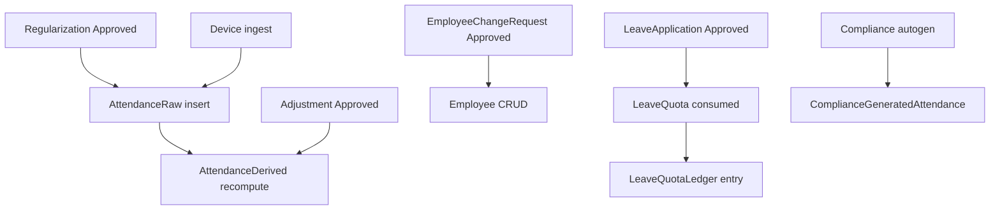

# Data Lifecycles — Mongoose Models (23)

Source: `mams-server/src/models/*.ts`, domain services that mutate each entity.

**Convention:** IST (`Asia/Kolkata`) calendar dates for HR workflows unless noted. Append-only models have `updatedAt: false`.

---

## Lifecycle Legend

| Symbol | Meaning |
|--------|---------|
| **Trigger** | Who/what causes a transition |
| **Cascade** | Downstream collections affected |
| **Terminal** | No further workflow transitions |

---

## 1. User (`users`)

**Purpose:** Authentication, RBAC, UI preferences.

### State machine

```
[Provisioned] ──login──► [Active session]
     │                        │
     │ isActive=false         │ mustChangePassword=true → forced /change-password
     ▼                        │
[Deactivated] ◄──admin───────┘
     │
failedLoginCount ≥ 5 ──► [Locked 15min] ──timeout──► [Active]
```

| Transition | Trigger | Fields changed | Cascade |
|------------|---------|----------------|---------|
| Activate/deactivate | `PATCH /api/users/:id` (`manage.org_users`) | `isActive` | Revokes refresh tokens if RBAC/status/mustChangePassword changed |
| Force password change | Admin sets `mustChangePassword: true` | `mustChangePassword` | Session revoke |
| Lockout | 5 failed logins (`auth.service`) | `failedLoginCount`, `lockedUntil` | None |
| Login success | `POST /api/auth/login` | Clears lockout, sets `lastLoginAt` | Creates `RefreshToken`; backfills permissions |
| Password changed | `POST /api/auth/change-password` | `passwordHash`, `mustChangePassword=false` | Revokes all refresh tokens |

**References:** None outbound. Referenced by most workflow models.

---

## 2. RefreshToken (`refreshtokens`)

### State machine

```
[Issued] ──used in /refresh──► [Revoked] (revokedAt set)
   │                              │
   │ logout / password change       └── cannot rotate again
   │ admin revoke-sessions
   ▼
[Revoked]

[Issued] ──expiresAt passed──► [TTL deleted] (Mongo TTL index)
```

| Transition | Trigger | Cascade |
|------------|---------|---------|
| Issue | login, refresh rotation | None |
| Revoke | logout, changePassword, revoke-sessions | User must re-authenticate |
| Rotate | `POST /api/auth/refresh` | Old token revoked; new token issued (`rotatedFromTokenHash`) |

---

## 3. Employee (`employees`)

### State machine

```
[Active] ◄──approve create/update──┐
   │                               │
   │ status=Inactive               │ EmployeeChangeRequest (create)
   ▼                               │
[Inactive]                         │
   │                               │
   │ soft delete (approve delete)  │
   ▼                               │
[Deleted] isDeleted=true ──────────┘
```

| Transition | Trigger | Cascade |
|------------|---------|---------|
| Create | Direct `POST /employees` (HR) OR approved `EmployeeChangeRequest` create | May allocate leave quotas |
| Update | `PATCH /employees` OR approved update request | None automatic |
| Deactivate | `status: Inactive` | Excluded from autogen, reports |
| Soft delete | `DELETE /employees` OR approved delete | `isDeleted`, `deletedAt` |
| Unmask read | `POST /employees/:id/unmask` | Creates `UnmaskAudit` row (not mutation) |

**Unique keys:** `empCode`, `biometricId`.

---

## 4. EmployeeChangeRequest (`employeechangerequests`)

### State machine

```
[Pending] ──approve──► [Approved] → applies change to Employee
        └──reject──► [Rejected] (terminal)
```

| changeType | On approve | Trigger write | Trigger approve |
|------------|------------|---------------|-----------------|
| `create` | Insert `employees` | `write.employee_change` | `approve.employee_change` |
| `update` | Patch employee from `proposedData` | same | same |
| `delete` | Soft-delete employee | same | same |

**Cascade:** Employee record created/updated/deleted; audit `employee_*` events.

---

## 5. Device (`devices`)

### State machine

```
[Active, isActive=true] ──admin deactivate──► [Inactive]
        │
        │ eSSL ping / Hanvon push
        ▼
[lastSyncStatus: ok|error|pending, lastPingAt, lastSyncAt]
```

| Transition | Trigger | Cascade |
|------------|---------|---------|
| Register | `POST /api/devices` | `notifyOrgAdmins` (device_registered) |
| Sync test | `POST /devices/:id/test` | Updates `lastSyncStatus` |
| Pull sync | `POST /devices/:id/sync`, `/sync-all` | May ingest `AttendanceRaw` |
| Deactivate | `PATCH` `isActive=false` | Device ignored by ingest whitelist |

---

## 6. AttendanceRaw (`attendanceraws`) — APPEND-ONLY

### State machine

```
[Inserted] ──terminal── (no updates/deletes; Mongoose hooks throw)
```

| Creation trigger | Cascade |
|------------------|---------|
| eSSL `/iclock` ingest | Recompute `AttendanceDerived` for employee+date |
| Hanvon `/integrations/hanvon/push` | Same |
| Regularization approval | Synthetic punches with `idempotencyKey: reg:{requestId}:{in|out}` |

**Idempotency:** Unique sparse index on `idempotencyKey` prevents duplicate punches.

---

## 7. AttendanceDerived (`attendancederiveds`)

### State machine

```
[Computed] ──recompute──► [Computed'] (overwrite; prior in recomputeHistory)
```

| Recompute trigger | Reason in history | Cascade |
|-------------------|-------------------|---------|
| New raw punch after cutoff | `late_punch` | Updates real + compliant projections |
| Adjustment approved | `adjustment_applied` | Sets `appliedAdjustmentId` |
| Regularization approved | `regularization` | Links new `rawRecordIds` |
| Smart Anchor version bump | `version_migration` | Full re-derive |

**Unique:** `{ employeeId, date }`. **dayType/status:** `Present`, `Absent`, `Weekly Off`, `Half Day`.

---

## 8. Adjustment (`adjustments`)

### State machine

```
[Pending] ──approve──► [Approved] → recompute AttendanceDerived
        └──reject──► [Rejected]
```

| Transition | Trigger | Cascade |
|------------|---------|---------|
| Submit | `POST /api/adjustments` (`write.adjust`) | None until decided |
| Approve/reject | `POST /:id/decide`, `/bulk-decide` (`approve.adjust`) | On approve: attendance re-derive for `employeeId`+`date` |

**Append-only decision metadata:** `decidedBy`, `decidedAt`, `approverNote`.

---

## 9. RegularizationRequest (`regularizationrequests`)

### State machine

```
[Pending] ──approve──► [Approved] → insert AttendanceRaw + recompute Derived
        └──reject──► [Rejected]
```

| Transition | Trigger | Cascade |
|------------|---------|---------|
| Submit | `POST /api/regularization` | None |
| Approve | `PATCH /:id/approve` | `regularizationApply.service` inserts raw punches; stores `appliedRawIds` |
| Reject | `PATCH /:id/reject` | No attendance mutation |

---

## 10. ComplianceGeneratedAttendance (`compliancegeneratedattendances`)

### State machine

```
[Absent for date] ──autogen──► [Present] (synthetic 8h)
                      │
                      └──manual PATCH──► [Edited] (org.admin only)
```

| Transition | Trigger | Cascade |
|------------|---------|---------|
| Daily autogen | Cron scheduler, `POST /generate`, cron secret header | Upsert per active employee (skip Sunday) |
| Month autogen | `POST /generate-month` | Iterates all dates in month |
| Manual edit | `PATCH /:id` (`org.admin`) | Updates check-in/out, hours |

**Does not** mutate `AttendanceDerived` — parallel compliance projection store.

---

## 11. LeaveType (`leavetypes`)

### State machine

```
[active=true] ◄──admin toggle──► [active=false]
```

| Transition | Trigger | Cascade |
|------------|---------|---------|
| CRUD | Leave admin routes (`manage.leave`) | Existing applications retain `leaveTypeId` reference |
| Deactivate | `active=false` | Hidden from new applications |

---

## 12. Holiday (`holidays`)

**No workflow status.** CRUD via leave admin.

| Mutation | Trigger | Cascade |
|----------|---------|---------|
| Create/update/delete | `manage.leave` | Affects leave day calculations; stored in `LeaveApplication.excludedHolidayDates` |

---

## 13. LeaveApplication (`leaveapplications`)

### State machine

```
[Pending] ──approve──► [Approved] → debit LeaveQuota + LeaveQuotaLedger
        ├──reject──► [Rejected]
        └──cancel──► [Cancelled] (from Approved or Pending)
```

| Transition | Trigger | Cascade |
|------------|---------|---------|
| Apply | `POST` leave applications | `notifyOrgAdmins` (leave_applied); optional employee email stub |
| Approve | `approve.leave` | Increments `LeaveQuota.consumed`; ledger entry |
| Reject | approver | None on quota |
| Cancel | applicant or approver | May restore quota (service logic) |

---

## 14. LeaveQuota (`leavequotas`)

### State machine

```
[Balance] ──entitlement reset──► [New period]
        ──approval/consume──► consumed += N
        ──manual adjust──► manualAdjustment ±=
```

**Effective balance:** `entitled + manualAdjustment - consumed`.

| Transition | Trigger | Cascade |
|------------|---------|---------|
| Ensure quota | Leave apply preview | Creates row if missing for period |
| Consume | Leave approved | Updates `consumed`; writes `LeaveQuotaLedger` |
| Period rollover | Policy from `settings.leaveQuotaResetPolicy` | New `periodKey` rows |

**Unique:** `{ employeeId, leaveTypeId, periodKey }`.

---

## 15. LeaveQuotaLedger (`leavequotaledgers`) — APPEND-ONLY

```
[Entry] ──terminal──
```

| Creation trigger | Fields |
|------------------|--------|
| Quota debit/credit | `delta`, `balanceAfter`, `reason`, `actorId`, optional `relatedApplicationId` |

---

## 16. ReportJob (`reportjobs`)

### State machine

```
[queued] ──runner claims──► [running] ──success──► [completed]
                              └──error──► [failed]

[completed|failed] ──expiresAt passed──► [purged] (deleteMany)
```

| Transition | Trigger | Cascade |
|------------|---------|---------|
| Enqueue | `POST /compliance-attendance/report-jobs` | Validates employee count ≤3000 for monthly |
| Claim | `reportJobRunner` poller | `status=running`, `startedAt` |
| Complete | `runReportJob` | Stores XLSX in `fileData`; `expiresAt` +24h |
| Fail | timeout / build error | `errorMessage` set |
| Purge | Every 120 polls (~6 min) | Deletes expired jobs |

---

## 17. Settings (`settings`) — SINGLETON

```
[Seeded defaults] ──PATCH──► [Updated] (merge fields)
```

| Mutation source | Audit event |
|-----------------|-------------|
| `PATCH /api/settings` | `settings_changed` |
| Feature flags console | `feature_flags_changed` or `settings_changed` |
| Startup | `loadFeatureFlagOverrides` reads `featureFlags` subdoc |

**No delete.** One document per deployment.

---

## 18. Notification (`notifications`)

### State machine

```
[Unread, readAt=null] ──mark read──► [Read, readAt set]
```

| Creation trigger | Recipients |
|------------------|------------|
| `notifyOrgAdmins` | All `role=org.admin`, `isActive=true` |
| Kinds gated by `settings.orgNotificationAlerts` | Per-kind toggle |

**No SMS/push** — in-app only.

---

## 19. AuditLog (`auditlogs`) — APPEND-ONLY

```
[Event recorded] ──terminal──
```

Written by `audit.service` from auth, settings, HR workflows, UI `/activity/log`. See doc 13.

---

## 20. UnmaskAudit (`unmaskaudits`) — APPEND-ONLY

```
[Unmask attempt logged] ──terminal──
```

| Trigger | Fields |
|---------|--------|
| Successful unmask | `userId`, `employeeId`, `fieldName`, IP, UA |
| Failed unmask | Same (failed event in AuditLog separately) |

---

## 21. VisitorForm (`visitorforms`)

### State machine

```
[Draft/active] ──archive──► [isArchived=true]
             ──slug change──► retiredSlugs[] append
```

| Transition | Trigger | Cascade |
|------------|---------|---------|
| Create/update | `manage.visitors` | Bumps `formVersion` on structural change |
| Archive | Admin | Public slug may move to `retiredSlugs` |
| Deactivate | `isActive=false` | Public GET returns 404 |

---

## 22. VisitorFile (`visitorfiles`)

### State machine

```
[Uploaded, consumed=false] ──form submit──► [consumed=true]
        ──TTL/orphan cleanup──► (no explicit job; files persist until consumed)
```

| Creation | Trigger |
|----------|---------|
| Public upload | `POST /api/public/visitor-forms/:slug/upload` |
| Link to submission | `VisitorRequest.fileAttachments[].storageKey` |

**Storage:** Binary in MongoDB `data` Buffer field.

---

## 23. VisitorRequest (`visitorrequests`)

### State machine

```
[Pending] ──approve──► [Approved] (visitValidUntil, visitAccessMode set)
        └──reject──► [Rejected]
```

| Transition | Trigger | Cascade |
|------------|---------|---------|
| Public submit | `POST /:slug/submit` | `notifyOrgAdmins`; marks files consumed |
| Approve/reject | `approve.visitors` | Sets decision metadata |

**Append-only** after submit except status/decision fields.

---

## Cross-Entity Cascade Map



---

## Model Pattern Summary

| Pattern | Models |
|---------|--------|
| Approval workflow | Adjustment, RegularizationRequest, EmployeeChangeRequest, LeaveApplication, VisitorRequest |
| Append-only | AttendanceRaw, AuditLog, UnmaskAudit, LeaveQuotaLedger, RefreshToken, Notification, VisitorFile, VisitorRequest |
| Job lifecycle | ReportJob |
| Singleton | Settings |
| Soft delete | Employee |
| TTL expiry | RefreshToken, ReportJob |
| Immutability hooks | AttendanceRaw only |
